# Incident Triage Agent

[](https://github.com/shaversj/incident-triage-agent/actions/workflows/ci.yml)


[](LICENSE)

A portfolio prototype for bounded, evidence-grounded SRE incident triage.

The project demonstrates an agentic incident workflow where the system owns state, evidence, validation, provenance, mitigation governance, safety gates, and scoring. The LLM owns one constrained judgment: explain the incident evidence and choose from a bounded operational taxonomy.

The goal is not to build an incident chatbot. The goal is to show how an AI-assisted SRE workflow can remain inspectable, auditable, and safe.

## Try It

Run the deterministic demo path with no provider credentials:

```bash
npm install
npm run triage -- run checkout-payment-timeout --mock-llm --trace
```

The run emits structured logs to stderr and the operator-facing triage report to stdout.

Sample output: [docs/examples/checkout-payment-timeout-trace.txt](docs/examples/checkout-payment-timeout-trace.txt)

## What To Notice

- The workflow gathers evidence before asking the LLM for judgment.
- Raw incident fixtures do not contain expected causes or actions.
- The LLM result must pass local schema, taxonomy, confidence, and evidence-citation validation.
- The Mitigation Control Plane maps mutating intents to an approved catalog, simulates dry-run and verification, and stages approval-sensitive actions instead of executing them.
- The scorecard is deterministic; the model does not grade itself.
- Recorded Grafana and Loki-shaped inputs exercise the real webhook and workflow path.

## Architecture

```mermaid
flowchart LR
    A["Raw incident data"] --> B["Evidence package"]
    B --> C["Investigation trace"]
    C --> D["incident-triage skill"]
    D --> E["Structured LLM result"]
    E --> F["Schema and taxonomy validation"]
    F --> G["Evidence citation validation"]
    G --> H["Mitigation Control Plane"]
    H --> I["Safety compatibility gate"]
    I --> J["Operator output"]
    J --> K["Scorecard"]
```



The workflow owns control flow, factual investigation steps, validation, provenance, mitigation governance, safety, and scoring. The `incident-triage` skill guides the LLM through a human SRE-style investigation order: current signal, impact, recent changes, dependency-vs-local evidence, evidence quality, missing context, bounded next action, and verification.

The Mitigation Control Plane sits after local decision validation. It deterministically decides whether the proposed action is recommendation-only, catalog-approved but approval-required, or blocked/escalated. It records evidence checks, simulated dry-run output, staged action state, audit data, and recorded verification outcomes without granting production mutation authority.

## Scenarios

| Scenario | Incident type | Expected action | Shows |
| --- | --- | --- | --- |
| `checkout-payment-timeout` | Dependency outage | Escalate owner | Evidence grounding and dependency-vs-local reasoning |
| `bad-deploy-latency` | Bad deploy | Request rollback approval | Approval gate for risky remediation |
| `capacity-saturation` | Capacity saturation | Apply runbook step with approval | Runbook-guided next action |
| `noisy-alert` | Noisy alert | Continue monitoring | Restraint when evidence is weak |

List scenarios:

```bash
npm run list
```

Run a different scenario:

```bash
npm run triage -- run bad-deploy-latency --mock-llm --trace
```

## What To Review

- [src/workflow.ts](src/workflow.ts): the incident triage state machine.
- [src/evidence.ts](src/evidence.ts): deterministic evidence gathering and provenance.
- [src/llm.ts](src/llm.ts): Flue-backed MiniMax adapter and response validation.
- [src/mitigation-control.ts](src/mitigation-control.ts): catalog-backed mitigation governance, dry-run, audit, and verification simulation.
- [src/policy.ts](src/policy.ts): safety compatibility gate derived from mitigation governance.
- [src/scoring.ts](src/scoring.ts): deterministic scorecard.
- [evals/recorded-triage-quality.eval.ts](evals/recorded-triage-quality.eval.ts): deterministic quality gates.
- [.agents/skills/incident-triage/SKILL.md](.agents/skills/incident-triage/SKILL.md): local skill boundary used for bounded SRE judgment.

## Decision Contract

Each completed triage run returns a run envelope:

- `run_id` and `run_status` identify the run and lifecycle state.
- `investigation` summarizes workflow-authored evidence-gathering steps.
- `analysis`, `finding_summary`, and `recommendation` are LLM-authored explanation fields.
- `explanation_validation` reports whether explanation fields were valid, degraded, or unavailable.
- `decision` is the authoritative bounded operational result.
- `mitigation_control` records catalog match, policy reason, dry-run, staged or blocked state, audit event, and verification outcome.
- `safety`, `provenance`, and `scorecard` derive from the validated decision and deterministic mitigation governance.

Allowed `incident_class` values:

- `dependency_outage`
- `bad_deploy`
- `capacity_saturation`
- `noisy_alert`
- `insufficient_context`
- `unknown`

Allowed `next_action` values:

- `escalate_owner`
- `request_rollback_approval`
- `apply_runbook_step_with_approval`
- `continue_monitoring`
- `ask_human`
- `gather_more_context`

The provider response is never trusted directly. Local validation checks JSON shape, taxonomy values, confidence, and cited evidence IDs before the workflow applies mitigation governance or safety policy.

## Recorded Observability Path

Run recorded Grafana webhook payloads plus Loki-shaped logs through the real webhook handler and workflow:

```bash
npm run triage:recorded
npm run triage:recorded -- --scenario capacity-saturation
npm run triage:recorded -- --scenario bad-deploy-latency --json
```

The recorded path does not start Grafana, Loki, Docker Compose, or a synthetic service. It loads fixtures from `fixtures/grafana/` and `fixtures/logs/`, then exercises webhook normalization, evidence construction, workflow validation, mitigation governance, safety policy, provenance, and scorecard output.

## Live Provider Path

Create `.env` from `.env.example`:

```text
MINIMAX_API_KEY=replace-with-your-minimax-api-key
MODEL_NAME=MiniMax-M2.7
MINIMAX_BASE_URL=https://api.minimax.io
GRAFANA_WEBHOOK_SECRET=replace-with-a-local-webhook-secret
LOKI_BASE_URL=http://localhost:3100
LOKI_LIMIT=20
```

Run with live MiniMax through Flue:

```bash
npm run triage -- run checkout-payment-timeout --trace
npm run triage:live
```

The real `.env` is ignored by git.

## Webhook Server

Run the local webhook server with mock LLM output:

```bash
npm run serve -- --mock-llm
```

Post a recorded Grafana payload:

```bash
curl -s http://localhost:8080/webhooks/grafana \
  -H 'Content-Type: application/json' \
  -H 'X-Webhook-Secret: replace-with-a-local-webhook-secret' \
  --data @fixtures/grafana/checkout-payment-timeout-webhook.json
```

## Verification

Run the full local verification path:

```bash
npm test
npm run typecheck
npm run evals
```

Default tests avoid real MiniMax calls, Docker, and networked Loki. They exercise parser, evidence, workflow, policy, scoring, CLI, Grafana, Loki-shaped log replay, webhook, and outcome code paths with fixture payloads and mock external transports.

Deterministic evals cover scenario contracts, evidence citations, provenance, safety behavior, mitigation governance, and recorded-triage readability. Live evals are opt-in:

```bash
RUN_LIVE_FLUE_EVALS=1 npm run evals
```

## Docker

Build the local image:

```bash
docker build -t incident-triage-agent:local .
```

Run the deterministic path:

```bash
docker run --rm incident-triage-agent:local run checkout-payment-timeout --mock-llm --trace
```

Run the live provider path:

```bash
docker run --rm --env-file .env incident-triage-agent:local run checkout-payment-timeout --trace
```

## Why Actions Are Simulated

Incident response actions can affect customers. This prototype stages approval-sensitive actions and prints mitigation-control audit payloads, but it does not call deployment, ticketing, chat, or production observability systems. Simulated dry-runs and verification outcomes are recorded-fixture proof, not production execution. That keeps the architecture inspectable without creating production blast radius.
