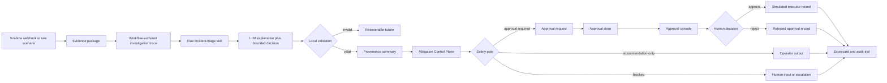

# AI Operator Architecture

This project is an AI Operator-style incident response prototype, not an incident chatbot. The core claim is that useful AI operations require a governed harness around the model: evidence collection, bounded decisions, deterministic validation, approval-aware mitigation control, non-executing actuation records, and repeatable evaluation.

The LLM contributes one constrained judgment. The system owns everything that decides whether that judgment can be trusted or acted on.

## Executive Summary

The prototype shows how an incident triage agent can move from alert to approval-ready mitigation without giving the model production authority.

- The workflow gathers raw incident facts before asking the LLM for judgment.
- The LLM returns an explanation plus one bounded decision from fixed incident and action taxonomies.
- Local validation checks schema, taxonomy values, confidence, and evidence citations before downstream state changes.
- The Mitigation Control Plane maps approval-sensitive actions to a catalog, evidence checks, dry-run record, staged approval request, audit event, and verification status.
- The approval console lets a human approve or reject the staged mitigation.
- The executor boundary records simulated execution only. Production action remains `executed: false`.
- Tests and evals prove the safety contract without relying on the model to grade itself.

## Architecture



The important design choice is the authority split. The LLM can explain and classify, but it cannot create catalog entries, approve actions, execute mitigations, score itself, or decide that production mutation happened.

## Trust Boundaries

| Boundary | Owned by | Trusted for | Not trusted for |
| --- | --- | --- | --- |
| Grafana webhook normalization | deterministic code | Raw alert facts and incident envelope | Root cause or mitigation recommendation |
| Loki-shaped log replay/query | deterministic code | Operational log evidence | Expected answer or hidden labels |
| Evidence package | deterministic code | Prompt input, source tiers, stable evidence IDs | Freeform model claims |
| Flue/MiniMax decision | LLM through adapter | Explanation and bounded judgment candidate | Workflow state, action safety, approval, execution |
| Local validation | deterministic code | Whether model output is admissible | Semantic truth beyond available evidence |
| Provenance summary | deterministic code | Whether cited evidence is current, operational, guidance, or historical | Model-generated confidence |
| Mitigation Control Plane | deterministic code | Catalog match, evidence checks, approval posture, dry-run, verification | Real production mutation |
| Approval store and console | deterministic code plus human | Human approval/rejection record | Actual rollback, scaling, throttling, or ticketing |
| Simulated executor | deterministic code | Proof that execution remains disabled | Production change |
| Scorecard and evals | deterministic code | Contract compliance and regression detection | Freeform quality as a safety substitute |

## What The LLM Does

The LLM is used for a narrow SRE judgment:

- Explain the evidence in an incident-shaped way.
- Choose one `incident_class` from a fixed taxonomy.
- Choose one `next_action` from a fixed taxonomy.
- Cite only evidence IDs that the workflow actually provided.
- Provide caveats and a verification plan.

The model does not call tools, inspect systems directly, write runbooks, create approvals, execute actions, or decide safety. Those are outside its authority.

## What Deterministic Code Does

Deterministic code owns the harness:

- Builds evidence from scenarios, Grafana payloads, Loki-shaped logs, deploy facts, services, runbooks, prior incidents, and verification signals.
- Records workflow state transitions such as `received`, `context_gathered`, `decision_validated`, `approval_pending`, `simulated_action_recorded`, and `verification_failed`.
- Validates the LLM response before the workflow trusts it.
- Computes provenance from cited evidence.
- Applies mitigation governance through `fixtures/mitigations/catalog.json`.
- Persists approvals in `.triage/approvals.json`.
- Serves the approval console at `/approvals`.
- Records simulated executor output with `executed: false`.
- Computes deterministic scorecards and eval gates.

## Mitigation Control Plane

The Mitigation Control Plane is the project's Actus-like layer. It sits between a validated next action and anything that resembles actuation.

For approval-sensitive actions, it checks:

- Does the decision match an approved mitigation catalog entry?
- Are required evidence sources present, such as deploy, runbook, and verification evidence?
- Is a dry-run required?
- Is human approval required?
- What staged action and audit event should be recorded?
- Do recorded verification signals show recovery or continued unhealthy behavior?

For example, `bad-deploy-latency` can produce:

```text
incident_class: bad_deploy
next_action: request_rollback_approval
catalog_id: rollback-approval
runbook_id: bad-deploy
status: approval_required
executed: false
```

That is intentionally not a rollback. It is a governed approval request for a rollback-shaped mitigation.

## Approval And Execution Boundary

The approval layer has two surfaces:

- CLI: `npm run triage:approval`
- Local console: `http://127.0.0.1:8080/approvals`

Approval records include incident ID, service, catalog ID, runbook ID, action intent, status, timestamps, and execution status. Approval can move from `pending_human_approval` to `human_approved` or `human_rejected`.

If approved, the executor records:

```json
{
  "status": "simulated_not_executed",
  "executed": false,
  "dry_run": true
}
```

This is the current safety line. The project demonstrates the actuation boundary without integrating with deployment systems, Kubernetes, incident tooling, Slack, ticketing, or production observability.

## Demo Paths

### Deterministic Approval UI Demo

Use this for portfolio review and development because it requires no provider credentials:

```bash
npm run approval-demo
```

It uses recorded Grafana and Loki-shaped inputs, mock LLM output, the real webhook handler, the real workflow, the real Mitigation Control Plane, and the real approval console.

Open:

```text
http://127.0.0.1:8080/approvals
```

### Live LLM Approval UI Demo

Use this to test the provider boundary with the same recorded observability inputs:

```bash
npm run approval-demo -- --live
```

This calls MiniMax through Flue. The approval queue is populated only if the live model returns an admissible approval-sensitive bounded decision.

### Recorded Triage Run

Use this to inspect the operator-facing text path:

```bash
npm run triage:recorded -- --scenario bad-deploy-latency
```

### Scriptable Verification

Use this in automation or review:

```bash
npm run approval-demo -- --once --json
```

## Evaluation Strategy

The project uses two kinds of quality gates:

- Deterministic tests prove the system contract: parser behavior, evidence construction, validation, safety, mitigation governance, approval persistence, UI/API approval behavior, and recoverable failures.
- Evals exercise model and skill behavior while keeping schema validity, citation validity, provenance, mitigation governance, and safety gates deterministic.

Important commands:

```bash
npm test
npm run typecheck
npm run build
npm run evals
npm run approval-demo -- --once --json
npm run triage:recorded -- --scenario bad-deploy-latency
```

The scorecard is computed by code. The model never grades its own run.

## Current Versus Future

| Capability | Current state | Future production shape |
| --- | --- | --- |
| Alert ingestion | Grafana-shaped webhook fixtures and local webhook handler | Real Grafana alerts into the same handler |
| Logs | Recorded Loki-shaped logs or bounded Loki client | Real Loki query with production auth and rate limits |
| LLM | MiniMax through Flue or deterministic mock client | Same adapter boundary with model monitoring |
| Runbooks | Local fixture-backed runbook evidence | Versioned runbook source of truth |
| Mitigation catalog | Local JSON catalog | Change-controlled mitigation catalog with owners |
| Approval | Local JSON store plus console | Authenticated approval workflow with audit storage |
| Executor | Simulated record only | Bounded executors with policy, dry-run, rollback, and post-checks |
| Verification | Recorded verification signals | Live SLO, metrics, logs, and rollback health checks |
| Evaluation | Vitest and eval suites | CI plus live canaries and incident replay suite |

## Why This Is Closer To AI Operator

An AI Operator is not just an LLM that describes incidents. It is a harness that can:

- Receive an operational signal.
- Gather relevant evidence.
- Ask a model for a bounded judgment.
- Validate the judgment locally.
- Route risky action through a deterministic control plane.
- Require human approval.
- Record what would happen without executing it.
- Verify and score the run.

This repository now demonstrates that loop end to end while keeping production mutation authority deliberately out of scope.

