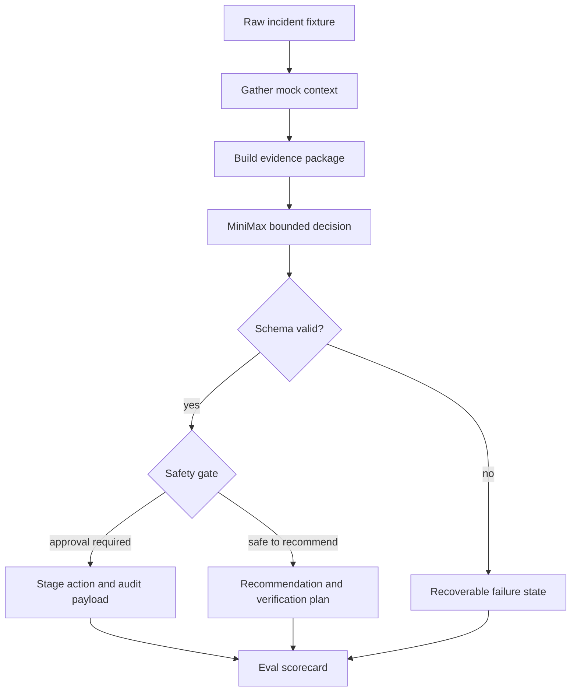

# Incident Triage Agent Requirements

## Summary

Build a working incident-triage architecture proof of concept that runs against raw mock incident data, gathers operational context, uses MiniMax to classify the incident and choose the next bounded action, and exposes the state, evidence, safety gate, verification plan, and eval scorecard for inspection.

---

## Problem Frame

The goal is to prove an agentic SRE architecture, not to package an interview demo or build production automation. The system should show that an LLM can make useful incident-triage decisions when the surrounding workflow controls context, state, decision vocabulary, validation, and safety.

The PoC should use synthetic operational data so it can run safely and repeatably. It should demonstrate the SRE operating loop of detect, diagnose, recommend, approve, verify, and learn without giving the agent open-ended production authority.

---

## Key Decisions

- **Bounded decision vocabulary.** The LLM selects from a global incident-class and next-action taxonomy so its reasoning can be validated, scored, and routed through deterministic control flow.
- **Raw incident fixtures only.** Input fixtures include operational facts, not suspected causes, recommended actions, or approval hints; those are derived by the workflow.
- **Runbooks as grounding and policy context.** Runbooks help the LLM interpret evidence and constrain safe recommendations, but they do not define separate per-team vocabularies in the MVP.
- **Multiple runnable scenarios.** The first version should run more than one incident scenario so the architecture proves classification and next-action selection beyond a single scripted case.
- **Real LLM behind an adapter boundary.** MiniMax is used for the decision step, while the workflow retains control of prompting, schema validation, retries, fallback behavior, and scorekeeping.

---

## Actors

- A1. **Operator.** Reviews the trace, decision, recommendation, approval gate, and scorecard for a mock incident.
- A2. **Triage workflow.** Owns state transitions, context gathering, prompt assembly, validation, policy checks, and output rendering.
- A3. **LLM decision step.** Classifies the incident and chooses the next action from the allowed taxonomy using gathered evidence.
- A4. **Mock operational tools.** Provide alert, log, deploy, ownership, runbook, prior-incident, and verification-signal context from fixtures.

---

## Requirements

**Incident input and context**

- R1. The PoC must run against raw mock incident data containing operational facts such as alert, symptom, service, log, deploy, ownership, runbook, prior-incident, and verification-signal context.
- R2. The raw incident fixtures must not include suspected causes, recommended actions, or approval requirements as input hints.
- R3. The workflow must gather context through tool-like boundaries so the trace distinguishes fixture input from derived agent output.
- R4. The workflow must support multiple runnable scenarios that exercise different incident classes and next actions.

**Bounded LLM decision**

- R5. The LLM must choose one global `incident_class` from `dependency_outage`, `bad_deploy`, `capacity_saturation`, `noisy_alert`, `insufficient_context`, or `unknown`.
- R6. The LLM must choose one global `next_action` from `escalate_owner`, `request_rollback_approval`, `apply_runbook_step_with_approval`, `continue_monitoring`, `ask_human`, or `gather_more_context`.
- R7. The LLM output must include confidence, cited evidence, caveats, and a verification plan.
- R8. The workflow must validate the LLM response against the expected structure before using it for state transitions or scoring.
- R9. Invalid, unsupported, or low-confidence LLM output must move the workflow into a recoverable state instead of silently producing a recommendation.

**Stateful workflow and traceability**

- R10. The workflow must expose explicit state transitions from incident receipt through context gathering, LLM decision, validation, safety gating, verification planning, and eval scoring.
- R11. Each material claim in the triage output must cite evidence gathered from mock operational tools.
- R12. The CLI trace must make the LLM boundary visible, including the decision inputs, structured output, validation result, and fallback behavior when applicable.

**Safety and approval behavior**

- R13. The workflow must separate recommending an action from executing an action.
- R14. Actions that imply mutation or operational risk must be staged behind an approval gate.
- R15. The MVP must simulate approved actions by printing the staged payload and audit event rather than calling external systems.
- R16. The workflow must continue with caveats for non-critical missing context and ask for human input when missing context would make a recommendation unsafe or unverifiable.

**Evaluation**

- R17. Each runnable scenario must produce an eval scorecard covering state correctness, evidence grounding, safety behavior, classification quality, and next-action quality.
- R18. The scorecard must make failures legible enough that a reader can distinguish bad LLM reasoning from missing context, validation failure, or policy rejection.
- R19. The PoC must include enough fixture variation to show that the classifier is not hardcoded to one dependency-outage path.

---

## Key Flows

- F1. Incident triage run
  - **Trigger:** An operator runs a mock incident scenario from the CLI.
  - **Actors:** A1, A2, A3, A4
  - **Steps:** The workflow loads the raw incident, gathers context, assembles an evidence package, asks MiniMax for a bounded decision, validates the response, applies safety policy, prints the trace, and emits a scorecard.
  - **Outcome:** The operator can inspect how the classification and next action were produced.
  - **Covered by:** R1, R3, R5, R6, R8, R10, R17

- F2. Approval-gated recommendation
  - **Trigger:** The LLM chooses a next action that implies mutation or operational risk.
  - **Actors:** A1, A2, A3
  - **Steps:** The workflow stages the action, explains why approval is required, prints the payload that would be sent, and records an audit event if the simulated approval is granted.
  - **Outcome:** The PoC demonstrates governed action without performing real execution.
  - **Covered by:** R13, R14, R15

- F3. Missing-context handling
  - **Trigger:** A scenario lacks enough evidence for a safe or verifiable recommendation.
  - **Actors:** A1, A2, A3, A4
  - **Steps:** The workflow distinguishes critical from non-critical missing context, either continues with caveats or moves to human input, and reflects the choice in the scorecard.
  - **Outcome:** The workflow degrades predictably instead of pretending certainty.
  - **Covered by:** R9, R16, R18

---

## Acceptance Examples

- AE1. **Covers R1, R2, R5, R6, R11.**
  - **Given:** A checkout latency scenario includes alerts, logs, recent deploys, runbook context, and verification signals, but no suspected causes or recommended actions.
  - **When:** The workflow runs the scenario.
  - **Then:** The LLM returns a bounded incident class and next action with evidence citations derived from gathered context.

- AE2. **Covers R8, R9, R12.**
  - **Given:** MiniMax returns malformed JSON or a class outside the global taxonomy.
  - **When:** The workflow validates the response.
  - **Then:** The workflow reports validation failure, records the failed boundary, and enters a recoverable state.

- AE3. **Covers R13, R14, R15.**
  - **Given:** A bad-deploy scenario leads to `request_rollback_approval`.
  - **When:** The workflow reaches the safety gate.
  - **Then:** The workflow stages the rollback recommendation and simulated audit payload without executing a rollback.

- AE4. **Covers R16, R18.**
  - **Given:** A scenario lacks the runbook or verification signal needed to support a safe recommendation.
  - **When:** The workflow scores the run.
  - **Then:** The scorecard identifies the missing context and distinguishes caveated continuation from human-input pause.

---

## Success Criteria

- The CLI can run multiple mock incident scenarios end to end with a readable state trace.
- The LLM classification and next action are bounded, schema-valid, and evidence-backed.
- The workflow shows where MiniMax is used and where deterministic validation and policy take over.
- Approval-sensitive actions are staged and audited, not executed.
- Eval scorecards make architecture quality visible across successful, ambiguous, and invalid-output cases.

---

## Scope Boundaries

- Team-defined incident classes and action vocabularies are deferred.
- Production observability, incident-management, chat, ticketing, and deployment integrations are out of scope.
- Real action execution is out of scope.
- A web UI is out of scope for the MVP.
- Interview-specific packaging is not the primary goal.

---

## Dependencies / Assumptions

- A MiniMax API key is available for local runs.
- Mock data can be synthetic and does not need to represent any private production system.
- The CLI is the first product surface.
- The exact implementation stack, persistence approach, and test framework can be chosen during planning.

---

## Sources / Research

- Attached Bear note: `Agentic SRE Management Prep`, especially the operating model, autonomy tiers, governance framework, and Agentic Incident Triage Assistant demo concept.
- Attached Bear note: `SRE AI Strategy`, especially the governed reliability platform framing, incident context package initiative, maturity model, and evaluation metrics.
