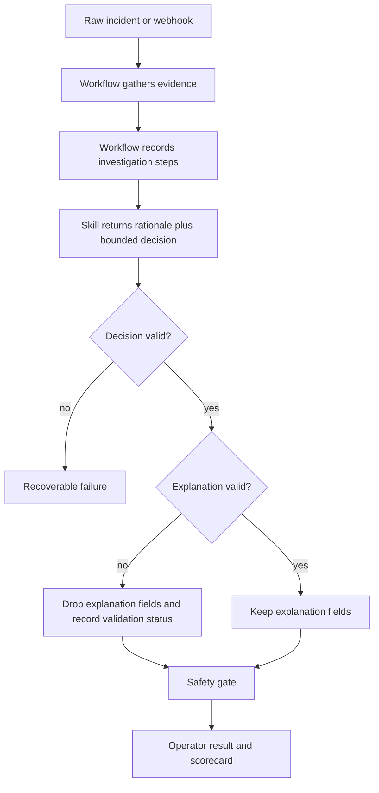

# Agentic Triage Run Envelope Requirements

## Summary

Add an agentic run envelope around the existing incident triage result. The current bounded `decision` object remains authoritative, while the surrounding result gains workflow-authored investigation steps and LLM-authored evidence-grounded hypotheses, finding summary, and recommendation rationale.

---

## Problem Frame

The current incident triage agent already has a strong safety shape: code gathers evidence, the LLM returns one bounded decision, and deterministic validation, safety, provenance, and scoring decide whether that output can be trusted.

The remaining gap is inspectability. A reviewer can see the evidence package and final decision, but not a structured account of what the system investigated or which hypotheses the model presents to explain the bounded class and action. That makes the workflow safer than a freeform agent, but less legible than a governed investigation trace.

The next step should make the investigation visible without giving the LLM new operational authority.

---

## Key Decisions

- **Preserve the bounded decision contract.** The existing `decision` shape remains nested and unchanged so current validation, safety, provenance, scorecard, CLI, and API consumers retain a stable operational contract.
- **Add an agentic envelope, not an autonomous tool loop.** The first version records the investigation the workflow already performs instead of letting the model choose tools dynamically.
- **Workflow records factual investigation steps.** Code owns `investigation.steps` because those steps should represent what actually happened, not what the model claims it considered.
- **LLM writes the explanation layer.** The same `incident-triage` skill call should return evidence-grounded hypotheses, `finding_summary`, and recommendation rationale alongside the bounded decision.
- **Label explanations as rationale, not hidden reasoning.** Hypotheses should explain how the cited evidence supports or weakens candidate causes, but they are not proof of the model's internal chain of thought.
- **Keep explanations non-authoritative.** If hypotheses, `finding_summary`, or recommendation metadata are invalid but the bounded decision is valid, the workflow may drop the invalid explanation fields, record warnings, and continue through safety.
- **Attach rationale to the bounded action.** `recommendation` explains `decision.next_action`, but does not repeat it or introduce a second action vocabulary.

The intended result shape is:

```json
{
  "run_id": "triage-run-abc123",
  "run_status": "completed",
  "investigation": {
    "summary": "Collected alert, log, deploy, owner, runbook, prior incident, and verification evidence.",
    "steps": [
      {
        "id": "step:0",
        "kind": "inspect_logs",
        "status": "found",
        "purpose": "Check checkout behavior during the incident window.",
        "evidence_ids": ["log:0"]
      }
    ]
  },
  "analysis": {
    "hypotheses": [
      {
        "label": "payment gateway timeout pattern",
        "status": "supported",
        "supporting_evidence_ids": ["alert:1", "log:0"],
        "contradicting_evidence_ids": ["deploy:0"]
      }
    ]
  },
  "finding_summary": "Checkout latency appears driven by payment-gateway timeouts rather than the recent checkout deploy.",
  "recommendation": {
    "rationale": "`decision.next_action` escalates the payment-gateway owner because current timeout evidence points upstream.",
    "evidence_ids": ["alert:1", "log:0"]
  },
  "explanation_validation": {
    "status": "valid",
    "warnings": []
  },
  "decision": {
    "incident_class": "dependency_outage",
    "next_action": "escalate_owner",
    "confidence": 0.88,
    "evidence_ids": ["alert:1", "log:0", "runbook:dependency-outage"],
    "caveats": [],
    "verification_plan": []
  },
  "safety": {
    "status": "safe_recommendation",
    "approval_required": false
  },
  "provenance": {
    "cited_tiers": ["current_signal", "operational_context", "guidance"]
  },
  "scorecard": {
    "state_correctness": true,
    "evidence_grounding": true
  }
}
```

---

## Actors

- A1. **Operator.** Reviews the compact investigation summary, finding summary, recommendation rationale, decision, safety gate, provenance, and scorecard.
- A2. **Triage workflow.** Records factual investigation steps, validates the LLM payload, applies safety policy, and renders the result.
- A3. **LLM skill.** Produces evidence-grounded hypotheses, finding summary, recommendation rationale, and the bounded decision from the supplied evidence package.
- A4. **Reviewer or maintainer.** Uses the run envelope to distinguish evidence-gathering gaps from LLM explanation gaps.

---

## Requirements

**Agentic run envelope**

- R1. The triage result must expose a top-level run envelope with `run_id`, terminal `run_status`, `investigation`, optional explanatory analysis, `explanation_validation`, the authoritative `decision`, safety, provenance, and scorecard surfaces.
- R2. The default operator output must show a compact investigation summary, while detailed investigation steps remain available in trace, debug, API, or JSON output.
- R3. The run envelope must preserve the current bounded `decision` fields: `incident_class`, `next_action`, `confidence`, `evidence_ids`, `caveats`, and `verification_plan`.

**Workflow-authored investigation**

- R4. `investigation.steps` must describe evidence-gathering work the workflow actually performed, such as alert inspection, log lookup, deploy lookup, ownership lookup, runbook loading, prior-incident lookup, and verification-signal collection.
- R5. Each investigation step must identify its purpose, bounded status, and produced evidence IDs when evidence was found.
- R6. Evidence lookups that are attempted, skipped, empty, or failed must still be represented by an investigation step with a status such as `found`, `not_found`, `skipped`, or `error`.
- R7. Investigation steps must not claim that the LLM executed tools or performed actions the workflow did not run.

**LLM-authored explanation layer**

- R8. The same `incident-triage` skill call should return `analysis.hypotheses`, top-level `finding_summary`, `recommendation`, and the nested bounded `decision`.
- R9. Hypothesis labels may be freeform so the model can describe the suspected mechanism, but hypotheses are evidence-grounded explanatory output rather than proof of internal model reasoning.
- R10. Each hypothesis must cite supplied evidence IDs for support or contradiction.
- R11. The top-level `finding_summary` must be a concise human-readable finding grounded in the supplied evidence.
- R12. `recommendation.rationale` must explain why `decision.next_action` is appropriate using cited evidence.
- R13. `recommendation` must not contain its own `next_action` field.
- R14. `recommendation.evidence_ids` must contain only valid supplied evidence IDs.

**Validation and failure behavior**

- R15. The bounded `decision` remains the only LLM output allowed to drive workflow state, safety evaluation, approval behavior, and scorecard results.
- R16. Invalid bounded decisions must continue to produce the existing recoverable failure behavior.
- R17. Invalid hypotheses, `finding_summary`, or recommendation metadata may be dropped with validation warnings when the bounded decision is valid.
- R18. `explanation_validation` must make dropped or malformed explanation fields visible enough for tests and operators to distinguish a usable decision from a degraded explanation layer.
- R19. The expanded skill payload must preserve the current bounded-decision reliability target; if decision validity regresses compared with the current decision-only contract, the workflow must have a decision-only fallback or rollback path.

**Scope safety**

- R20. The first version must not add agent-selected tools, write tools, autonomous remediation, ticket creation, rollback execution, scaling execution, alert closure, or extension points solely for future read-only tool selection.

---

## Key Flows

- F1. Agentic triage result
  - **Trigger:** An operator runs a fixture scenario, webhook scenario, or live demo probe.
  - **Actors:** A1, A2, A3
  - **Steps:** The workflow records investigation steps while gathering evidence, sends the completed evidence package to the skill, validates the bounded decision, validates or drops non-authoritative explanation fields, records `explanation_validation`, applies safety, and renders the compact result.
  - **Outcome:** The operator can see what was investigated, what the model concluded, and what safety policy accepted or blocked.
  - **Covered by:** R1, R2, R3, R4, R8, R15

- F2. Valid decision with malformed explanation
  - **Trigger:** The skill returns a valid bounded decision but invalid hypotheses, `finding_summary`, or recommendation metadata.
  - **Actors:** A2, A4
  - **Steps:** The workflow keeps the valid decision, drops the malformed explanation fields, records validation warnings, and continues through safety.
  - **Outcome:** A useful operational decision is not discarded because a non-authoritative explanation field failed validation.
  - **Covered by:** R15, R17, R18



---

## Acceptance Examples

- AE1. **Covers R1, R3, R4, R5, R6.**
  - **Given:** A checkout payment timeout scenario gathers alert, log, deploy, service, runbook, prior-incident, and verification evidence.
  - **When:** The workflow renders an agentic run result.
  - **Then:** The result includes investigation steps for found, empty, skipped, or failed evidence-gathering work and preserves the nested bounded decision object.

- AE2. **Covers R8, R9, R10, R11, R12, R13, R14.**
  - **Given:** The skill returns hypotheses, `finding_summary`, recommendation, and decision fields.
  - **When:** The response is validated.
  - **Then:** Hypotheses and recommendation evidence cite valid evidence IDs, and recommendation rationale explains `decision.next_action` without adding a second action field.

- AE3. **Covers R15, R16.**
  - **Given:** The skill returns an invalid incident class or next action.
  - **When:** The workflow validates the response.
  - **Then:** The run enters recoverable failure and does not apply safety or render a trusted recommendation.

- AE4. **Covers R17, R18.**
  - **Given:** The skill returns a valid decision but a malformed hypothesis object.
  - **When:** The workflow validates the response.
  - **Then:** The decision continues through the safety gate, the malformed explanation is dropped, and `explanation_validation` records the warning.

- AE5. **Covers R20.**
  - **Given:** A reviewer inspects the new run envelope.
  - **When:** They look for tool selection or remediation authority.
  - **Then:** They see only workflow-authored evidence-gathering steps and no autonomous production actions.

---

## Success Criteria

- The project can show a compact operator result that reads like an investigation, not only a classification.
- Tests can distinguish workflow evidence-gathering failures from LLM explanation failures and bounded decision failures.
- The current decision contract remains stable enough that existing safety, provenance, scorecard, and output behavior can migrate without semantic drift.
- The model is more agentic in presentation and evidence-grounded rationale, but not more autonomous in operational authority.

---

## Scope Boundaries

- Agent-selected tools are deferred.
- Read-only pivoting across observability tools is deferred.
- Queue prioritization and risk ranking are deferred.
- Autonomous closure, rollback, scaling, ticket updates, and alert-status changes are out of scope.
- A UI for exploring the trace is out of scope.
- Persisted run history is fully deferred for the first version; tests and demo output should use transient run results unless a separate requirements pass brings persistence into scope.

---

## Dependencies / Assumptions

- The current evidence package remains the input to the skill.
- The current bounded incident class and next action taxonomies remain global.
- MiniMax can return the larger structured payload through the existing Flue skill boundary.
- Existing fixture, webhook, Docker E2E, and live-provider tests can be extended without requiring production credentials or production data.

---

## Sources / Research

- `docs/brainstorms/2026-06-14-incident-triage-agent-requirements.md` for the original bounded decision, safety, and evaluation requirements.
- `AGENTS.md` for current project constraints around raw fixtures, deterministic validation, safety gates, opt-in live tests, and testing conventions.
- `docs/learnings.md` for the human investigation skill and TypeScript/Flue runtime context.
- Panther blog, "AI Agents for Incident Triage and Prioritization: What Actually Works", for external support around context enrichment, reasoning trails, read-only investigation, phased rollout, and human checkpoints.
