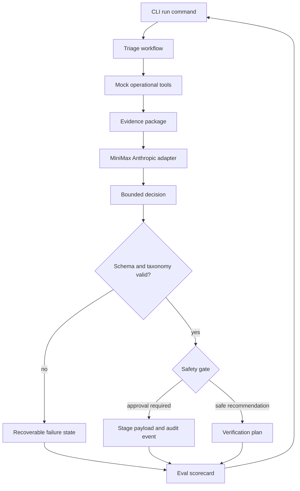
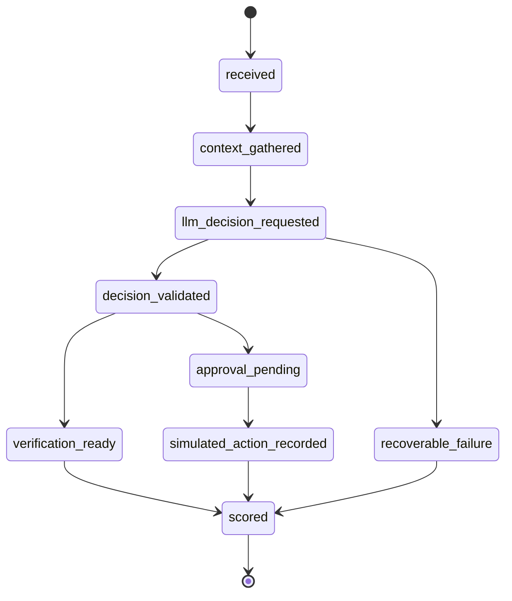

# feat: Build incident triage agent PoC

## Summary

Build the full greenfield CLI proof of concept from the brainstorm: raw incident fixtures feed mock operational tools, a stateful triage workflow calls MiniMax through its Anthropic-compatible endpoint, local validation constrains the LLM decision, and each run emits trace, safety-gate, verification, and eval-scorecard output.

---

## Problem Frame

The repo has no application scaffold yet, so the plan must establish the project structure as well as the incident-triage architecture. The purpose is to prove that an LLM can classify incident scenarios and choose bounded next actions from realistic mock operational context without granting open-ended production authority.

The implementation should make architecture inspection easy. The first surface is a CLI, the data world is synthetic, and all action execution remains simulated.

---

## Requirements

**CLI and configuration**

- R1. The project provides a CLI that can run named mock incident scenarios and optionally show a detailed trace.
- R2. MiniMax configuration is read from `.env` using `MINIMAX_API_KEY` and `MODEL_NAME`.
- R3. The CLI never prints secret values from `.env`.

**Raw context and tools**

- R4. Scenario fixtures contain raw incident facts only, without suspected causes, recommended actions, or approval hints.
- R5. Mock tool boundaries expose alert, log, deploy, ownership, runbook, prior-incident, and verification-signal context.
- R6. The trace distinguishes fixture facts, gathered evidence, LLM output, validation results, safety-gate decisions, and eval results.

**LLM decision and safety**

- R7. The LLM chooses one global incident class and one global next action from the taxonomy defined in the origin requirements.
- R8. LLM output is parsed and validated locally before it can drive workflow state.
- R9. Invalid, unsupported, or low-confidence LLM output moves the workflow into a recoverable state.
- R10. Approval-sensitive recommendations are staged and audited, not executed.

**Evaluation**

- R11. Multiple runnable scenarios exercise different incident classes and next actions.
- R12. Each scenario emits a scorecard covering state correctness, evidence grounding, safety behavior, classification quality, and next-action quality.
- R13. Tests cover successful runs, missing-context behavior, approval-gated behavior, invalid LLM responses, and low-confidence LLM responses.

---

## Key Technical Decisions

- **Python CLI first:** A small Python package gives the fastest path to typed domain models, fixture loading, HTTP integration, and testable command behavior in a greenfield repo.
- **Anthropic-compatible MiniMax adapter:** The LLM boundary targets MiniMax's `/anthropic/v1/messages` shape and reads provider configuration from `.env`, matching the user's stated API setup.
- **Local schema validation over provider-enforced structure:** MiniMax documentation confirms an Anthropic-compatible messages endpoint, but the plan should not depend on provider-side JSON schema enforcement for workflow safety.
- **Provider response extraction is isolated:** Anthropic-style responses can contain typed content blocks, so response extraction belongs inside the adapter and must produce a single candidate decision string before validation.
- **State machine as the orchestration spine:** The workflow should model incident receipt, context gathering, LLM decision, validation, safety gating, verification planning, and scoring as explicit states.
- **Fixtures as operational tools, not shortcuts:** Mock tools return raw evidence and runbook context; they do not hand the LLM suspected causes or recommended actions.
- **Scorecards as architecture proof:** Eval output should be produced during normal CLI runs so correctness, grounding, and safety are visible without a separate hidden harness.

---

## High-Level Technical Design

The PoC has four layers: CLI entrypoint, workflow orchestration, deterministic context/policy/eval services, and the MiniMax adapter. The LLM makes the bounded classification decision, while the surrounding workflow controls state, validation, and safety.



The workflow state model should stay small enough to inspect in one pass.



The decision vocabulary is global for the MVP.

| Field | Allowed values |
| --- | --- |
| `incident_class` | `dependency_outage`, `bad_deploy`, `capacity_saturation`, `noisy_alert`, `insufficient_context`, `unknown` |
| `next_action` | `escalate_owner`, `request_rollback_approval`, `apply_runbook_step_with_approval`, `continue_monitoring`, `ask_human`, `gather_more_context` |

---

## Output Structure

The implementation should create a compact Python package with fixtures and tests beside it.

```text
.
|-- .env.example
|-- .gitignore
|-- README.md
|-- pyproject.toml
|-- src/
|   `-- incident_triage_agent/
|       |-- __init__.py
|       |-- cli.py
|       |-- config.py
|       |-- domain.py
|       |-- llm.py
|       |-- policy.py
|       |-- scoring.py
|       |-- tools.py
|       `-- workflow.py
|-- fixtures/
|   |-- scenarios/
|   |-- runbooks/
|   |-- services/
|   `-- prior_incidents/
`-- tests/
    |-- test_cli.py
    |-- test_config.py
    |-- test_llm.py
    |-- test_policy.py
    |-- test_scoring.py
    |-- test_tools.py
    `-- test_workflow.py
```

---

## Implementation Units

### U1. Project scaffold and configuration

- **Goal:** Establish the Python package, CLI entrypoint, dependency metadata, test runner, secret-safe `.env` loading, and documentation baseline.
- **Requirements:** R1, R2, R3
- **Dependencies:** None
- **Files:** `pyproject.toml`, `.gitignore`, `.env.example`, `README.md`, `src/incident_triage_agent/__init__.py`, `src/incident_triage_agent/config.py`, `src/incident_triage_agent/cli.py`, `tests/test_config.py`, `tests/test_cli.py`
- **Approach:** Use a minimal package layout with a console entrypoint and typed config object. `.env.example` documents `MINIMAX_API_KEY` and `MODEL_NAME`; `.gitignore` protects the real `.env`.
- **Execution note:** Implement config tests before wiring the CLI so secret handling is locked down early.
- **Patterns to follow:** No local code patterns exist; follow conventional Python package structure and keep CLI output deterministic.
- **Test scenarios:**
  - Loading config succeeds when both `MINIMAX_API_KEY` and `MODEL_NAME` are present.
  - Loading config fails with a clear non-secret error when either variable is missing.
  - CLI help lists the scenario-run command without requiring MiniMax credentials.
  - CLI error output redacts secret values if config loading fails after reading `.env`.
- **Verification:** A contributor can install the package locally, run the CLI help, and run tests without a real MiniMax call.

### U2. Domain model and fixture schema

- **Goal:** Define the typed incident, evidence, runbook, service, prior-incident, decision, workflow-state, audit, and scorecard models.
- **Requirements:** R4, R7, R8, R11
- **Dependencies:** U1
- **Files:** `src/incident_triage_agent/domain.py`, `fixtures/scenarios/checkout-payment-timeout.json`, `fixtures/scenarios/bad-deploy-latency.json`, `fixtures/scenarios/capacity-saturation.json`, `fixtures/scenarios/noisy-alert.json`, `tests/test_tools.py`, `tests/test_workflow.py`
- **Approach:** Keep fixture records raw and separate expected eval labels from incident facts. The global taxonomy lives in code as a stable contract and is reused by validation, policy, scoring, and documentation.
- **Execution note:** Add fixture validation tests before expanding scenarios.
- **Patterns to follow:** Use clear domain names from the requirements doc: raw incident fixture, evidence package, incident class, next action, caveats, verification plan, scorecard.
- **Test scenarios:**
  - Covers AE1. A raw scenario fixture with alerts, logs, deploys, runbook references, and verification signals loads without suspected causes or recommended actions.
  - A fixture containing prohibited hint fields is rejected.
  - Each scenario declares eval expectations outside the raw incident facts.
  - The taxonomy rejects unknown incident classes and next actions.
- **Verification:** Fixtures are loadable, hint-free, and ready for both workflow runs and eval scoring.

### U3. Mock operational tools and evidence package

- **Goal:** Implement deterministic tool-like context gathering over the fixture data world.
- **Requirements:** R4, R5, R6, R11
- **Dependencies:** U2
- **Files:** `src/incident_triage_agent/tools.py`, `fixtures/runbooks/dependency-outage.md`, `fixtures/runbooks/bad-deploy.md`, `fixtures/runbooks/capacity-saturation.md`, `fixtures/services/services.json`, `fixtures/prior_incidents/prior-incidents.json`, `tests/test_tools.py`
- **Approach:** Each mock tool returns evidence records with stable IDs and source labels. The evidence package should be compact enough to include in the LLM prompt and detailed enough to trace each material claim.
- **Patterns to follow:** Treat tools as boundaries even though they read local fixtures, preserving the future option to replace them with real observability or incident APIs.
- **Test scenarios:**
  - Service ownership lookup returns owner and escalation context for a known service.
  - Runbook lookup returns matching runbook guidance without adding a recommended action hint.
  - Prior-incident lookup returns similar historical context with evidence IDs.
  - Missing runbook context is represented as missing evidence rather than a thrown workflow crash.
  - Evidence package output is deterministic for repeated runs of the same scenario.
- **Verification:** A scenario can be converted into a traceable evidence package without invoking MiniMax.

### U4. MiniMax Anthropic adapter and decision validation

- **Goal:** Add the MiniMax LLM boundary, prompt assembly, response extraction, schema validation, retry/fallback handling, and mockable test surface.
- **Requirements:** R2, R7, R8, R9
- **Dependencies:** U1, U2, U3
- **Files:** `src/incident_triage_agent/llm.py`, `src/incident_triage_agent/domain.py`, `tests/test_llm.py`
- **Approach:** Use MiniMax's Anthropic-compatible messages endpoint with API key and model name from config. The adapter should return raw provider metadata plus parsed decision data so the trace can show both the LLM boundary and the local validation result.
- **Technical design:** Directional only: the prompt should provide the taxonomy, evidence package, runbook context, and instruction to return only the decision object. The adapter extracts candidate text from Anthropic-style content blocks, then the validator decides whether it can drive state.
- **Patterns to follow:** Keep the provider adapter behind an interface so workflow tests can inject fake responses.
- **Test scenarios:**
  - A valid mocked MiniMax response parses into a decision with class, action, confidence, evidence IDs, caveats, and verification plan.
  - Covers AE2. Malformed JSON is rejected and converted into a recoverable validation failure.
  - Covers AE2. Unknown taxonomy values are rejected before safety policy runs.
  - Low-confidence output is marked for recoverable handling.
  - Anthropic-style responses with non-text content blocks are ignored or reported without corrupting decision parsing.
  - Provider errors and timeouts produce traceable adapter failures without exposing API keys.
- **Verification:** Workflow tests can run with a fake adapter, while a documented integration path can call MiniMax when credentials are present.

### U5. Stateful triage workflow and safety policy

- **Goal:** Orchestrate the end-to-end state machine, safety gate, approval staging, simulated audit event, and missing-context handling.
- **Requirements:** R6, R9, R10
- **Dependencies:** U2, U3, U4
- **Files:** `src/incident_triage_agent/workflow.py`, `src/incident_triage_agent/policy.py`, `tests/test_workflow.py`, `tests/test_policy.py`
- **Approach:** The workflow owns state transitions and delegates decision validation to the LLM boundary and action gating to policy. Policy decides whether a next action is safe to recommend, approval-required, unsupported, or needs human input.
- **Patterns to follow:** Model state transitions explicitly and make every terminal state scoreable.
- **Test scenarios:**
  - Covers F1. A valid dependency-outage scenario reaches verification-ready or approval-pending with a complete trace.
  - Covers F2 and AE3. A bad-deploy rollback recommendation is staged behind approval and emits a simulated audit event without execution.
  - Covers F3 and AE4. Missing critical context moves the workflow to human input rather than pretending a safe recommendation exists.
  - Non-critical missing context lowers confidence or adds caveats while allowing the run to continue.
  - Invalid LLM output reaches recoverable failure and still emits a scorecard.
- **Verification:** All workflow terminal paths produce trace, state history, and scorecard data.

### U6. Eval scorecards and scenario suite

- **Goal:** Score each run for state correctness, evidence grounding, safety behavior, classification quality, and next-action quality.
- **Requirements:** R11, R12, R13
- **Dependencies:** U2, U3, U4, U5
- **Files:** `src/incident_triage_agent/scoring.py`, `fixtures/scenarios/checkout-payment-timeout.json`, `fixtures/scenarios/bad-deploy-latency.json`, `fixtures/scenarios/capacity-saturation.json`, `fixtures/scenarios/noisy-alert.json`, `tests/test_scoring.py`, `tests/test_workflow.py`
- **Approach:** Store expected labels and allowed outcomes as eval metadata outside raw incident facts. Scorecards should be human-readable and machine-checkable enough for tests to assert category outcomes.
- **Patterns to follow:** Keep scoring deterministic; do not ask the LLM to grade itself.
- **Test scenarios:**
  - A dependency outage scenario scores highest when the decision escalates owner or gathers dependency context with cited evidence.
  - A bad deploy scenario scores highest when rollback approval is requested with deploy evidence and approval gating.
  - A capacity scenario scores highest when the next action avoids rollback and focuses on runbook-guided mitigation.
  - A noisy alert scenario scores highest when continued monitoring or more context is selected.
  - Scorecards distinguish bad classification from missing evidence and policy rejection.
- **Verification:** Running the scenario suite produces scorecards that expose both successful and failed decision paths.

### U7. CLI trace output and README walkthrough

- **Goal:** Make the PoC easy to run, inspect, and understand from the command line.
- **Requirements:** R1, R3, R6, R10, R12
- **Dependencies:** U1, U2, U3, U4, U5, U6
- **Files:** `src/incident_triage_agent/cli.py`, `README.md`, `tests/test_cli.py`
- **Approach:** The CLI should support listing scenarios, running one scenario, showing trace output, and showing scorecards. The README should explain architecture boundaries, `.env` setup, fixture design, MiniMax usage, safety gates, and eval interpretation.
- **Patterns to follow:** Treat CLI output as a public architecture artifact: readable, stable, and secret-safe.
- **Test scenarios:**
  - CLI lists available scenarios without MiniMax credentials.
  - CLI run with a fake LLM adapter prints state transitions, evidence IDs, validation status, safety result, and scorecard.
  - CLI trace mode includes the LLM boundary without printing secrets.
  - CLI reports missing credentials only when a real MiniMax-backed run is requested.
- **Verification:** A reader can follow the README, run fixture-only tests, and understand how to run a real MiniMax-backed scenario.

---

## Acceptance Examples

- AE1. **Raw dependency scenario.** Given a checkout latency fixture with alerts, logs, deploys, ownership, runbook context, prior incidents, and verification signals, a run emits a bounded incident class and next action with evidence citations.
- AE2. **Invalid LLM output.** Given a mocked MiniMax response with malformed JSON or unknown taxonomy values, validation fails visibly and the workflow enters a recoverable state.
- AE3. **Approval-gated action.** Given a bad-deploy scenario that selects rollback approval, the workflow stages the recommendation and audit payload without executing a rollback.
- AE4. **Missing context.** Given a scenario without the runbook or verification signal needed for a safe recommendation, the scorecard explains the missing context and the workflow either continues with caveats or asks for human input.

---

## System-Wide Impact

- **CLI contract:** Scenario names, trace output, and scorecard categories become the user-facing contract for this PoC.
- **Provider boundary:** MiniMax changes should be contained in the adapter; workflow, policy, and scoring should depend on validated decisions, not provider response objects.
- **Fixture contract:** Raw scenario fixtures and eval metadata must remain separated so future scenarios do not leak answers into the LLM prompt.
- **Safety posture:** Simulated action payloads and audit events should make approval behavior inspectable without creating a path to real execution.

---

## Scope Boundaries

- Team-defined classification extensions remain deferred.
- Real observability, incident-management, chat, ticketing, and deployment integrations are out of scope.
- Real action execution is out of scope.
- A web UI is out of scope.
- The plan does not target interview-specific packaging, although the README should make the architecture understandable.

### Deferred to Follow-Up Work

- Add integration fixtures for real observability or incident-management APIs after the mock architecture is proven.
- Add team-specific taxonomy extension support after the global taxonomy demonstrates value.
- Add a web UI only after the CLI trace and scorecard are stable.

---

## Risks & Dependencies

- **MiniMax response shape drift:** The adapter must isolate provider details and keep tests around response extraction so endpoint changes do not infect workflow code.
- **Provider-side structure assumptions:** Local validation is mandatory because the plan does not rely on MiniMax enforcing the decision schema.
- **Anthropic content-block ambiguity:** The adapter must handle typed content blocks and fail closed when no usable decision text is present.
- **Hardcoded-scenario risk:** Multiple scenarios and scorecard tests must prove the workflow is not tailored only to the dependency-outage happy path.
- **Secret exposure risk:** Config and CLI error handling must be tested for redaction because `.env` contains the live API key.
- **Fixture leakage into conclusions:** Raw fixtures must reject suspected causes and recommended actions so the PoC proves inference over evidence.

---

## Documentation / Operational Notes

- `README.md` should describe the architecture loop, setup, `.env` variables, how to run scenarios, how to read a trace, how to interpret scorecards, and why actions are simulated.
- `.env.example` should include `MINIMAX_API_KEY` and `MODEL_NAME` with placeholder values only.
- `.gitignore` should exclude `.env` and common Python build/test artifacts.
- Real MiniMax calls should be optional in tests; default tests should use fake adapter responses.

---

## Sources / Research

- Origin requirements: `docs/brainstorms/2026-06-14-incident-triage-agent-requirements.md`
- MiniMax API reference via Context7: `/websites/platform_minimax_io_api-reference`
- MiniMax docs confirm an Anthropic-compatible messages endpoint at `/anthropic/v1/messages` with JSON requests and API-key authentication.
- MiniMax docs also show an OpenAI-compatible chat endpoint, but the user directed this plan to use the Anthropic-compatible endpoint.
