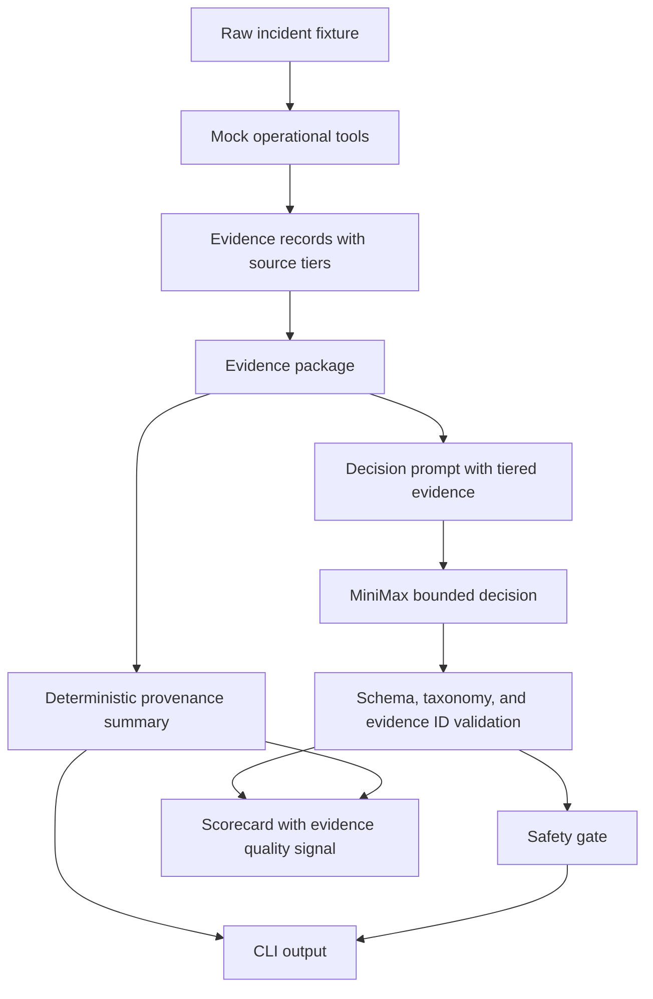

# feat: Add evidence source tiering and provenance output

## Summary

Add source-tier metadata to evidence records and expose a provenance summary in CLI output, prompts, and scorecards. This strengthens the existing triage PoC by making the quality of cited evidence visible without adding production integrations or expanding the decision taxonomy.

---

## Problem Frame

The current PoC validates that LLM decisions cite known evidence IDs, but it treats all evidence IDs as equal once validation passes. Incident triage needs a stronger distinction: a live verification signal, a deploy record, a runbook, and a prior incident can all be useful, but they should not carry the same weight.

This work improves the trust layer around the existing bounded workflow. The workflow should tell the model which sources are stronger, show the operator what kind of evidence supported the recommendation, and score whether decisions relied on appropriate evidence types.

---

## Requirements

**Evidence quality model**

- R1. Each evidence record carries a source tier derived by the workflow, not by the LLM.
- R2. Source tiers distinguish current incident signals, operational context, guidance context, and historical context.
- R3. Source tiering is deterministic and does not require fixture authors to annotate every evidence item manually.

**Prompt and decision grounding**

- R4. The decision prompt includes each evidence item's source tier so the model can prefer stronger current signals over historical support.
- R5. The evidence ID validation remains strict and continues to reject unknown or reformatted IDs.
- R6. No new freeform action, incident class, or production integration behavior is introduced.

**Operator visibility**

- R7. CLI output includes a provenance summary for every valid run.
- R8. Trace output includes source tiers beside individual evidence items.
- R9. Invalid or recoverable runs still show available provenance context when evidence was gathered.

**Evaluation**

- R10. Scorecards include an evidence quality check or note that distinguishes weak citation sets from unknown evidence IDs.
- R11. Tests cover source tier assignment, prompt rendering, CLI provenance output, and scoring behavior.

---

## Key Technical Decisions

- **Keep source tiering deterministic:** Source tiers belong on `Evidence` records and are assigned by mock operational tools from known source types. This preserves the architecture rule that the workflow owns evidence contracts.
- **Use four tiers instead of numeric weights:** Named tiers are easier to inspect in CLI output and safer to evolve than hidden scores. The initial tiers are `current_signal`, `operational_context`, `guidance`, and `historical_context`.
- **Show provenance outside the LLM decision:** The provenance summary should be computed from the evidence package and cited evidence IDs, not generated by the LLM. This keeps trust reporting deterministic.
- **Do not make prior incidents invalid evidence:** Historical evidence can support pattern matching, but it should not satisfy grounding requirements alone for high-confidence recommendations.
- **Keep this separate from Grafana ingestion:** Grafana webhooks are a later source of raw alerts. This plan improves the evidence contract that future ingestion should feed.

---

## High-Level Technical Design

The source tier mapping should start conservative:

| Evidence source | Source tier | Rationale |
| --- | --- | --- |
| `alert`, `symptom`, `verification` | `current_signal` | Directly describes the active incident or recovery condition. |
| `log`, `deploy`, `service` | `operational_context` | Explains current system context but may be indirect. |
| `runbook` | `guidance` | Provides approved response context but does not prove the current cause. |
| `prior_incident` | `historical_context` | Useful analogy, never sufficient by itself. |

---

## Scope Boundaries

- This plan does not add Grafana, Slack, PagerDuty, incident-management, or deployment integrations.
- This plan does not introduce team-defined incident classes or action vocabularies.
- This plan does not create full incident-class playbook files.
- This plan does not execute or simulate new action types.
- The untracked nested `src/incident_triage_agent/pyproject.toml` is unrelated and should not be included in this work unless separately cleaned up.

---

## Implementation Units

### U1. Add source tier domain model

- **Goal:** Extend evidence records with deterministic source-tier metadata.
- **Requirements:** R1, R2, R3
- **Dependencies:** None
- **Files:** `src/incident_triage_agent/domain.py`, `tests/test_domain.py`
- **Approach:** Add a small enum-like type for the four source tiers and a field on `Evidence`. Keep default construction explicit enough that tests catch untiered evidence.
- **Patterns to follow:** Reuse the existing `StrEnum` style used by `IncidentClass`, `NextAction`, and `WorkflowState`.
- **Test scenarios:**
  - Creating an evidence record with a valid source tier preserves the tier value.
  - The source tier values are stable strings suitable for prompts and CLI output.
  - Existing scenario loading remains unchanged because raw incident fixtures do not carry tier data.
- **Verification:** Domain tests prove source tiers are workflow metadata, not raw fixture hints.

### U2. Assign tiers in mock operational tools

- **Goal:** Ensure every tool-produced evidence item receives the correct source tier.
- **Requirements:** R1, R2, R3, R8
- **Dependencies:** U1
- **Files:** `src/incident_triage_agent/tools.py`, `tests/test_tools.py`
- **Approach:** Assign tiers at each evidence-construction boundary: alerts, symptoms, and verification as `current_signal`; logs, deploys, and service ownership as `operational_context`; runbooks as `guidance`; prior incidents as `historical_context`.
- **Patterns to follow:** Keep tool methods deterministic and preserve existing stable evidence IDs.
- **Test scenarios:**
  - Alert, symptom, and verification evidence are tiered as `current_signal`.
  - Log, deploy, and service evidence are tiered as `operational_context`.
  - Runbook evidence is tiered as `guidance`.
  - Prior incident evidence is tiered as `historical_context`.
  - Missing runbook and verification context still appear as missing context markers, not tiered fake evidence.
- **Verification:** The evidence package for each existing scenario contains no untiered evidence.

### U3. Compute deterministic provenance summaries

- **Goal:** Add a provenance summary derived from the evidence package and cited decision evidence.
- **Requirements:** R7, R9, R10
- **Dependencies:** U1, U2
- **Files:** `src/incident_triage_agent/domain.py`, `src/incident_triage_agent/scoring.py`, `tests/test_scoring.py`, `tests/test_workflow.py`
- **Approach:** Add a small summary structure or helper that reports available tiers, cited tiers, missing context, and whether cited evidence includes current or operational signals. Keep this deterministic and usable even when the LLM decision is invalid.
- **Patterns to follow:** Mirror the current scorecard style: compact, inspectable, and not LLM-graded.
- **Test scenarios:**
  - A valid dependency-outage decision citing alert, log, and runbook evidence reports current, operational, and guidance support.
  - A decision citing only prior incident evidence is reported as historical-only support.
  - A recoverable validation failure still reports available evidence tiers and missing context.
  - A scenario with missing verification context includes that missing context in the provenance summary.
- **Verification:** Provenance can be inspected from a `TriageRun` without parsing CLI text.

### U4. Add source tiers to prompt construction

- **Goal:** Tell the LLM how to interpret source strength while preserving strict output validation.
- **Requirements:** R4, R5, R6
- **Dependencies:** U1, U2
- **Files:** `src/incident_triage_agent/llm.py`, `tests/test_llm.py`
- **Approach:** Include tier labels in evidence lines and add a concise instruction that current signals and operational context should outweigh historical analogy. Do not ask the model to output a provenance field.
- **Patterns to follow:** Keep the prompt boundary style already added for mission, scope, exact evidence ID rules, and runbook/deploy guidance.
- **Test scenarios:**
  - The prompt renders each evidence line with both source and source tier.
  - The prompt states that historical context is supporting evidence only.
  - The prompt still includes the exact allowed evidence ID contract.
  - Existing validation still rejects unknown evidence IDs after tier labels are added.
- **Verification:** Prompt tests demonstrate tier guidance without expanding the response schema.

### U5. Render provenance in CLI output

- **Goal:** Make evidence quality visible to the operator in normal and trace CLI output.
- **Requirements:** R7, R8, R9
- **Dependencies:** U1, U2, U3
- **Files:** `src/incident_triage_agent/cli.py`, `tests/test_cli.py`
- **Approach:** Add a `Provenance` section after the LLM decision or invalid decision block. In trace mode, render individual evidence lines as `evidence_id [source/tier] summary`.
- **Patterns to follow:** Preserve the current CLI style: plain text, deterministic ordering, no secret values, and readable output for mock runs.
- **Test scenarios:**
  - A mock CLI run prints a provenance section with cited tiers and missing context when present.
  - Trace output includes source tiers beside evidence records.
  - Invalid LLM output still prints provenance based on gathered evidence.
  - CLI output does not include `.env` secrets or provider credentials.
- **Verification:** CLI tests assert the public output contract without requiring a MiniMax call.

### U6. Strengthen scoring and documentation

- **Goal:** Make scorecards and project docs explain why evidence quality matters.
- **Requirements:** R10, R11
- **Dependencies:** U3, U5
- **Files:** `src/incident_triage_agent/scoring.py`, `README.md`, `docs/learnings.md`, `tests/test_scoring.py`
- **Approach:** Add an `evidence_quality` score or a scorecard note that fails when a valid decision cites only historical context for a non-`unknown` incident class. Update documentation to explain source tiers as a trust feature, not a new model capability.
- **Patterns to follow:** Continue keeping scorecards deterministic and concise.
- **Test scenarios:**
  - A decision citing current and guidance evidence passes evidence quality.
  - A decision citing only prior incident evidence fails evidence quality or emits a clear scorecard note.
  - Existing scorecard categories still distinguish invalid output from weak grounding.
  - README output examples mention provenance without implying production readiness.
- **Verification:** Scorecards make weak evidence visible in the same run output the operator already reads.

---

## Acceptance Examples

- AE1. **Covers R1, R2, R7, R8.**
  - **Given:** A checkout latency scenario has alerts, logs, runbook context, prior incidents, and verification signals.
  - **When:** The operator runs the scenario with trace output.
  - **Then:** Each evidence item shows its source tier and the final output includes a provenance summary.

- AE2. **Covers R4, R5, R6.**
  - **Given:** The workflow builds the MiniMax prompt.
  - **When:** Evidence lines are rendered.
  - **Then:** The prompt includes source tiers while keeping the same allowed evidence ID and bounded decision contracts.

- AE3. **Covers R9, R10.**
  - **Given:** MiniMax returns malformed JSON after context has been gathered.
  - **When:** The workflow enters recoverable failure.
  - **Then:** The run still exposes available evidence tiers and missing context.

- AE4. **Covers R10, R11.**
  - **Given:** A valid decision cites only prior incident evidence for a concrete incident class.
  - **When:** The scorecard is produced.
  - **Then:** The scorecard flags weak evidence quality separately from unknown evidence ID validation.

---

## Risks & Dependencies

- **Prompt clutter:** Adding tier labels could make the prompt noisier. Keep the tier guidance short and test that the exact evidence ID list remains obvious.
- **False precision:** Source tiers should not imply mathematical confidence. They are trust categories for inspection and scoring.
- **Backwards compatibility:** Existing tests and mock decisions cite the same IDs, so tiering should preserve IDs and scenario fixture shapes.
- **Scorecard drift:** Adding `evidence_quality` changes scorecard expectations. Tests should assert category names and output readability.

---

## Sources & Research

- `docs/brainstorms/2026-06-14-incident-triage-agent-requirements.md` defines the raw-fixture, evidence-citation, traceability, safety, and scorecard requirements this plan extends.
- `docs/solutions/architecture-patterns/bounded-llm-incident-triage-workflow.md` records the core architecture rule: the workflow controls context, validation, safety, and scoring while the LLM contributes one bounded judgment.
- `src/incident_triage_agent/domain.py` currently defines `Evidence` and `EvidencePackage` without evidence-quality metadata.
- `src/incident_triage_agent/tools.py` is the right boundary for deterministic source-tier assignment because all evidence records are created there.
- `src/incident_triage_agent/cli.py` and `src/incident_triage_agent/scoring.py` are the existing operator-visible surfaces for trace output and trust evaluation.
