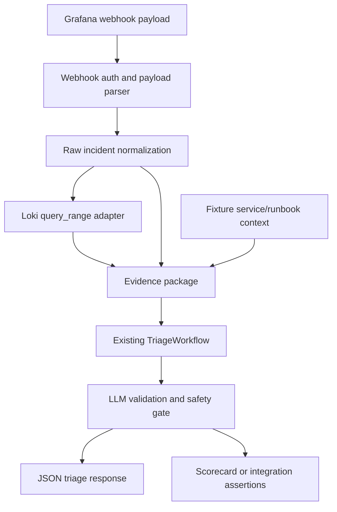

# feat: Add Grafana and Loki ingestion E2E path

## Summary

Extend the incident triage proof of concept from fixture-only CLI runs to a local observability-shaped integration path. The agent should accept a Grafana alert webhook, normalize it into raw incident facts, enrich it with bounded Loki log context, run the existing triage workflow, and prove the path with a Docker-based E2E test.

This plan keeps the current architecture boundary intact: Grafana and Loki provide facts, while the workflow derives the incident class, next action, safety result, provenance, and scorecard.

---

## Problem Frame

The current project proves the core agent architecture with static fixture scenarios. That is useful for repeatability, but it does not yet prove that the architecture can ingest the shape of real observability systems.

The next useful proof is not a production integration. It is a local integration harness that uses Grafana-shaped alert payloads and Loki log queries while preserving the raw-data constraint from the origin requirements. This matters because alert payloads and logs are operational evidence, but they should not be allowed to smuggle in suspected causes, recommended actions, or approval hints.

---

## Requirements

**Grafana alert ingestion**

- R1. The agent must expose a local HTTP endpoint that accepts Grafana webhook alert payloads without requiring the CLI scenario loader.
- R2. The webhook path must validate request authenticity through a local shared secret or equivalent test-only guard.
- R3. The Grafana payload parser must preserve alert facts from `alerts`, `labels`, `annotations`, `startsAt`, `endsAt`, `values`, `fingerprint`, and Grafana URLs where present.
- R4. The normalization layer must reject or ignore answer-like fields that would violate the raw incident contract from the origin requirements.
- R5. Resolved Grafana alerts must not trigger a fresh active incident triage recommendation by default.

**Loki enrichment**

- R6. The integration path must query Loki for bounded log context using service labels and an alert-relative time window.
- R7. Loki evidence must be represented as `Evidence` with stable IDs, `source="log"`, and `SourceTier.OPERATIONAL_CONTEXT`.
- R8. Loki queries must be bounded by time range and result limit so the prompt cannot grow unbounded.
- R9. Missing, empty, or unreachable Loki results must become explicit missing context instead of breaking the whole workflow.

**Workflow integration**

- R10. Grafana-derived incidents must flow through the same LLM decision validation, safety gate, provenance output, and bounded decision taxonomy as fixture scenarios.
- R11. The integration path must keep eval expectations separate from raw webhook payloads.
- R12. The endpoint response must include the triage decision, safety gate result, provenance summary, and any validation or missing-context errors in machine-readable JSON.
- R13. The default integration test path must use the mock LLM so it is deterministic and does not require MiniMax credentials.

**Docker E2E**

- R14. The repo must include a Docker Compose test stack with the agent endpoint, Grafana, Loki, and a deterministic log seeding path.
- R15. The E2E test must push synthetic logs to Loki, deliver a Grafana-shaped alert to the agent, and assert that the resulting triage output cites Grafana and Loki evidence.
- R16. The E2E path must be runnable with `uv` locally and with Docker, matching the project tooling constraints in `AGENTS.md`.

---

## Key Technical Decisions

- KTD1. **Add ingestion beside the CLI, not inside the CLI.** The CLI remains the fixture demo surface, while `POST /webhooks/grafana` becomes the integration surface. This avoids bending the scenario loader around webhook semantics.
- KTD2. **Normalize Grafana payloads into raw incident facts.** Grafana fields become alert, symptom, service, and verification facts; they do not become suspected causes or recommended actions. This preserves R1-R3 from the origin requirements.
- KTD3. **Use Loki as an evidence adapter, not as a second decision engine.** Loki log lines become operational context evidence with stable IDs. The LLM still receives one evidence package and the workflow still owns validation, safety, and scoring.
- KTD4. **Start with synchronous endpoint responses.** A synchronous JSON response is enough for the PoC and simpler to test. Queues, retries, and async status polling can come later if the endpoint becomes production-shaped.
- KTD5. **Keep the default E2E deterministic.** The E2E should use the mock LLM by default and reserve live MiniMax for an opt-in smoke test. The integration proof should not fail because a provider call varied.
- KTD6. **Separate runtime output from eval metadata.** Real Grafana webhooks do not contain expected classes or expected actions. Integration tests may assert expected outcomes in test code or companion fixtures, but that metadata must not enter the agent as incident evidence.
- KTD7. **Use local synthetic observability first.** The Docker stack should prove the integration shape without using production Grafana, Grafana Cloud, real services, or private logs.

---

## High-Level Technical Design

Grafana alert data maps primarily to `SourceTier.CURRENT_SIGNAL`. Loki log results map to `SourceTier.OPERATIONAL_CONTEXT`. Existing service ownership fixtures remain operational context, and runbooks remain `SourceTier.GUIDANCE`.

The local Docker E2E should exercise the same flow the endpoint uses. If Grafana scheduler behavior makes the first E2E too slow or flaky, the first test can post a recorded default Grafana webhook payload while the Compose stack still runs Grafana and Loki. A later hardening pass can add a scheduler-driven Grafana notification test.

---

## Implementation Units

### U1. Integration Configuration And HTTP Surface

- **Goal:** Add a minimal HTTP entrypoint for Grafana webhook requests.
- **Files:** `src/incident_triage_agent/server.py`, `src/incident_triage_agent/config.py`, `pyproject.toml`, `.env.example`, `tests/test_server.py`.
- **Patterns:** Follow `src/incident_triage_agent/cli.py` for config loading, Loguru setup, secret-safe errors, and mock-vs-live LLM selection.
- **Test Scenarios:**
  - `POST /webhooks/grafana` rejects missing or invalid webhook secret.
  - The endpoint returns structured JSON for a valid active alert payload.
  - The endpoint returns a non-2xx structured error for malformed JSON.
  - Endpoint logs include request phase and scenario or incident ID without printing secrets.
- **Verification:** `uv run python -m unittest tests/test_server.py`.

### U2. Grafana Payload Parser And Raw Incident Normalizer

- **Goal:** Convert Grafana default webhook payloads into raw `Incident` facts without adding derived answers.
- **Files:** `src/incident_triage_agent/grafana.py`, `src/incident_triage_agent/domain.py`, `tests/test_grafana.py`, `fixtures/grafana/checkout-payment-timeout-webhook.json`.
- **Patterns:** Reuse `validate_raw_incident_payload` so Grafana ingestion honors the same prohibited-field contract as fixture loading.
- **Test Scenarios:**
  - Active alert payloads produce incident ID, title, status, started time, service, alerts, symptoms, and verification signals.
  - Grouped alerts preserve multiple alert facts with stable evidence-friendly ordering.
  - Resolved-only payloads return a non-triage result or explicit ignored status.
  - Payloads with answer-like custom annotations are rejected or excluded from incident facts.
  - Missing service labels produce `insufficient_context`-friendly missing context rather than a parser crash.
- **Verification:** `uv run python -m unittest tests/test_grafana.py`.

### U3. Loki Client And Log Evidence Adapter

- **Goal:** Fetch bounded log context from Loki and represent it as operational evidence.
- **Files:** `src/incident_triage_agent/loki.py`, `src/incident_triage_agent/tools.py`, `tests/test_loki.py`.
- **Patterns:** Follow `MockOperationalTools.log_evidence` for evidence IDs and source tier assignment.
- **Test Scenarios:**
  - `query_range` requests include service label filters, start time, end time, limit, and direction.
  - Loki stream responses become stable `log:<index>` evidence records.
  - Empty Loki responses mark log context as missing when logs are required.
  - HTTP errors, timeouts, and invalid Loki JSON produce bounded missing context and safe logs.
  - High-volume responses are truncated before prompt assembly.
- **Verification:** `uv run python -m unittest tests/test_loki.py`.

### U4. External Evidence Package Builder

- **Goal:** Build an `EvidencePackage` from normalized Grafana incidents plus Loki results and existing fixture-backed service/runbook context.
- **Files:** `src/incident_triage_agent/tools.py`, `src/incident_triage_agent/domain.py`, `tests/test_tools.py`, `tests/test_workflow.py`.
- **Patterns:** Extend the existing evidence package shape rather than creating a second prompt contract.
- **Test Scenarios:**
  - Grafana alert evidence uses `SourceTier.CURRENT_SIGNAL`.
  - Loki logs, service ownership, and deploy-like operational facts use `SourceTier.OPERATIONAL_CONTEXT`.
  - Runbook references still use `SourceTier.GUIDANCE`.
  - Missing service ownership, runbook, or Loki logs appear in `EvidencePackage.missing_context`.
  - Provenance summary includes both available and cited tiers for integration evidence.
- **Verification:** `uv run python -m unittest tests/test_tools.py tests/test_workflow.py`.

### U5. Workflow Response And Eval Boundary

- **Goal:** Let integration runs return useful triage JSON without pretending every live webhook has fixture-style expected answers.
- **Files:** `src/incident_triage_agent/workflow.py`, `src/incident_triage_agent/scoring.py`, `src/incident_triage_agent/domain.py`, `src/incident_triage_agent/cli.py`, `tests/test_workflow.py`, `tests/test_scoring.py`.
- **Patterns:** Preserve the current scorecard for fixture scenarios, but allow integration runs to omit expectation-dependent checks or keep expectations in test-only fixtures.
- **Test Scenarios:**
  - Fixture scenarios still produce the existing scorecard checks.
  - Integration runs without eval expectations still return validation, safety, provenance, and decision data.
  - Integration tests can assert expected class/action outside the raw Grafana payload.
  - Invalid LLM decisions still enter `RECOVERABLE_FAILURE`.
  - Safety-gated actions remain recommendations only.
- **Verification:** `uv run python -m unittest tests/test_workflow.py tests/test_scoring.py`.

### U6. Docker Compose Observability E2E

- **Goal:** Prove the integration path through local containers.
- **Files:** `docker-compose.yml`, `Dockerfile`, `tests/test_e2e_grafana_loki.py`, `fixtures/grafana/checkout-payment-timeout-webhook.json`, `scripts/seed_loki_logs.py`, `README.md`.
- **Patterns:** Keep Docker aligned with the existing package entrypoint and `uv` workflow from `AGENTS.md`.
- **Test Scenarios:**
  - Compose starts the agent endpoint, Loki, and Grafana.
  - The test pushes synthetic checkout or payment logs into Loki.
  - The test delivers a Grafana-shaped webhook payload to the agent endpoint.
  - The response cites at least one Grafana alert evidence ID and one Loki log evidence ID.
  - The response includes source-tier provenance and a non-mutating safety result unless the selected action requires approval.
- **Verification:** `uv run python -m unittest tests/test_e2e_grafana_loki.py`.

### U7. Documentation And Learning Updates

- **Goal:** Make the new integration path understandable without turning it into production guidance.
- **Files:** `README.md`, `AGENTS.md`, `CONCEPTS.md`, `docs/learnings.md`, `docs/solutions/architecture-patterns/bounded-llm-incident-triage-workflow.md`.
- **Patterns:** Keep `README.md` operational and keep `docs/learnings.md` teaching-oriented.
- **Test Scenarios:**
  - README commands use `uv` and Docker.
  - Docs state that production Grafana Cloud, real logs, and real action execution are out of scope.
  - Learning checklist explains why ingestion is facts-only and why eval expectations stay out of webhook payloads.
- **Verification:** Documentation review plus full test suite: `uv run python -m unittest discover -s tests`.

---

## Acceptance Examples

- AE1. **Covers R1, R3, R10, R12.**
  - **Given:** Grafana sends an active checkout latency webhook with service labels, alert annotations, values, and dashboard links.
  - **When:** The agent receives the webhook.
  - **Then:** The endpoint returns a bounded triage decision with evidence IDs, safety result, provenance summary, and no production action execution.

- AE2. **Covers R6, R7, R8, R15.**
  - **Given:** Synthetic Loki logs exist for the alerted service in the alert time window.
  - **When:** The integration path queries Loki.
  - **Then:** The triage output can cite `log:<index>` evidence with `operational_context` provenance.

- AE3. **Covers R4, R11, R13.**
  - **Given:** A Grafana annotation includes answer-like text such as a suspected cause or recommended rollback.
  - **When:** The parser normalizes the payload.
  - **Then:** That text is excluded or rejected before evidence package construction, and expected class/action assertions remain in test code.

- AE4. **Covers R5, R9.**
  - **Given:** Grafana sends a resolved-only payload or Loki is unavailable.
  - **When:** The endpoint processes the request.
  - **Then:** The workflow returns a bounded ignored or missing-context response rather than inventing certainty.

---

## Scope Boundaries

- Production Grafana, Grafana Cloud, and private service logs are out of scope for the default E2E.
- Real remediation execution, deploy rollback, feature-flag mutation, Slack paging, and ticket creation remain out of scope.
- Team-defined incident classes and action vocabularies remain deferred.
- A web UI remains out of scope.
- A durable queue, database, retry worker, and async status API are deferred until the webhook path proves useful.
- Scheduler-driven Grafana alert firing is optional hardening; the first E2E can use a recorded Grafana default webhook payload if it keeps the test deterministic.

---

## System-Wide Impact

This work changes the project from a fixture-only CLI proof to a two-surface PoC: CLI scenarios for repeatable architecture demos and an HTTP webhook path for observability-shaped integration. The core workflow, bounded taxonomy, validation, safety gate, and provenance contract should stay shared between both surfaces.

The main design risk is accidental contract drift. If Grafana annotations, Loki logs, or integration test metadata become trusted as derived answers, the project stops proving model reasoning over raw incident data. The implementation should therefore keep parser normalization, evidence construction, LLM decision output, and eval assertions visibly separate.

---

## Risks And Dependencies

| Risk | Impact | Mitigation |
| --- | --- | --- |
| Grafana scheduler E2E is flaky or slow | CI and local test reliability suffer | Start with recorded Grafana default payload plus local Loki, then add scheduler-driven coverage as optional hardening |
| Webhook annotations contain answer-like text | Raw-data contract weakens | Reuse prohibited-field validation and maintain an allowlist of fields used as facts |
| Loki returns too much text | Prompt quality and latency degrade | Enforce query limits, time windows, and truncation before evidence package construction |
| Integration runs lack fixture expectations | Scorecard can misrepresent live webhook quality | Keep fixture scorecards unchanged and treat integration expected outcomes as test assertions, not incident evidence |
| New HTTP dependency grows the project | PoC complexity increases | Prefer a minimal standard-library server first unless implementation discovers a clear need for a framework |

---

## Sources And Research

- `docs/brainstorms/2026-06-14-incident-triage-agent-requirements.md` for raw-data, bounded-decision, safety, and eval constraints.
- `docs/plans/2026-06-14-001-feat-incident-triage-agent-plan.md` for the original implementation shape.
- `docs/plans/2026-06-16-001-feat-evidence-provenance-plan.md` for source tiering and provenance constraints.
- Grafana webhook notifier documentation for default webhook payload fields such as `receiver`, `status`, `alerts`, `labels`, `annotations`, `startsAt`, `endsAt`, `values`, `fingerprint`, `dashboardURL`, `panelURL`, `groupKey`, and `truncatedAlerts`.
- Loki HTTP API documentation for `/loki/api/v1/push` and `/loki/api/v1/query_range` request and response shape.
