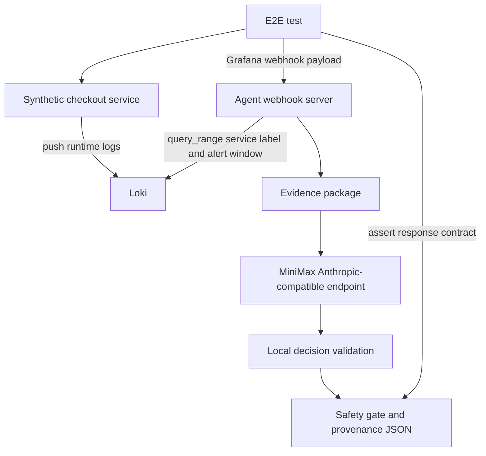

# feat: Add live service and LLM E2E

## Summary

Extend the Grafana/Loki integration proof so the E2E path uses a real local service to generate incident logs and a real MiniMax call for the triage decision. The default test suite should stay deterministic, while the live-provider E2E becomes an explicit opt-in validation path for proving the architecture with real service behavior and real model variance.

---

## Problem Frame

The current Docker E2E proves that Grafana-shaped alerts and Loki log evidence can reach the agent, but the logs are seeded by a helper script and the decision comes from a mock LLM. That proves the integration contract, not the full architecture under live conditions.

The next step should prove a stronger loop: a running service produces logs in response to traffic, those logs reach Loki, Grafana-shaped alert data triggers the webhook, the agent gathers the service-generated log evidence, and MiniMax returns a bounded decision that local validation and safety policy can accept or reject.

This should remain a local PoC. The plan does not introduce production Grafana, private service logs, real remediation, paging, tickets, deploy rollback, or feature-flag mutation.

---

## Requirements

**Synthetic service behavior**

- R1. The E2E stack must include a real local service that exposes at least one HTTP endpoint and generates checkout/payment incident logs when called.
- R2. The service must send its generated logs to Loki with labels that the existing `LokiClient` can query, including `service="checkout-api"`.
- R3. The service must provide a health or readiness endpoint so tests can wait for it without relying on sleep-only timing.
- R4. The service logs must be derived from runtime requests, not pre-seeded by `scripts/seed_loki_logs.py`.

**Live MiniMax decision path**

- R5. The live E2E must run the agent without `--mock-llm`.
- R6. MiniMax credentials and model configuration must come from `.env` or environment variables without copying secrets into images, logs, docs, fixtures, or test failure output.
- R7. The live E2E must skip cleanly when required credentials are absent or when the explicit live-test environment flag is not set.
- R8. The live E2E must assert the workflow receives a schema-valid bounded decision, not just an HTTP 200 response.

**E2E assertions and safety**

- R9. The live E2E must prove the triage response cites at least one Grafana alert evidence ID and one Loki log evidence ID generated by the service.
- R10. The live E2E must assert provenance includes `current_signal` and `operational_context`.
- R11. The live E2E must assert that safety policy still prevents real action execution.
- R12. The existing mock Docker E2E and default unit suite must remain deterministic and must not require MiniMax credentials, network access to MiniMax, or live LLM spend.

---

## Key Technical Decisions

- KTD1. **Add a synthetic service, not a production dependency.** The service should behave like a tiny checkout API, but its only job is to generate realistic incident log evidence locally.
- KTD2. **Have the service push logs to Loki directly.** This avoids introducing Promtail or another log collector in this increment while still ensuring logs originate from a running service and runtime request path.
- KTD3. **Keep the live MiniMax path opt-in.** The default suite remains mock-driven. The live test should require a flag such as `RUN_LIVE_LLM_E2E=1` plus real MiniMax config, because live model calls are slower, cost-bearing, and can vary.
- KTD4. **Keep mock and live Compose paths separate.** The existing mock E2E remains the fast integration proof. A Compose override or profile should run the agent without `--mock-llm` for live validation.
- KTD5. **Assert contracts, not exact model wording.** The live E2E should require valid bounded schema, known evidence citations, provenance, and safety behavior. Exact `incident_class` or `next_action` assertions may be too brittle unless implementation proves MiniMax is stable enough for this scenario.
- KTD6. **Keep secrets outside Docker build context.** The Dockerfile and `.dockerignore` already avoid copying `.env`; the live Compose path should pass secrets at runtime with `env_file` or environment variables.

---

## High-Level Technical Design

The synthetic service owns incident-log generation. The agent still owns evidence assembly, MiniMax prompting, schema validation, safety policy, and response rendering. The E2E test orchestrates the scenario but does not inject expected class/action data into the webhook payload.

---

## Implementation Units

### U1. Synthetic Checkout Service

- **Goal:** Add a small local service that generates checkout/payment logs from real HTTP requests and pushes them to Loki.
- **Requirements:** R1, R2, R3, R4.
- **Dependencies:** None.
- **Files:** `services/synthetic_checkout_service.py`, `tests/test_synthetic_checkout_service.py`, `docker-compose.yml`, `README.md`.
- **Approach:** Use the Python standard library to keep dependencies small. The service should expose a health endpoint and an incident endpoint that emits payment-timeout style log lines to Loki with service labels.
- **Patterns to follow:** Use the existing `scripts/seed_loki_logs.py` Loki push payload shape. Keep generated data synthetic and avoid secrets in logs.
- **Test scenarios:**
  - A health request returns a successful response without pushing incident logs.
  - A checkout incident request pushes at least two timestamped log lines to the configured Loki URL.
  - Loki push failures produce a non-secret error response or bounded failure result.
  - Generated log payloads include `stream` labels compatible with the current `LokiClient` query.
- **Verification:** Unit tests prove request handling and Loki push payload construction without needing Docker.

### U2. Compose Live Stack

- **Goal:** Add a Docker Compose path that runs Loki, Grafana, the synthetic checkout service, and the agent in live-LLM mode.
- **Requirements:** R1, R2, R5, R6, R7, R12.
- **Dependencies:** U1.
- **Files:** `docker-compose.yml`, `docker-compose.live.yml`, `.env.example`, `README.md`, `AGENTS.md`.
- **Approach:** Keep the existing mock Compose path intact. Add an override or profile that removes `--mock-llm`, passes MiniMax config at runtime, and wires the synthetic service to Loki.
- **Patterns to follow:** Preserve the current Dockerfile entrypoint and `.dockerignore` secret boundary. Follow the existing `agent` service structure rather than creating a second image.
- **Test scenarios:**
  - The mock Compose path still starts with `--mock-llm`.
  - The live Compose path starts the agent without `--mock-llm`.
  - MiniMax config is passed at runtime and is not copied into the image.
  - Missing live credentials cause the live E2E test to skip, not fail with secret-bearing output.
- **Verification:** Compose config inspection or test helpers confirm service commands and environment behavior.

### U3. Live E2E Test Flow

- **Goal:** Add an opt-in E2E test that drives the synthetic service, posts a Grafana webhook, and verifies the live MiniMax-backed response.
- **Requirements:** R4, R5, R7, R8, R9, R10, R11, R12.
- **Dependencies:** U1, U2.
- **Files:** `tests/test_e2e_real_service_live_llm.py`, `fixtures/grafana/checkout-payment-timeout-webhook.json`, `README.md`.
- **Approach:** The test should require `RUN_LIVE_LLM_E2E=1`, Docker, and MiniMax config. It should call the synthetic service to generate logs, post the Grafana payload with a current `startsAt`, then assert the agent returns a validated decision with alert and log citations.
- **Patterns to follow:** Follow `tests/test_e2e_grafana_loki.py` for Compose lifecycle, cleanup, current alert timestamp handling, and JSON response assertions.
- **Test scenarios:**
  - Without `RUN_LIVE_LLM_E2E=1`, the test is skipped.
  - Without MiniMax config, the test is skipped without printing secret values.
  - With Docker, MiniMax config, and the live flag, the test generates service logs before posting the alert.
  - The response includes `validation.valid=true`, a bounded `incident_class`, a bounded `next_action`, `alert:<index>` citation, `log:<index>` citation, current/operational provenance, and no executed action.
  - If MiniMax returns invalid output, the response remains a recoverable workflow result rather than a crash.
- **Verification:** The live E2E passes when explicitly enabled in an environment with MiniMax credentials.

### U4. Response Contract Hardening For Live Variance

- **Goal:** Ensure tests and endpoint responses can distinguish live model variance from actual workflow failure.
- **Requirements:** R8, R9, R10, R11.
- **Dependencies:** U3.
- **Files:** `src/incident_triage_agent/server.py`, `src/incident_triage_agent/llm.py`, `tests/test_server.py`, `tests/test_llm.py`.
- **Approach:** Keep the existing validation boundary as the authority. Add response fields or assertions only if the current JSON lacks enough signal to prove validation, cited evidence, and safety behavior.
- **Patterns to follow:** Preserve the current `ValidationResult`, `SafetyResult`, and provenance response shape. Avoid adding model-output fields that duplicate deterministic workflow state.
- **Test scenarios:**
  - Valid MiniMax-style responses expose `validation.valid=true` and decision fields.
  - Invalid provider output exposes validation errors without unsafe action execution.
  - Response JSON does not include raw provider prompt, API key, or secret-bearing request data.
- **Verification:** Server and LLM tests prove the response contract used by the live E2E.

### U5. Documentation And Learning Updates

- **Goal:** Document how to run the real-service/live-LLM path safely and explain why it remains opt-in.
- **Requirements:** R6, R7, R11, R12.
- **Dependencies:** U1, U2, U3.
- **Files:** `README.md`, `AGENTS.md`, `CONCEPTS.md`, `docs/learnings.md`, `docs/solutions/architecture-patterns/bounded-llm-incident-triage-workflow.md`.
- **Approach:** Add commands and guardrails for live E2E without encouraging production use. Explain the difference between mock E2E, real-service mock-LLM E2E, and real-service live-LLM E2E.
- **Patterns to follow:** Keep `README.md` operational and `docs/learnings.md` teaching-oriented.
- **Test scenarios:**
  - Docs name the required flags and env vars without showing real secrets.
  - Docs state that live E2E may cost money and may vary because it calls MiniMax.
  - Docs preserve the boundary that no remediation is executed.
- **Verification:** Documentation review plus default test suite.

---

## Acceptance Examples

- AE1. **Covers R1, R2, R4, R9.**
  - **Given:** The live E2E stack is running.
  - **When:** The test calls the synthetic checkout service incident endpoint.
  - **Then:** Loki receives log lines for `service="checkout-api"` and the agent can cite them as `log:<index>` evidence.

- AE2. **Covers R5, R6, R7, R8.**
  - **Given:** `RUN_LIVE_LLM_E2E=1` and MiniMax config are present.
  - **When:** The live E2E posts the Grafana payload to the agent.
  - **Then:** The agent calls MiniMax through the Anthropic-compatible adapter and returns a locally validated bounded decision.

- AE3. **Covers R11, R12.**
  - **Given:** The live model recommends any bounded next action.
  - **When:** The workflow applies safety policy.
  - **Then:** The response shows no real remediation execution and the default mock suite still runs without MiniMax credentials.

---

## Scope Boundaries

- Production Grafana, Grafana Cloud, and private logs remain out of scope.
- Promtail or Docker log scraping is deferred; direct Loki push from the synthetic service is enough for this increment.
- Real remediation, deploy rollback, feature-flag mutation, paging, ticketing, and Slack integrations remain out of scope.
- The live E2E is not a default CI gate unless a future decision explicitly budgets provider cost, secrets, and expected variance.
- Exact live model classification and action may be asserted later only if repeated runs prove the scenario is stable enough.

---

## System-Wide Impact

This change turns the E2E suite into a two-tier validation system. The default tier remains deterministic and cheap. The live tier proves the full architecture under more realistic conditions: service-generated logs, Loki lookup, webhook ingestion, MiniMax response handling, validation, safety, and provenance.

The main risk is confusing a live provider smoke test with deterministic regression coverage. The plan keeps the live path opt-in so provider latency, cost, network failures, and model variance do not destabilize ordinary development.

---

## Risks And Dependencies

| Risk | Impact | Mitigation |
| --- | --- | --- |
| Live MiniMax output varies | Exact class/action assertions may be flaky | Assert bounded validation, evidence citations, provenance, and safety first |
| MiniMax credentials leak through Compose or logs | Secret exposure | Use runtime env only, keep `.env` out of build context, and redact errors |
| Synthetic service fails to push logs before alert time window | E2E misses log evidence | Generate logs immediately before posting the alert and use current timestamps |
| Live E2E adds cost and latency | Developers avoid running tests or CI becomes slow | Keep `RUN_LIVE_LLM_E2E=1` opt-in |
| Direct Loki push is less production-like than log scraping | Reduced realism | Accept for this increment; defer Promtail or collector-based logging |

---

## Sources And Research

- `docs/plans/2026-06-16-002-feat-grafana-loki-ingestion-e2e-plan.md` for the current webhook and Loki integration baseline.
- `docs/brainstorms/2026-06-14-incident-triage-agent-requirements.md` for the raw-data, bounded-decision, safety, and eval constraints.
- `docs/solutions/architecture-patterns/bounded-llm-incident-triage-workflow.md` for the architecture pattern to preserve.
- MiniMax Anthropic-compatible API documentation confirms `/anthropic/v1/messages`, model names such as `MiniMax-M2.7`, and `X-Api-Key` authentication.
- Existing `docker-compose.yml`, `tests/test_e2e_grafana_loki.py`, and `scripts/seed_loki_logs.py` provide the local Docker and Loki patterns this plan extends.
