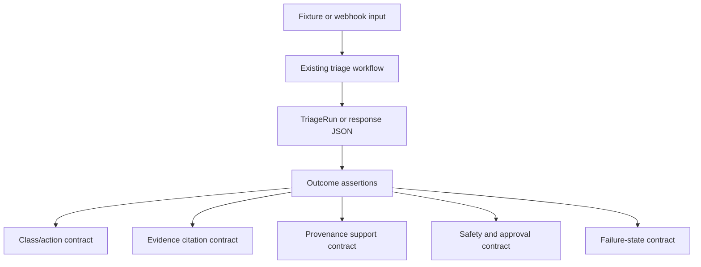

# test: Add outcome-based triage suite

## Summary

Add an outcome-focused test layer that verifies what a triage run proves to an operator: a bounded classification, a bounded next action, cited evidence, provenance, safety behavior, and recoverable failure handling. The suite should preserve the deterministic default path while making Docker and live-provider tests assert broad contracts instead of exact model prose.

---

## Problem Frame

The project already has strong unit tests, scorecards, webhook tests, Docker E2E coverage, and an opt-in live MiniMax E2E. The remaining gap is that the expected operational outcomes are spread across many files and assertion styles. That makes future refactors or agent-loop experiments harder to evaluate because each test has to rediscover what "good triage" means.

Outcome-based tests should become the contract layer above implementation details. They should not assert prompt wording, exact caveat prose, or every internal workflow step. They should assert the stable promise of the system: the workflow produces a safe, grounded, bounded triage recommendation or fails in a legible recoverable way.

This plan does not change triage behavior, model prompts, provider calls, scorecard semantics, safety policy, or public APIs.

---

## Requirements

**Outcome contracts**

- R1. The suite must define reusable assertions for valid triage decisions, bounded incident classes, bounded next actions, evidence citations, provenance tiers, safety status, approval behavior, missing context, and recoverable provider failures.
- R2. Default outcome tests must cover the main fixture classes: dependency outage, bad deploy, capacity saturation, and noisy alert.
- R3. Outcome tests must cover at least one missing-context run and one invalid LLM output run.
- R4. Outcome tests must verify webhook response outcomes from Grafana-shaped payloads and Loki-shaped evidence without relying on live model wording.

**Stability and execution**

- R5. The default suite must remain deterministic and must not require Docker, MiniMax credentials, or network access to MiniMax.
- R6. Live MiniMax E2E assertions must stay broad enough to tolerate provider wording variance while still enforcing schema, citations, provenance, and safety.
- R7. Outcome tests must not duplicate the scorecard implementation or make exact caveats and verification-plan prose part of the stable contract.
- R8. Public APIs, CLI behavior, webhook response behavior, and workflow behavior must remain stable.

**Documentation and teaching**

- R9. Documentation must explain when to add an outcome test instead of a unit test, scorecard check, Docker E2E test, or live provider test.
- R10. Learning docs must explain why evidence, provenance, safety, and recoverable failure are part of the product outcome rather than supporting metadata.

---

## Key Technical Decisions

- KTD1. **Create assertion vocabulary instead of snapshots:** Shared helpers make outcome intent readable while avoiding brittle full-output snapshots.
- KTD2. **Keep deterministic outcomes in the default suite:** Fixture and webhook outcome tests should use static LLM responses so every developer can run them cheaply and reliably.
- KTD3. **Treat live MiniMax as contract smoke coverage:** Live tests should assert bounded schema, evidence citations, provenance, and safety, not exact explanatory text.
- KTD4. **Assert provenance and safety as first-class outcomes:** A correct class/action pair is not enough if the recommendation lacks current or operational support, requires approval incorrectly, or hides missing context.
- KTD5. **Build on `TriageRun`, response JSON, and `Scorecard`:** The new tests should compose existing runtime objects instead of inventing a parallel evaluator.
- KTD6. **Stay on stdlib `unittest`:** The project already uses `unittest`; introducing pytest is a separate migration, not part of this behavior-preserving test pass.

---

## High-Level Technical Design

The helper layer should read like the domain language of the project. A test should be able to say that a run produced a dependency-outage escalation supported by current and operational evidence, or that an invalid provider response failed recoverably without safety action. The helper does not decide whether the LLM was "right" in a new way; it verifies that existing workflow, validation, safety, provenance, and scorecard surfaces express the intended outcome.

---

## Implementation Units

### U1. Add Outcome Assertion Helpers

- **Goal:** Centralize readable assertions for triage outcomes.
- **Requirements:** R1, R5, R7.
- **Dependencies:** None.
- **Files:** `tests/support/__init__.py`, `tests/support/outcomes.py`, `tests/test_outcome_helpers.py`.
- **Approach:** Add helpers that accept either `TriageRun` objects or response JSON, or split those into two small helper families if one abstraction becomes unclear. Helpers should check existing fields such as validation, decision, evidence IDs, provenance, safety, scorecard, and workflow states.
- **Patterns to follow:** Follow existing `unittest` assertions in `tests/test_workflow.py`, `tests/test_server.py`, and `tests/test_scoring.py`. Keep failure messages specific enough that a failed outcome names the missing class, action, source tier, evidence source, or safety status.
- **Test scenarios:**
  - A valid `TriageRun` passes class, action, citation, provenance, safety, and scorecard helper checks.
  - A valid webhook response JSON passes the same semantic checks through response-shaped helpers.
  - A helper failure names the expected and actual class, action, source tier, or state.
  - A recoverable invalid run passes failure-oriented helpers and fails valid-decision helpers.
- **Verification:** Helper tests pass and existing default tests do not need behavior changes.

### U2. Add Deterministic Fixture Outcome Tests

- **Goal:** Express the stable expected outcomes for the main incident classes in one outcome-focused suite.
- **Requirements:** R2, R5, R7, R8.
- **Dependencies:** U1.
- **Files:** `tests/test_triage_outcomes.py`, `tests/support/outcomes.py`.
- **Approach:** Use existing fixture scenarios and `StaticLLMClient` responses to run the workflow deterministically. Assert class/action, cited evidence source types, source-tier support, safety status, and scorecard pass/fail intent.
- **Patterns to follow:** Use `TriageWorkflow`, `load_scenario`, `StaticLLMClient`, and existing mock-decision patterns from `tests/test_workflow.py` and `tests/test_cli.py`.
- **Test scenarios:**
  - `checkout-payment-timeout` produces `dependency_outage`, `escalate_owner`, current/operational support, and a safe recommendation.
  - A bad deploy scenario produces `bad_deploy`, `request_rollback_approval`, approval-required safety, and no executed remediation.
  - A capacity saturation scenario produces `capacity_saturation`, a bounded approval-sensitive or owner-escalation action matching fixture expectations, and cited current/operational evidence.
  - A noisy alert scenario produces `noisy_alert`, `continue_monitoring`, and a non-mutating safety result.
- **Verification:** The new tests pass in the default `unittest` suite without Docker or MiniMax credentials.

### U3. Add Missing-Context And Invalid-Decision Outcome Tests

- **Goal:** Prove bad or weak runs remain legible and safe.
- **Requirements:** R3, R5, R7, R8.
- **Dependencies:** U1.
- **Files:** `tests/test_triage_outcomes.py`, `tests/support/outcomes.py`.
- **Approach:** Reuse existing workflow and validation failure scenarios, but assert the outcome contract rather than only individual fields. Missing critical context should route toward human input or context gathering. Invalid model output should enter recoverable failure, preserve scorecard visibility, and avoid safety action.
- **Patterns to follow:** Follow the recoverable-failure tests in `tests/test_workflow.py` and validation tests in `tests/test_llm.py`.
- **Test scenarios:**
  - Malformed provider output reaches `RECOVERABLE_FAILURE`, has validation errors, has a scorecard, and has no safety action.
  - Unknown evidence IDs fail grounding and do not produce a trusted valid decision.
  - Missing critical context routes to `HUMAN_INPUT_NEEDED` or the existing missing-context terminal behavior.
  - Historical-only or insufficiently supported citations fail evidence-quality expectations without crashing the workflow.
- **Verification:** Failure-oriented outcomes pass in the default suite and do not alter current scorecard semantics.

### U4. Add Webhook Response Outcome Tests

- **Goal:** Verify Grafana/Loki-shaped inputs satisfy the same outcome contract as fixture runs.
- **Requirements:** R1, R4, R5, R7, R8.
- **Dependencies:** U1.
- **Files:** `tests/test_webhook_outcomes.py`, `tests/support/outcomes.py`, `tests/test_server.py`.
- **Approach:** Call `handle_grafana_webhook` with synthetic payloads, fake Loki evidence, and static LLM output. Assert response JSON contains a valid bounded decision, alert and log citations, provenance support, safety result, and scorecard shape appropriate for external runs.
- **Patterns to follow:** Follow `tests/test_server.py` for webhook auth, response JSON shape, and provenance assertions.
- **Test scenarios:**
  - Active checkout webhook response includes `validation.valid=true`, bounded class/action, alert citation, log citation, current and operational provenance, and safe non-execution.
  - Resolved webhook payload produces the existing ignored response rather than a triage recommendation.
  - Loki missing or empty results surface missing context rather than endpoint failure.
  - Invalid static LLM output produces a recoverable response with validation errors and no safety action.
- **Verification:** Webhook outcome tests pass without Docker by using the existing in-process handler and fakes.

### U5. Align Docker And Live E2E Tests With Outcome Helpers

- **Goal:** Reduce duplicated E2E assertions and make live-provider checks focus on stable contracts.
- **Requirements:** R4, R5, R6, R7, R8.
- **Dependencies:** U1, U4.
- **Files:** `tests/test_e2e_grafana_loki.py`, `tests/test_e2e_real_service_live_llm.py`, `tests/test_live_e2e_probe_script.py`, `tests/support/outcomes.py`.
- **Approach:** Use outcome helpers in Docker and live tests where they improve readability. Keep exact class/action assertions only in deterministic mock paths. In live MiniMax tests, assert schema validity, bounded vocabulary, alert/log citations, provenance support, safety status, and lack of remediation execution.
- **Patterns to follow:** Preserve current opt-in flags `RUN_DOCKER_E2E=1` and `RUN_LIVE_LLM_E2E=1`.
- **Test scenarios:**
  - Mock Docker E2E still proves deterministic webhook plus Loki outcome.
  - Live MiniMax E2E accepts varied caveat and verification wording while enforcing bounded decision shape.
  - Live MiniMax E2E still fails when citations are absent, provenance lacks current or operational support, or safety output is missing.
  - Probe-script tests continue to verify sanitized summary output without requiring live credentials.
- **Verification:** Default suite passes; Docker and live tests retain their existing opt-in behavior.

### U6. Document Outcome-Test Guidance

- **Goal:** Make the testing layer understandable for future changes and agent handoffs.
- **Requirements:** R9, R10.
- **Dependencies:** U1, U2, U3, U4, U5.
- **Files:** `README.md`, `AGENTS.md`, `CONCEPTS.md`, `docs/learnings.md`, `docs/solutions/architecture-patterns/bounded-llm-incident-triage-workflow.md`.
- **Approach:** Add short guidance that distinguishes unit tests, scorecards, outcome tests, Docker E2E tests, and live provider tests. Explain that outcome tests protect the operator-facing contract across refactors and future agent tool-selection work.
- **Patterns to follow:** Keep `README.md` operational, `AGENTS.md` constraint-oriented, `CONCEPTS.md` glossary-only, and `docs/learnings.md` teaching-oriented.
- **Test scenarios:**
  - Docs state that default outcome tests do not require MiniMax credentials or Docker.
  - Docs explain that live provider tests assert contracts rather than exact wording.
  - Docs describe evidence, provenance, safety, and recoverable failure as part of the triage outcome.
- **Verification:** Documentation review and `git diff --check`.

---

## Acceptance Examples

- AE1. **Dependency outcome:** Given the checkout payment-timeout fixture and deterministic LLM response, when the workflow runs, then the outcome asserts `dependency_outage`, `escalate_owner`, current/operational evidence support, and a safe recommendation.
- AE2. **Approval outcome:** Given a bad deploy fixture and deterministic LLM response, when the workflow runs, then the outcome asserts `request_rollback_approval`, approval-required safety, a staged non-executed action, and cited deploy or alert evidence.
- AE3. **Recoverable failure outcome:** Given malformed provider output, when the workflow runs, then the outcome asserts recoverable failure, validation errors, scorecard visibility, and no safety action.
- AE4. **Webhook outcome:** Given a Grafana-shaped active alert plus Loki log evidence, when the in-process webhook handler runs, then the response outcome includes alert and log citations, current/operational provenance, bounded class/action, and safety status.
- AE5. **Live variance outcome:** Given the opt-in live MiniMax E2E, when the model returns varied caveats or verification wording, then the test still passes if schema, citations, provenance, and safety meet the contract.

---

## Scope Boundaries

- Do not change the incident class taxonomy or next action taxonomy.
- Do not change prompt wording, provider schemas, MiniMax model configuration, or live-call behavior.
- Do not change safety policy, scorecard calculations, provenance summary semantics, or workflow state transitions.
- Do not migrate from `unittest` to pytest.
- Do not add new live LLM calls to the default test suite.
- Do not make exact caveat text, verification-plan wording, or CLI report formatting part of the outcome contract.
- Do not replace existing unit tests or scorecards; outcome tests layer above them.

### Deferred to Follow-Up Work

- Add outcome metrics over repeated live-provider runs.
- Add team-defined outcome profiles if team-specific classifications are introduced.
- Add an agent-loop outcome suite if the workflow later lets the agent choose tools dynamically.

---

## System-Wide Impact

The suite becomes a refactor safety rail. It should make the modernization plan safer because module boundaries can change while the operator-facing triage contract remains checked in one place.

It also prepares the project for future agent-native work. If the agent later chooses tools dynamically, outcome tests can verify that the final recommendation is still bounded, grounded, provenance-backed, and safe even when the internal path becomes less predictable.

---

## Risks And Mitigations

| Risk | Impact | Mitigation |
| --- | --- | --- |
| Outcome helpers hide too much detail | Failures become harder to diagnose | Keep helpers specific and failure messages concrete |
| Tests duplicate scorecard logic | Two evaluators drift | Assert scorecard presence and key outcomes; do not recalculate scorecard internals |
| Outcome assertions become brittle | Refactors still break harmless changes | Prefer class/action/tier/source/safety contracts over exact prose |
| Live provider variance causes flake | Live E2E becomes noisy | Keep live assertions broad and opt-in |
| Helper abstraction becomes overgeneral | Tests become less readable | Split `TriageRun` and response JSON helpers if one interface feels forced |

---

## Sources And Research

- `docs/plans/2026-06-16-003-feat-live-service-llm-e2e-plan.md` for the current real-service and live MiniMax E2E contract.
- `docs/plans/2026-06-16-004-refactor-modernization-plan.md` for the behavior-preserving modernization direction that outcome tests should support.
- `docs/plans/2026-06-16-002-feat-grafana-loki-ingestion-e2e-plan.md` for webhook and Loki integration expectations.
- `docs/solutions/architecture-patterns/bounded-llm-incident-triage-workflow.md` for the central architecture invariant.
- `tests/test_workflow.py`, `tests/test_scoring.py`, `tests/test_server.py`, `tests/test_e2e_grafana_loki.py`, and `tests/test_e2e_real_service_live_llm.py` for current test surfaces to preserve and compose.
