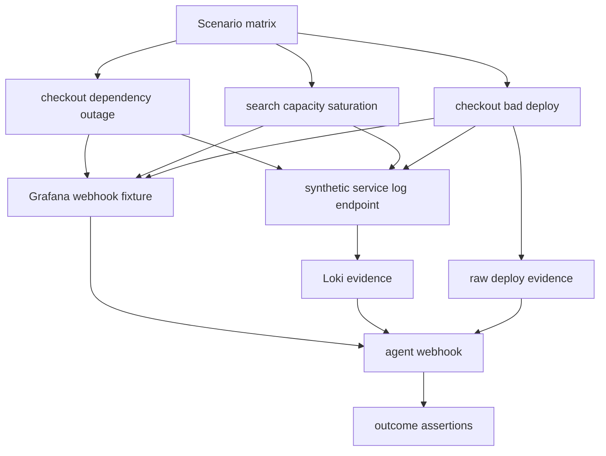

# test: Expand observability scenario matrix

## Summary

Expand the observability-shaped E2E coverage beyond checkout dependency outage. Add capacity saturation first, then add a deterministic bad-deploy path backed by raw deploy evidence. Keep live MiniMax coverage opt-in and contract-based so provider cost and variance do not destabilize the default suite.

---

## Problem Frame

The default fixture outcome suite already covers dependency outage, bad deploy, capacity saturation, and noisy alert. The observability path does not. Docker and live E2E currently exercise one path: checkout-like logs, a checkout Grafana payload, Loki lookup, and a MiniMax or mock decision.

That leaves an architectural blind spot. The agent can classify capacity saturation from fixture data, but the local Grafana/Loki stack has not proved it can produce and triage capacity-shaped alert and log evidence. Adding capacity coverage makes the E2E layer more representative without changing the agent's decision contract.

This plan does not add production integrations, new incident classes, new next actions, or remediation execution.

---

## Requirements

**Scenario coverage**

- R1. Add a Grafana webhook fixture for `capacity-saturation` using `service="search-api"`, capacity-related alerts, capacity values, and `runbook_ref="capacity-saturation"`.
- R2. Add synthetic Loki log generation for capacity saturation with queryable `service="search-api"` labels and runtime-generated log lines.
- R3. Add deterministic Docker E2E coverage that posts the capacity Grafana fixture, queries capacity logs from Loki, and asserts a bounded capacity outcome.
- R4. Add a deterministic bad-deploy observability scenario that includes raw deploy evidence as operational context.

**Live provider behavior**

- R5. Keep live MiniMax tests opt-in and contract-based.
- R6. Let live scenario coverage be filtered or selected so developers can run checkout only, capacity only, or the whole live matrix intentionally.
- R7. Do not assert exact live MiniMax prose, caveats, or verification-plan wording.

**Safety and boundaries**

- R8. Preserve the raw webhook contract: Grafana payloads provide facts, not suspected causes, recommended actions, approval hints, or eval expectations.
- R9. Preserve current public CLI flags, Docker ports, webhook response shape, outcome helper semantics, and scorecard semantics.
- R10. Do not encode deploy causes, rollback recommendations, or approval hints in Grafana annotations.

---

## Key Technical Decisions

- KTD1. **Capacity first:** Capacity saturation is the best next E2E scenario because it uses existing taxonomy, runbook guidance, alert evidence, log evidence, and approval-gated safety behavior.
- KTD2. **Generalize the synthetic service lightly:** Extend the current synthetic service to emit scenario-specific log payloads rather than adding a new service image for every scenario.
- KTD3. **Keep Docker E2E deterministic by default:** The mock server should know deterministic decisions for `grafana-checkout-api`, `grafana-search-api`, and the bad-deploy webhook scenario.
- KTD4. **Make live E2E selectable:** A live matrix should not force every scenario on every run; provider variance, latency, and cost should stay under user control.
- KTD5. **Add deploy evidence explicitly:** A convincing bad-deploy observability test needs deploy evidence as raw operational context. The plan should add that evidence source rather than hiding deploy cause or rollback hints in Grafana annotations.

---

## High-Level Technical Design

The matrix should reuse the same core sequence for each scenario: generate synthetic logs, post a Grafana fixture with current timestamps, run the webhook workflow, and assert the outcome contract. Scenario-specific differences should live in fixture data, synthetic log templates, and expected outcome metadata inside tests.

---

## Implementation Units

### U1. Add Capacity Grafana Fixture And Mock Decision

- **Goal:** Add capacity-shaped webhook input and deterministic mock LLM output for `grafana-search-api`.
- **Requirements:** R1, R3, R8, R9.
- **Dependencies:** None.
- **Files:** `fixtures/grafana/capacity-saturation-webhook.json`, `src/incident_triage_agent/cli.py`, `tests/test_server.py`, `tests/test_webhook_outcomes.py`.
- **Approach:** Model the new fixture after `fixtures/grafana/checkout-payment-timeout-webhook.json`, but use `search-api` labels, CPU/queue-depth alerts, and `runbook_ref="capacity-saturation"`. Add a mock webhook decision that returns `capacity_saturation`, an allowed approval-sensitive next action, capacity evidence IDs, and a verification plan.
- **Patterns to follow:** Preserve the raw payload contract enforced by `normalize_grafana_payload`; do not add suspected causes or recommended actions to annotations.
- **Test scenarios:**
  - A capacity Grafana payload normalizes into an active `search-api` incident.
  - The mock webhook path returns a valid `capacity_saturation` decision for `grafana-search-api`.
  - The response cites alert, log, and runbook evidence.
  - The safety gate reports approval required without executed remediation.
- **Verification:** Webhook and outcome tests prove capacity response shape without Docker.

### U2. Generalize Synthetic Log Generation For Capacity

- **Goal:** Let the local synthetic service emit capacity-saturation logs for `search-api`.
- **Requirements:** R2, R3, R9.
- **Dependencies:** U1.
- **Files:** `services/synthetic_checkout_service.py`, `tests/test_synthetic_checkout_service.py`, `docker-compose.yml`.
- **Approach:** Keep the existing `/checkout` behavior stable. Add a scenario-aware log builder and a capacity endpoint, or accept a bounded scenario field, so tests can generate `search-api` capacity logs with Loki labels the existing `LokiClient` can query.
- **Patterns to follow:** Preserve `build_loki_payload` behavior for checkout callers, and keep the service stdlib-only.
- **Test scenarios:**
  - Existing checkout log payload tests continue to pass unchanged.
  - Capacity log payloads use `service="search-api"` and a capacity scenario label.
  - Capacity logs include CPU, queue depth, and saturation wording without embedding recommendations.
  - Loki push failures still return bounded non-secret errors.
- **Verification:** Synthetic service unit tests prove both checkout and capacity payloads without Docker.

### U3. Parameterize Docker E2E Scenario Execution

- **Goal:** Run checkout and capacity through the same Docker E2E harness.
- **Requirements:** R3, R4, R8, R9.
- **Dependencies:** U1, U2.
- **Files:** `tests/test_e2e_grafana_loki.py`, `tests/support/outcomes.py`, `fixtures/grafana/capacity-saturation-webhook.json`.
- **Approach:** Replace checkout-only helper assumptions with a small scenario table that names the log-generation endpoint, webhook fixture, expected class, expected action, evidence prefixes, cited tiers, and safety expectation. Keep the default Docker E2E opt-in under `RUN_DOCKER_E2E=1`.
- **Patterns to follow:** Reuse `assert_valid_response_outcome` and the timestamp mutation pattern already in `tests/test_e2e_grafana_loki.py`.
- **Test scenarios:**
  - Checkout scenario still passes with dependency-outage escalation.
  - Capacity scenario passes with capacity classification, alert/log/runbook citations, current and operational provenance, and approval-required safety.
  - Each scenario updates webhook alert timestamps at runtime without modifying fixture files.
  - A failed scenario reports which scenario failed.
- **Verification:** Docker E2E passes when explicitly enabled, while the default suite skips containers.

### U4. Add Bad-Deploy Observability Scenario With Raw Deploy Evidence

- **Goal:** Add a bad-deploy observability scenario without putting derived causes or rollback hints in Grafana annotations.
- **Requirements:** R4, R8, R9.
- **Dependencies:** U3.
- **Files:** `fixtures/grafana/bad-deploy-latency-webhook.json`, `fixtures/deploys/deploys.json`, `src/incident_triage_agent/tools.py`, `src/incident_triage_agent/cli.py`, `services/synthetic_checkout_service.py`, `tests/test_tools.py`, `tests/test_webhook_outcomes.py`, `tests/test_e2e_grafana_loki.py`.
- **Approach:** Add a raw deploy evidence source keyed by service and alert window, then add a bad-deploy Grafana payload that supplies alert facts only. Synthetic logs should describe retry/latency symptoms, while the deploy evidence source supplies the recent deploy fact. The expected deterministic outcome should be `bad_deploy` with `request_rollback_approval`.
- **Patterns to follow:** Mirror `fixtures/scenarios/bad-deploy-latency.json` for raw facts, but keep eval expectations in tests. Follow existing `deploy:` evidence IDs from fixture evidence packages.
- **Test scenarios:**
  - Bad-deploy webhook normalizes as an active checkout incident without answer-like annotations.
  - Raw deploy evidence produces a stable `deploy:<index>` evidence ID for the alerted service.
  - Deterministic mock response cites alert, deploy, log, and runbook evidence.
  - Outcome assertions verify `bad_deploy`, `request_rollback_approval`, approval-required safety, and no executed remediation.
- **Verification:** Default webhook tests and opt-in Docker E2E pass.

### U5. Make Live E2E Scenario Selection Explicit

- **Goal:** Allow live MiniMax E2E to run checkout, capacity, or a chosen scenario set intentionally.
- **Requirements:** R5, R6, R7, R9.
- **Dependencies:** U3, U4.
- **Files:** `tests/test_e2e_real_service_live_llm.py`, `README.md`, `AGENTS.md`.
- **Approach:** Add a scenario selection environment variable or equivalent test-table filter. Keep `RUN_LIVE_LLM_E2E=1` as the outer opt-in, and default to the current checkout path unless the user selects more.
- **Patterns to follow:** Continue to assert bounded schema, evidence citations, provenance, safety, and no executed action rather than exact class/action prose for live runs.
- **Test scenarios:**
  - Without the live flag, all live matrix tests skip.
  - With the live flag and no scenario selector, checkout behavior remains unchanged.
  - With a capacity selector, the live test generates capacity logs and posts the capacity webhook.
  - With a bad-deploy selector, the live test generates deploy-related logs, includes raw deploy evidence, and posts the bad-deploy webhook.
  - Live responses may vary in class/action wording only within the bounded taxonomy and must cite alert/log evidence.
- **Verification:** Default suite remains deterministic; live E2E passes when explicitly enabled with usable MiniMax config.

### U6. Document Scenario Matrix Guidance

- **Goal:** Explain how to add future observability scenarios without weakening the raw-data boundary.
- **Requirements:** R5, R6, R8, R10.
- **Dependencies:** U1, U2, U3, U4, U5.
- **Files:** `README.md`, `AGENTS.md`, `docs/learnings.md`, `docs/solutions/architecture-patterns/bounded-llm-incident-triage-workflow.md`.
- **Approach:** Document the scenario matrix distinction: fixture outcomes prove taxonomy breadth, deterministic Docker E2E proves observability wiring, live E2E proves provider contract behavior. Call out why bad deploy uses raw deploy evidence rather than Grafana annotations as a shortcut.
- **Patterns to follow:** Keep README command-focused and `docs/learnings.md` teaching-focused.
- **Test scenarios:**
  - Docs state how to run deterministic Docker scenario coverage.
  - Docs state how to select live scenarios.
  - Docs warn that live scenario expansion increases provider cost and variance.
  - Docs preserve the no-production-remediation boundary.
- **Verification:** Documentation review and markdown diff checks.

---

## Acceptance Examples

- AE1. **Capacity Docker E2E:** Given the Docker stack is running with mock LLM output, when the test generates `search-api` capacity logs and posts the capacity Grafana webhook, then the response cites alert, log, and runbook evidence and reports approval-required safety without executing remediation.
- AE2. **Live capacity selection:** Given live E2E is explicitly enabled and capacity is selected, when the test runs, then MiniMax returns a schema-valid bounded decision with alert/log citations, provenance, and safety output.
- AE3. **Bad deploy deterministic path:** Given a bad-deploy webhook, deploy evidence, and retry-related logs, when the deterministic E2E runs, then the response cites alert, deploy, log, and runbook evidence and stages rollback approval without executing remediation.
- AE4. **Bad deploy boundary:** Given a bad-deploy webhook, when the payload is inspected, then Grafana annotations contain alert facts only and do not contain suspected causes, rollback recommendations, or approval hints.

---

## Scope Boundaries

- Do not add new incident classes, next actions, or safety statuses.
- Do not change prompt semantics or MiniMax adapter behavior.
- Do not require Docker or MiniMax credentials for the default suite.
- Do not make live provider tests default CI gates.
- Do not encode suspected causes, recommended actions, rollback hints, or eval expectations into Grafana payloads.
- Do not add bad-deploy observability E2E without raw deploy evidence.
- Do not rename the synthetic service module unless the implementation shows the name is actively confusing.

---

## Risks And Mitigations

| Risk | Impact | Mitigation |
| --- | --- | --- |
| Scenario matrix becomes too abstract | Tests become hard to read | Keep the table small and scenario fields explicit |
| Live scenario expansion adds cost | Developers avoid running live checks | Keep live matrix opt-in and selectable |
| Capacity live output varies | Flaky assertions | Assert outcome contract and bounded taxonomy rather than exact prose |
| Bad deploy shortcut leaks answers | Raw-data contract weakens | Add raw deploy evidence and keep Grafana annotations factual |
| Synthetic service name no longer fits | Confusing docs and tests | Defer rename unless multiple scenarios make the mismatch painful |

---

## Sources And Research

- `tests/test_triage_outcomes.py` already covers fixture-level capacity, noisy-alert, bad-deploy, and dependency outcomes.
- `tests/test_e2e_grafana_loki.py` currently exercises only checkout dependency outage through Docker and mock LLM.
- `tests/test_e2e_real_service_live_llm.py` currently exercises only checkout dependency outage through Docker and live MiniMax.
- `services/synthetic_checkout_service.py` currently emits checkout/payment-timeout Loki logs under `service="checkout-api"`.
- `src/incident_triage_agent/cli.py` currently provides fixture mock decisions for all scenarios, but webhook mock serving only has a canned `grafana-checkout-api` response.
- `fixtures/scenarios/capacity-saturation.json` and `fixtures/runbooks/capacity-saturation.md` provide the capacity facts and guidance to mirror in observability-shaped tests.
- `fixtures/scenarios/bad-deploy-latency.json` and `fixtures/runbooks/bad-deploy.md` provide the bad-deploy facts and guidance to mirror without leaking expected outcomes into Grafana payloads.
