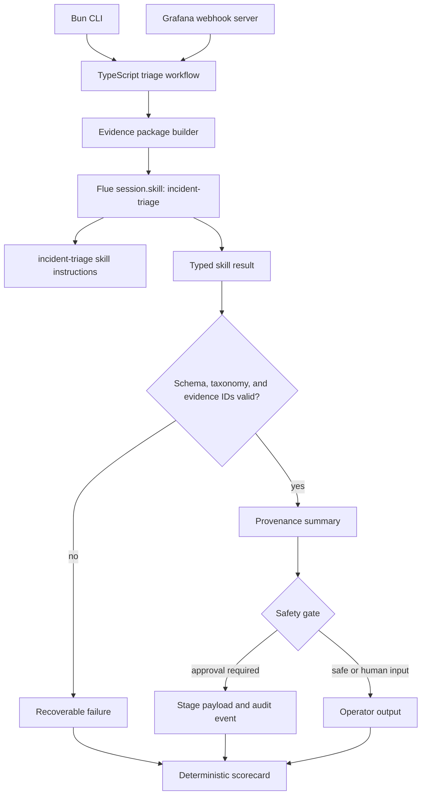
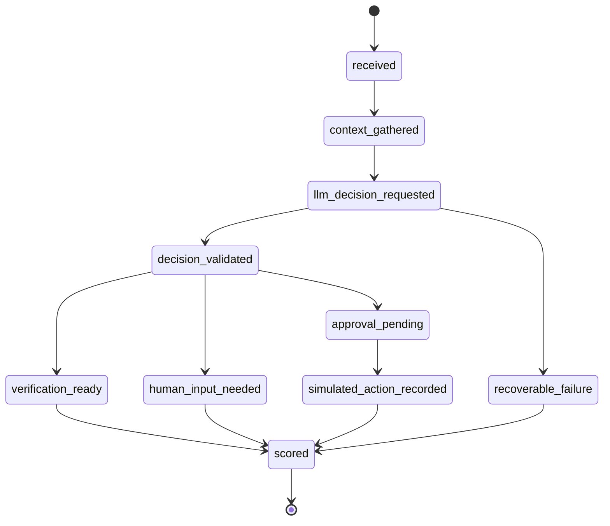

# refactor: Redesign incident triage agent with Bun, TypeScript, and Flue

## Summary

Redesign the incident triage proof of concept as a Bun and TypeScript application that uses Flue for one bounded `incident-triage` skill call and Pino for structured logging. The migration preserves the current raw-evidence, validation, provenance, safety-gate, scorecard, webhook, Docker, and live-provider behavior while replacing the Python runtime.

---

## Problem Frame

The current Python implementation proves the right architecture: deterministic workflow code owns evidence gathering, state, validation, safety, and scoring, while MiniMax contributes one bounded incident judgment. The next version should make that architecture more explicitly skill-guided and agent-native without broadening the agent's authority.

This is a runtime and framework redesign, not a product expansion. The project should still be a synthetic SRE architecture proof, not production incident automation, and it should keep the existing operator-facing contracts stable enough that reviewers can compare old and new behavior.

---

## Requirements

**Runtime and project structure**

- R1. The project uses Bun as the package manager, script runner, test runner, and Docker runtime for the TypeScript application.
- R2. The implementation is TypeScript-first and replaces the Python package as the primary product surface.
- R3. The CLI preserves the existing scenario list, scenario run, trace, mock LLM, and webhook server behavior.
- R4. The Docker and Compose paths continue to run the agent, Grafana, Loki, and synthetic service locally.

**Skill-guided agent boundary**

- R5. Flue invokes one registered `incident-triage` skill for the bounded decision step.
- R6. The skill receives an evidence package built from raw incident data and must not gather production data or execute remediation.
- R7. The Flue result is validated against the global incident-class and next-action taxonomy before workflow state advances.
- R8. The skill output includes confidence, evidence IDs, caveats, and a verification plan.

**Safety, provenance, and evaluation**

- R9. Raw scenario and Grafana payloads remain free of suspected causes, recommended actions, approval hints, and eval expectations.
- R10. Evidence records preserve stable evidence IDs, source labels, source tiers, and provenance output.
- R11. Approval-sensitive actions are staged and audited, not executed.
- R12. Scorecards remain deterministic and continue to distinguish bad reasoning, missing context, validation failure, and policy rejection.
- R13. Default tests avoid live MiniMax calls, network dependencies, and Docker startup unless explicitly opted in.

**Observability and logging**

- R14. Pino replaces Loguru with structured logs on stderr and local pretty/color output when requested.
- R15. Logs must include component, scenario, incident, workflow state, provider boundary, safety, and scorecard milestones without exposing secrets.
- R16. The live MiniMax path keeps using the Anthropic-compatible endpoint and `.env` model/API-key configuration through one adapter boundary.

---

## Key Technical Decisions

- **Full TypeScript replacement:** Migrate the product surface to Bun/TypeScript rather than keeping a long-term Python/TypeScript hybrid. This avoids two divergent implementations of the same safety-critical workflow, but it requires parity tests before deleting Python.
- **One Flue skill for the bounded decision:** Use a single `incident-triage` skill to classify, cite evidence, choose a next action, and draft verification steps. This gives the project the agent/skill architecture the user wants without introducing multi-step autonomous tool choice yet.
- **Deterministic orchestration stays outside Flue:** Keep fixture loading, evidence construction, state transitions, provenance, safety policy, and scoring in normal TypeScript modules. Flue owns the skill invocation and typed result validation, not the whole application.
- **Valibot schema at the Flue boundary plus local semantic validation:** Flue supports typed `session.skill(...)` results with Valibot, but the project still needs local checks for evidence IDs, confidence threshold, source-tier support, and action safety.
- **Pino logs on stderr, report output on stdout:** Preserve the current operator contract where diagnostic logs do not corrupt CLI or JSON report output. Pretty/color logs are a local developer convenience; structured JSON remains the production-friendly default.
- **Bun test runner for default tests:** Use Bun's TypeScript-aware test runner for the migrated suite so the runtime, module loader, and test path match the application stack.
- **Opt-in live and Docker E2E remain separate:** Keep deterministic mock tests as the default suite, Docker Grafana/Loki tests behind an explicit flag, and live MiniMax E2E behind a separate explicit flag.

---

## High-Level Technical Design

The redesigned architecture keeps the same control boundary while making the reasoning step skill-guided.



The workflow state model remains intentionally small and inspectable.



The skill content should express reasoning procedure, not side-effect authority.

```text
incident-triage skill
  -> classify one incident from allowed classes
  -> choose one allowed next action
  -> cite only provided evidence IDs
  -> explain weak or missing context as caveats
  -> produce verification steps
  -> never execute remediation or invent evidence
```

---

## Output Structure

The plan creates a TypeScript application layout while retaining existing fixtures and docs.

```text
.
|-- package.json
|-- bun.lock
|-- tsconfig.json
|-- src/
|   |-- cli.ts
|   |-- config.ts
|   |-- domain.ts
|   |-- evidence.ts
|   |-- flue/
|   |   |-- incident-triage-workflow.ts
|   |   `-- skills/
|   |       `-- incident-triage/SKILL.md
|   |-- grafana.ts
|   |-- llm.ts
|   |-- logger.ts
|   |-- loki.ts
|   |-- policy.ts
|   |-- scoring.ts
|   |-- server.ts
|   `-- workflow.ts
|-- services/
|   `-- synthetic-checkout-service.ts
|-- scripts/
|   `-- run-live-e2e-probe.ts
|-- tests/
|   |-- support/outcomes.ts
|   |-- *.test.ts
|   `-- e2e/*.test.ts
|-- fixtures/
|-- Dockerfile
|-- docker-compose.yml
|-- docker-compose.live.yml
|-- README.md
`-- AGENTS.md
```

---

## Implementation Units

### U1. Establish Bun and TypeScript scaffold

- **Goal:** Add the TypeScript project scaffold, Bun scripts, compiler settings, dependency set, and package entrypoint without changing product behavior yet.
- **Requirements:** R1, R2, R13
- **Dependencies:** None
- **Files:** `package.json`, `bun.lock`, `tsconfig.json`, `.gitignore`, `.dockerignore`, `README.md`, `AGENTS.md`
- **Approach:** Introduce Bun as the only JavaScript package manager and script runner. Add scripts for CLI execution, default tests, type checking, build, Docker-friendly start, and opt-in E2E runs. Keep Python files in place until TypeScript parity is proven.
- **Execution note:** Start with a tiny smoke test that proves Bun can run TypeScript tests before porting behavior.
- **Patterns to follow:** Preserve the current command vocabulary and secret-handling constraints from `AGENTS.md`.
- **Test scenarios:**
  - Running the default test script executes a TypeScript smoke test without MiniMax credentials.
  - The package scripts expose scenario run, scenario list, server, typecheck, and test commands.
  - The project rejects mixed lockfile drift by documenting Bun as the package manager and keeping the generated Bun lockfile tracked.
- **Verification:** A contributor can install dependencies with Bun and run the empty TypeScript test scaffold without touching `.env`.

### U2. Port domain contracts and fixture loading

- **Goal:** Recreate the domain model, taxonomy, workflow states, source tiers, fixture validation, and scenario loading in TypeScript.
- **Requirements:** R2, R7, R9, R10, R12
- **Dependencies:** U1
- **Files:** `src/domain.ts`, `src/config.ts`, `fixtures/scenarios/checkout-payment-timeout.json`, `fixtures/scenarios/bad-deploy-latency.json`, `fixtures/scenarios/capacity-saturation.json`, `fixtures/scenarios/noisy-alert.json`, `tests/domain.test.ts`, `tests/config.test.ts`
- **Approach:** Keep the current fixture JSON shape and prohibited raw incident fields. Use TypeScript union types or schema validators for the global incident classes and next actions so validation, policy, and scorecard code share one vocabulary.
- **Patterns to follow:** Mirror the existing `IncidentClass`, `NextAction`, `WorkflowState`, `SourceTier`, and raw fixture validation contracts.
- **Test scenarios:**
  - Covers AE1. A valid raw scenario loads with incident facts and eval metadata separated.
  - A scenario containing `suspected_causes`, `recommended_actions`, or `requires_approval` in raw incident data is rejected.
  - Unknown incident classes and next actions are rejected during expectation or decision validation.
  - Missing `.env` MiniMax settings produce non-secret errors only when a live provider path is requested.
- **Verification:** Existing fixtures load unchanged and prohibited answer fields remain impossible to pass through silently.

### U3. Port evidence builders and provenance

- **Goal:** Port deterministic evidence gathering, mock operational tools, deploy facts, service ownership, runbooks, prior incidents, source tiering, and provenance summaries.
- **Requirements:** R6, R9, R10
- **Dependencies:** U2
- **Files:** `src/evidence.ts`, `fixtures/runbooks/dependency-outage.md`, `fixtures/runbooks/bad-deploy.md`, `fixtures/runbooks/capacity-saturation.md`, `fixtures/deploys/deploys.json`, `fixtures/services/services.json`, `fixtures/prior_incidents/prior-incidents.json`, `tests/evidence.test.ts`, `tests/provenance.test.ts`
- **Approach:** Keep stable evidence ID formats and source tiers so old and new outputs can be compared. Evidence builders remain deterministic and tool-like even though they read local fixtures.
- **Patterns to follow:** Follow the current `tools.py` and `domain.py` behavior: alerts, symptoms, logs, deploys, service ownership, runbooks, prior incidents, and verification signals become evidence records rather than direct recommendations.
- **Test scenarios:**
  - Checkout evidence includes alert, symptom, log, deploy, service, runbook, prior incident, and verification evidence where fixture data provides it.
  - Bad-deploy evidence gets deployment facts from deploy fixtures rather than Grafana annotations.
  - Missing runbook or verification context is recorded as missing context instead of crashing the workflow.
  - Provenance reports available tiers, cited tiers, cited sources, cited evidence IDs, missing context, and support strength from cited IDs.
- **Verification:** Evidence IDs, source tiers, and provenance output remain stable enough for outcome tests and saved examples.

### U4. Add Flue workflow and incident-triage skill

- **Goal:** Introduce the Flue agent harness and one `incident-triage` skill that returns a typed bounded decision.
- **Requirements:** R5, R6, R7, R8, R16
- **Dependencies:** U2, U3
- **Files:** `src/flue/incident-triage-workflow.ts`, `src/flue/skills/incident-triage/SKILL.md`, `src/llm.ts`, `tests/llm.test.ts`, `tests/skill-contract.test.ts`
- **Approach:** Register the skill with Flue and call it through `session.skill(...)` with a Valibot result schema. The skill receives only the evidence package and allowed vocabulary, then returns the decision object the rest of the workflow validates semantically.
- **Technical design:** Directional only: the adapter exposes a `decide(evidencePackage)` interface, builds or passes the evidence payload to Flue, receives the typed skill data, and then runs local validation for confidence, taxonomy, and cited evidence IDs.
- **Patterns to follow:** Use the Flue docs pattern of `createAgent(...)`, registered markdown skills, `session.skill(...)`, and Valibot typed results. Preserve the existing MiniMax Anthropic-compatible adapter boundary and static mock client concept for deterministic tests.
- **Test scenarios:**
  - A mocked Flue skill result with valid class, action, confidence, citations, caveats, and verification plan becomes a valid decision.
  - Covers AE2. A skill result with unknown evidence IDs fails before safety policy.
  - Covers AE2. A skill result with malformed or missing fields produces recoverable validation errors.
  - A low-confidence result fails closed before workflow state advances.
  - Provider failures and timeouts produce validation failure without exposing API keys, model names beyond the configured non-secret name, or request secrets.
- **Verification:** The workflow can use either deterministic mock decisions or a real Flue-backed MiniMax skill call through the same decision interface.

### U5. Port workflow, safety gate, and scorecard

- **Goal:** Recreate the stateful workflow, safety policy, staged approval payloads, audit events, human-input handling, and deterministic scorecard in TypeScript.
- **Requirements:** R7, R10, R11, R12
- **Dependencies:** U2, U3, U4
- **Files:** `src/workflow.ts`, `src/policy.ts`, `src/scoring.ts`, `tests/workflow.test.ts`, `tests/policy.test.ts`, `tests/scoring.test.ts`, `tests/triage-outcomes.test.ts`, `tests/support/outcomes.ts`
- **Approach:** Port behavior behind outcome tests rather than line-by-line translating Python. The workflow continues to transition through explicit states and only reaches safety policy after validated decision output.
- **Patterns to follow:** Preserve the current `TriageWorkflow.run(...)`, `evaluate_safety(...)`, and scorecard category behavior as the conceptual contract.
- **Test scenarios:**
  - Covers F1. A dependency-outage run reaches a valid terminal state with evidence citations, provenance, safety, and scorecard output.
  - Covers F2 and AE3. A bad-deploy rollback recommendation produces approval-required safety, staged payload, and an audit event with `executed` false.
  - A capacity-saturation recommendation stages runbook-guided approval rather than treating it as safe execution.
  - Covers F3 and AE4. Missing critical runbook or verification context results in human input or a legible scorecard failure.
  - Invalid skill output enters recoverable failure and still produces a scorecard.
- **Verification:** Outcome tests prove the TypeScript workflow preserves the current operator-facing contract across success, approval, missing context, and invalid-output paths.

### U6. Port CLI output and Pino logging

- **Goal:** Replace the Python CLI and Loguru logging with a Bun CLI and Pino logging while preserving stdout/stderr separation.
- **Requirements:** R3, R14, R15
- **Dependencies:** U2, U3, U4, U5
- **Files:** `src/cli.ts`, `src/logger.ts`, `tests/cli.test.ts`, `tests/logger.test.ts`, `README.md`, `AGENTS.md`
- **Approach:** Implement `list`, `run`, and `serve` commands with the same public behavior. Use Pino child loggers with component/scenario/incident bindings, redact secret-like fields, and configure pretty/color output for local terminal logs without changing machine-readable report output.
- **Patterns to follow:** Follow current CLI rendering sections: incident header, optional state trace, evidence, LLM decision, provenance, safety gate, and scorecard.
- **Test scenarios:**
  - `list` prints scenario names without loading MiniMax config.
  - `run --mock-llm --trace` prints state, evidence, decision, provenance, safety, and scorecard sections to stdout.
  - Logs are emitted to stderr and do not appear in captured stdout report output.
  - Pino redacts API keys and webhook secrets from log records and errors.
  - Pretty/color logging is opt-in or terminal-aware and does not break JSON output mode.
- **Verification:** CLI users see the same product surface with clearer structured logs and no secret leakage.

### U7. Port Grafana, Loki, webhook server, and synthetic service

- **Goal:** Rebuild the observability-shaped ingestion path in TypeScript: Grafana payload normalization, bounded Loki lookup, webhook response rendering, and synthetic log-generating service.
- **Requirements:** R3, R4, R9, R10, R11, R13
- **Dependencies:** U2, U3, U5, U6
- **Files:** `src/grafana.ts`, `src/loki.ts`, `src/server.ts`, `services/synthetic-checkout-service.ts`, `tests/grafana.test.ts`, `tests/loki.test.ts`, `tests/server.test.ts`, `tests/synthetic-service.test.ts`, `tests/webhook-outcomes.test.ts`, `fixtures/grafana/checkout-payment-timeout-webhook.json`, `fixtures/grafana/capacity-saturation-webhook.json`, `fixtures/grafana/bad-deploy-latency-webhook.json`
- **Approach:** Preserve the raw Grafana boundary and bounded Loki query behavior. The server should build the same evidence package and run the same workflow as the fixture CLI path.
- **Patterns to follow:** Keep webhook secrets as authentication only, never evidence. Keep Loki labels, time window, and result limit bounded before prompt assembly.
- **Test scenarios:**
  - Active Grafana alerts normalize into raw incident facts without suspected causes or recommended actions.
  - Resolved-only Grafana payloads return an ignored response.
  - Missing or invalid webhook secret returns unauthorized without leaking the configured secret.
  - Loki query failures become missing log context instead of crashing the workflow.
  - Webhook responses include decision, evidence, provenance, safety, and scorecard fields with the same outcome assertions as CLI runs.
  - Synthetic checkout, capacity, and bad-deploy endpoints emit Loki-compatible logs and never execute remediation.
- **Verification:** The TypeScript webhook path remains the same architecture as the CLI path, with observability sources providing facts only.

### U8. Update Docker, Compose, and live demo probe

- **Goal:** Move container and demo tooling from Python/uv to Bun while preserving the deterministic Docker E2E and opt-in live MiniMax paths.
- **Requirements:** R1, R4, R13, R16
- **Dependencies:** U1, U6, U7
- **Files:** `Dockerfile`, `docker-compose.yml`, `docker-compose.live.yml`, `scripts/run-live-e2e-probe.ts`, `tests/e2e/grafana-loki.test.ts`, `tests/e2e/live-service-llm.test.ts`, `docs/examples/live-e2e-response.json`
- **Approach:** Use the official Bun container pattern with frozen lockfile installs and a lean runtime image. Keep Compose service names, ports, environment variables, and scenario matrix stable unless implementation discovers a compatibility blocker.
- **Patterns to follow:** Preserve opt-in flags for Docker and live provider tests; default tests must not start containers or call MiniMax.
- **Test scenarios:**
  - Docker image runs the scenario list command without credentials.
  - Docker Compose mock path starts Grafana, Loki, synthetic service, and agent, then runs checkout, capacity, and bad-deploy webhook scenarios with deterministic mock decisions.
  - Live Compose override removes mock LLM behavior and passes MiniMax config only through environment variables.
  - The live demo probe starts the stack, generates logs, posts the webhook, prints a sanitized decision summary, and cleans up.
  - Empty or invalid live scenario selection fails or skips explicitly rather than silently passing.
- **Verification:** The local demo still has one deterministic path for repeatability and one opt-in live path for provider proof.

### U9. Documentation, cleanup, and Python retirement

- **Goal:** Update project docs, learning docs, examples, and agent instructions, then remove the Python implementation only after TypeScript parity is proven.
- **Requirements:** R2, R3, R13, R14, R16
- **Dependencies:** U1, U2, U3, U4, U5, U6, U7, U8
- **Files:** `README.md`, `AGENTS.md`, `CONCEPTS.md`, `docs/learnings.md`, `docs/solutions/architecture-patterns/bounded-llm-incident-triage-workflow.md`, `pyproject.toml`, `uv.lock`, `src/incident_triage_agent/`, `services/synthetic_checkout_service.py`, `scripts/run_live_e2e_probe.py`, `tests/*.py`
- **Approach:** Update docs to describe the code-orchestrated, skill-guided TypeScript architecture. Retire Python files only after the TypeScript CLI, webhook, mock E2E, and live E2E have equivalent tests and docs.
- **Patterns to follow:** Keep `docs/learnings.md` as a teaching checklist and update `AGENTS.md` so future agents use Bun, TypeScript, Flue, Pino, and the same testing convention.
- **Test scenarios:**
  - Documentation commands match the migrated Bun scripts and Docker commands.
  - No default docs path asks for `uv` after Python retirement.
  - Saved live response still demonstrates evidence citations, provenance, safety, and scorecard output without secrets.
  - Removing Python files does not leave stale imports, entrypoints, Docker commands, or test references.
- **Verification:** The repo reads as a TypeScript/Flue project end to end, and old Python runtime artifacts are gone or explicitly marked as historical if intentionally retained.

---

## Acceptance Examples

- AE1. **Fixture parity:** Given the checkout payment timeout fixture, the Bun CLI mock path emits a dependency-outage decision with alert, log, and runbook evidence citations plus provenance and a safe recommendation.
- AE2. **Recoverable invalid output:** Given a mocked Flue skill result with malformed fields or an unknown evidence ID, the workflow enters recoverable failure and emits validation errors plus a scorecard.
- AE3. **Approval-gated action:** Given the bad-deploy scenario, the TypeScript workflow stages rollback approval with an audit payload and never executes a rollback.
- AE4. **Webhook parity:** Given the Grafana/Loki Docker scenario matrix, webhook responses preserve the bounded decision, evidence, provenance, safety, and scorecard contract for checkout, capacity, and bad deploy.
- AE5. **Live provider isolation:** Given live MiniMax credentials and an explicit live E2E flag, the Flue-backed skill call uses the Anthropic-compatible endpoint and the test asserts the broad outcome contract rather than exact model wording.

---

## System-Wide Impact

- **Runtime ownership:** Bun replaces uv/Python for install, scripts, tests, Docker image construction, and demo execution.
- **Agent architecture:** Flue becomes the harness for the bounded skill call, while deterministic TypeScript modules remain the source of truth for orchestration and safety.
- **Testing surface:** The existing behavior-focused tests become the migration safety net and should be ported before broad file deletion.
- **Operational story:** Pino makes logs more production-shaped, but the project remains local and synthetic with no production remediation authority.
- **Documentation:** README, AGENTS, learning docs, and solution docs need coordinated updates so future work does not mix Python and TypeScript instructions.

---

## Scope Boundaries

- This plan does not add autonomous multi-step tool selection.
- This plan does not add team-defined incident classes or action vocabularies.
- This plan does not add production Grafana, Loki, incident-management, deployment, ticketing, or chat integrations.
- This plan does not execute rollback, scaling, throttling, or runbook actions.
- This plan does not add a web UI.
- This plan does not require live MiniMax calls in the default test suite.

### Deferred to Follow-Up Work

- Add an optional multi-step Flue loop where the agent can request one additional allowed evidence type before deciding.
- Add team-specific taxonomy extension support after the global taxonomy remains stable in TypeScript.
- Add real observability or incident-management connectors only after the synthetic Flue architecture is proven.
- Add hosted or channel-based Flue deployment after the local CLI and webhook architecture is stable.

---

## Risks & Dependencies

- **Flue 1.0 beta churn:** The Flue API may move during implementation, so isolate Flue usage in the decision adapter and skill workflow rather than spreading it across the app.
- **Provider compatibility:** MiniMax must continue to work through the Anthropic-compatible endpoint. Keep provider details behind one adapter and test provider failures without network calls.
- **Migration regression:** A full language migration can subtly change output shapes. Port outcome tests first and compare operator-facing behavior rather than internal implementation details.
- **Secret leakage:** Pino structured logging can accidentally serialize config objects. Logger bindings and redaction must be tested before live-provider runs.
- **Over-agentification:** Flue can support more autonomous loops, but this project should keep the LLM as one bounded reasoning step until the baseline migration is stable.
- **Docker drift:** Bun image and Compose changes can break the live demo path. Keep deterministic Docker E2E opt-in but runnable before removing Python.

---

## Documentation / Operational Notes

- `README.md` should explain the new architecture as code-orchestrated and skill-guided: TypeScript gathers and validates evidence, Flue runs the incident skill, safety gates actions, and scorecards evaluate outcomes.
- `AGENTS.md` should switch quick-start and hard constraints from uv/Python to Bun/TypeScript while preserving Docker and live-provider opt-in rules.
- `docs/learnings.md` should add a checklist explaining why the migration uses one skill, why Flue does not own safety, and why Pino logs stay separate from report output.
- `.env.example` should keep `MINIMAX_API_KEY`, `MODEL_NAME`, `MINIMAX_BASE_URL`, `GRAFANA_WEBHOOK_SECRET`, `LOKI_BASE_URL`, and `LOKI_LIMIT` with placeholders only.
- Saved examples under `docs/examples/` should remain sanitized and show evidence citations, provenance, safety, and scorecard output.

---

## Sources / Research

- Origin requirements: `docs/brainstorms/2026-06-14-incident-triage-agent-requirements.md`
- Existing architecture learning: `docs/solutions/architecture-patterns/bounded-llm-incident-triage-workflow.md`
- Current implementation references: `src/incident_triage_agent/workflow.py`, `src/incident_triage_agent/llm.py`, `src/incident_triage_agent/domain.py`, `src/incident_triage_agent/server.py`, `tests/test_triage_outcomes.py`, `tests/test_e2e_grafana_loki.py`
- Bun docs via Context7: `/oven-sh/bun`, covering scripts, TypeScript execution, tests, and Docker guidance.
- Flue docs via Context7: `/withastro/flue`, covering `createAgent`, registered skills, `session.skill(...)`, Valibot typed results, and CLI workflow execution.
- Pino docs via Context7: `/pinojs/pino/v10.1.0`, covering child loggers, transports, pretty output, and redaction.
