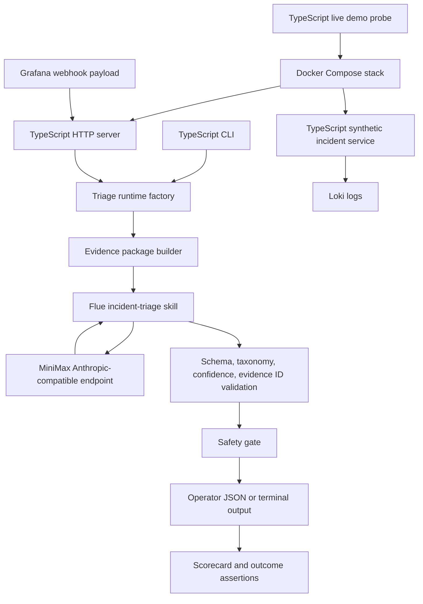
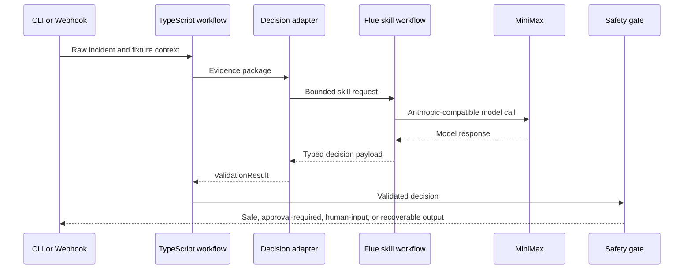

# feat: Promote TypeScript live incident triage runtime

## Summary

Promote the Node/TypeScript implementation from parity scaffold to the only live/demo surface. The work wires real MiniMax execution through the TypeScript Flue boundary, enables the TypeScript HTTP server, ports Docker/Compose and the live demo probe, ports live/E2E tests to Vitest, and removes remaining Python-facing docs and runtime paths after parity is proven.

---

## Problem Frame

The TypeScript code now owns the core fixture workflow, evidence package, validation, provenance, safety gate, scorecard, CLI rendering, Grafana normalization, Loki client, and webhook response handler. The remaining live path still depends on the older runtime: the container image, Compose stack, synthetic service, live probe, opt-in E2E tests, and major docs still point at Python commands.

That split weakens the architecture proof. A reviewer can see the bounded TypeScript workflow, but the strongest demonstration still routes through a different runtime. This plan closes that gap while preserving the original product boundary: raw synthetic incident evidence enters the workflow, MiniMax makes one bounded decision, and deterministic TypeScript code owns validation, state, safety, provenance, and scoring.

---

## Requirements

**Runtime promotion**

- R1. The TypeScript runtime must become the live CLI, webhook, Docker, Compose, demo, and test surface.
- R2. User-facing docs and agent instructions must stop presenting Python, uv, or unittest as the active workflow.
- R3. Python files may be used as parity references during implementation, but they must not remain active entrypoints after TypeScript parity is proven.

**Live MiniMax and Flue boundary**

- R4. Live MiniMax execution must use the existing TypeScript decision adapter boundary and keep provider details out of workflow, policy, scoring, and rendering code.
- R5. The Flue `incident-triage` skill must remain one bounded decision step that returns the validated class, action, confidence, evidence IDs, caveats, and verification plan.
- R6. Provider failures, malformed results, unsupported taxonomy values, low confidence, and unknown evidence IDs must remain recoverable workflow failures.

**HTTP and observability runtime**

- R7. The TypeScript `serve` command must run an HTTP server that exposes the Grafana webhook contract already covered by the handler tests.
- R8. Grafana payloads, Loki logs, service metadata, deploy facts, runbooks, prior incidents, and verification signals must continue to enter the prompt only as raw evidence.
- R9. Webhook authentication, resolved-alert handling, invalid payload handling, Loki failure handling, and response JSON shape must preserve the existing operator contract.

**Docker, demo, and tests**

- R10. Docker and Compose must run the TypeScript agent, TypeScript synthetic incident service, Grafana, and Loki without Python entrypoints.
- R11. The live demo probe must be a TypeScript script that starts the stack, generates synthetic logs, posts the Grafana webhook, prints a sanitized decision summary, and cleans up.
- R12. Default tests must remain deterministic and avoid live MiniMax, Docker startup, and networked Loki.
- R13. Docker E2E and live MiniMax E2E tests must remain opt-in and must fail or skip explicitly when prerequisites are missing.

---

## Assumptions

- A new follow-on plan is clearer than rewriting the existing redesign plan because the earlier plan documents the broader runtime migration and still contains useful historical context.
- Node remains the target JavaScript runtime because the Flue Node runtime path depends on Node-specific APIs such as `node:sqlite`.
- The existing TypeScript handler tests are the seed contract for the HTTP server; the Python server tests are parity references, not the long-term test surface.

---

## Key Technical Decisions

- **Promote TypeScript by surface, not by deleting first:** Keep deletion last so every old live/demo capability has a TypeScript replacement and tests before Python files are removed.
- **Use Flue for the model admission boundary:** Invoke MiniMax through the TypeScript Flue workflow or a small admission wrapper rather than calling provider transport directly from CLI or server code.
- **Keep provider auth isolated:** MiniMax Anthropic-compatible URL, model, headers, and response extraction stay in one provider adapter so the rest of the workflow only sees a `ValidationResult`.
- **Implement the HTTP server with Node primitives unless a framework becomes necessary:** The current server module already owns request-independent webhook behavior, so a small Node HTTP wrapper can preserve the contract without introducing a web framework migration.
- **Port E2E helpers into shared TypeScript support:** The Docker E2E, live E2E, and demo probe currently duplicate Compose startup, readiness polling, log generation, webhook posting, and cleanup; a shared TypeScript helper should own that orchestration.
- **Delete Python only after TypeScript E2E parity:** Removing the old runtime before the TypeScript live and Docker checks pass would erase the strongest behavioral oracle for the migration.

---

## High-Level Technical Design

The promoted runtime has one live decision boundary.

---

## Implementation Units

### U1. Wire TypeScript MiniMax live execution

- **Goal:** Replace the intentional live-path blocker with a real TypeScript MiniMax execution path through the Flue decision boundary.
- **Requirements:** R4, R5, R6
- **Dependencies:** None
- **Files:** `src/llm.ts`, `src/flue/incident-triage-workflow.ts`, `.agents/skills/incident-triage/SKILL.md`, `tests/llm.test.ts`, `tests/skill-contract.test.ts`, `tests/cli.test.ts`
- **Approach:** Keep `FlueDecisionClient` as the workflow-facing API and replace the placeholder direct runner with the smallest Flue-compatible admission path that can be used by CLI and server code. Normalize provider errors into recoverable validation failures and keep credentials redacted in errors and logs.
- **Patterns to follow:** Preserve `StaticDecisionClient` for deterministic tests, `validateDecisionPayload` for local semantic validation, and the current skill contract that cites only provided evidence IDs.
- **Test scenarios:**
  - A live client constructed with valid config can call an injected Flue runner and returns a validated decision.
  - A provider timeout or thrown transport error returns `valid: false` with a non-secret error.
  - A provider payload with malformed JSON, low confidence, unknown evidence IDs, or unsupported taxonomy values fails before safety policy.
  - CLI live mode uses the live decision client when credentials are present and does not print `MINIMAX_API_KEY`.
  - CLI live mode exits with a clear configuration error when required MiniMax settings are absent.
- **Verification:** The TypeScript CLI can choose between deterministic mock decisions and the real MiniMax-backed decision adapter without changing workflow code.

### U2. Enable the TypeScript HTTP webhook server

- **Goal:** Make `npm run serve` run the Grafana webhook server through TypeScript instead of returning a placeholder error.
- **Requirements:** R7, R8, R9
- **Dependencies:** U1
- **Files:** `src/cli.ts`, `src/server.ts`, `src/config.ts`, `src/logger.ts`, `tests/server.test.ts`, `tests/cli.test.ts`
- **Approach:** Add a small HTTP runtime around `handleGrafanaWebhook`, parse JSON bodies, read webhook and Loki config, construct either mock or live decision clients, and serialize the existing `runToResponse` output. Keep request parsing and network lifecycle outside the pure handler so current tests stay useful.
- **Patterns to follow:** Reuse `handleGrafanaWebhook`, `runToResponse`, `LokiClient`, `loadConfig`, and Pino component logging.
- **Test scenarios:**
  - `serve --mock-llm` starts the HTTP server and accepts a valid Grafana webhook with the configured secret.
  - Missing or wrong webhook secret returns unauthorized without exposing the expected secret.
  - Invalid JSON returns a client error without crashing the server.
  - Resolved-only Grafana payloads return an ignored response.
  - Loki query failures become missing log context and still produce a workflow response.
  - Live server construction requires MiniMax config only when mock mode is not selected.
- **Verification:** The same TypeScript workflow handles fixture CLI runs and Grafana webhook runs.

### U3. Port the synthetic incident service to TypeScript

- **Goal:** Replace the synthetic service entrypoint with a TypeScript service that emits Loki-compatible logs for checkout, capacity, and bad-deploy scenarios.
- **Requirements:** R8, R10, R13
- **Dependencies:** U2
- **Files:** `services/synthetic-checkout-service.ts`, `tests/synthetic-service.test.ts`, `tests/loki.test.ts`, `docker-compose.yml`
- **Approach:** Preserve the current service endpoints and response shape so Docker E2E and demo scripts can swap runtimes without changing scenario semantics. Keep Loki push behavior bounded and synthetic, with no remediation authority.
- **Patterns to follow:** Mirror the current scenario matrix: checkout payment timeout, capacity saturation, and bad deploy log generation.
- **Test scenarios:**
  - `/health` returns a readiness response without contacting Loki.
  - Checkout requests emit payment-timeout log records for `checkout-api`.
  - Capacity requests emit saturation log records for `search-api`.
  - Bad-deploy requests emit deploy-related log records that include the version under test.
  - Loki push failures return a legible service error or accepted-with-warning response without hiding that logs were not written.
- **Verification:** Docker E2E can generate real Loki log evidence without invoking Python.

### U4. Port Docker and Compose to Node/TypeScript

- **Goal:** Replace the container image and Compose commands with Node/TypeScript entrypoints.
- **Requirements:** R1, R10, R13
- **Dependencies:** U1, U2, U3
- **Files:** `Dockerfile`, `.dockerignore`, `docker-compose.yml`, `docker-compose.live.yml`, `package.json`, `package-lock.json`, `README.md`, `AGENTS.md`
- **Approach:** Build an image that installs npm dependencies from `package-lock.json`, runs TypeScript entrypoints in the intended runtime mode, and exposes the same ports and environment variables as the current Compose stack. The live override should remove mock LLM behavior and pass MiniMax config only through environment variables.
- **Patterns to follow:** Preserve service names, Grafana and Loki images, ports, webhook secret behavior, Loki base URL, and live scenario opt-in semantics.
- **Test scenarios:**
  - The image can list scenarios without credentials.
  - The base Compose stack starts Loki, Grafana, the synthetic service, and the agent with mock LLM behavior.
  - The live Compose override starts the same stack without mock LLM behavior and requires live MiniMax settings.
  - Compose teardown removes local volumes and containers after E2E and demo runs.
  - No container command references Python, uv, or the old package entrypoint.
- **Verification:** The local container demo exercises TypeScript from image build through webhook response.

### U5. Port the live demo probe

- **Goal:** Replace the live demo probe with a TypeScript script that demonstrates the full local stack.
- **Requirements:** R11, R13
- **Dependencies:** U2, U3, U4
- **Files:** `scripts/run-live-e2e-probe.ts`, `package.json`, `tests/live-e2e-probe.test.ts`, `docs/examples/live-e2e-response.json`
- **Approach:** Move Compose orchestration, readiness polling, scenario selection, synthetic request generation, webhook posting, sanitized decision rendering, JSON output, and cleanup into TypeScript. Share orchestration helpers with E2E tests where that reduces duplication.
- **Patterns to follow:** Preserve the current probe behaviors: explicit live config validation, selectable scenario, sanitized output, optional JSON mode, and cleanup in failure cases.
- **Test scenarios:**
  - Missing MiniMax settings fail before the stack starts.
  - Placeholder MiniMax settings fail before the stack starts.
  - Empty or unknown scenario selection fails or skips explicitly.
  - The probe posts the selected webhook fixture with current alert timestamps.
  - The probe prints decision, provenance, safety, and scorecard summaries without secrets.
  - Cleanup runs even when webhook posting or live model execution fails.
- **Verification:** A reviewer can run one TypeScript demo command to see the live-provider architecture without stitching manual steps together.

### U6. Port Docker and live E2E tests to Vitest

- **Goal:** Move opt-in Docker, live-provider, and outcome assertions from Python unittest to TypeScript/Vitest.
- **Requirements:** R12, R13
- **Dependencies:** U2, U3, U4, U5
- **Files:** `tests/support/outcomes.ts`, `tests/e2e/grafana-loki.test.ts`, `tests/e2e/live-service-llm.test.ts`, `tests/webhook-outcomes.test.ts`, `tests/workflow.test.ts`, `package.json`
- **Approach:** Port the existing outcome helper semantics instead of copying test implementation line by line. Keep default Vitest deterministic and require explicit environment gates for Docker and live-provider tests.
- **Patterns to follow:** Preserve the outcome contract: bounded class/action, evidence citations, source-tier provenance, safety behavior, scorecard legibility, and recoverable failure handling.
- **Test scenarios:**
  - Default Vitest runs do not start Docker or call MiniMax.
  - Docker E2E exercises checkout, capacity, and bad-deploy webhook scenarios with deterministic mock decisions.
  - Live E2E defaults to checkout and supports selected additional scenarios.
  - Live E2E asserts taxonomy membership, evidence citations, provenance support, and safety shape rather than exact model wording.
  - Missing Docker, missing live credentials, placeholder live credentials, empty selectors, and unknown selectors skip or fail explicitly.
- **Verification:** TypeScript tests cover the same default, Docker, and live contracts the Python suite covered.

### U7. Retire Python runtime paths and update project docs

- **Goal:** Remove Python runtime artifacts and replace user-facing Python references with TypeScript, npm, Docker, and Flue guidance.
- **Requirements:** R1, R2, R3, R12, R13
- **Dependencies:** U1, U2, U3, U4, U5, U6
- **Files:** `README.md`, `AGENTS.md`, `docs/learnings.md`, `docs/solutions/architecture-patterns/bounded-llm-incident-triage-workflow.md`, `pyproject.toml`, `uv.lock`, `src/incident_triage_agent/`, `services/synthetic_checkout_service.py`, `scripts/run_live_e2e_probe.py`, `scripts/seed_loki_logs.py`, `tests/test_*.py`, `tests/support/outcomes.py`
- **Approach:** Delete or archive Python code only after the TypeScript CLI, HTTP server, Docker E2E, live E2E, and demo probe pass their parity checks. Rewrite docs so active commands use npm and Docker, while historical architecture docs explain the invariant without teaching old runtime commands.
- **Patterns to follow:** Keep the learning doc as a teaching checklist and preserve the testing convention from `AGENTS.md`.
- **Test scenarios:**
  - Repository search finds no active command guidance using Python, uv, unittest, or old Python entrypoints.
  - Default docs describe TypeScript CLI, server, tests, Docker, and live demo commands.
  - Topic docs still explain the bounded LLM workflow without depending on Python examples.
  - Package metadata and lockfiles no longer include inactive runtime tooling.
  - Deleting Python files does not leave broken imports, stale test helpers, or stale Compose entrypoints.
- **Verification:** The repo reads and runs as a TypeScript incident-triage project end to end.

---

## Acceptance Examples

- AE1. **Live CLI:** Given valid MiniMax config, a TypeScript CLI run without mock LLM calls the real provider through the Flue decision boundary and prints a bounded, evidence-cited triage result.
- AE2. **Webhook server:** Given a Grafana checkout payload and Loki logs in the local stack, the TypeScript server returns decision, evidence, provenance, safety, and scorecard JSON.
- AE3. **Docker mock E2E:** Given the base Compose stack, checkout, capacity, and bad-deploy scenarios pass deterministic outcome assertions without live MiniMax.
- AE4. **Live provider E2E:** Given live credentials and an explicit live flag, the stack calls MiniMax and validates broad outcome contracts without asserting exact model wording.
- AE5. **Python retirement:** Given the migration is complete, active docs and runtime scripts no longer tell users to run Python, uv, or unittest.

---

## Scope Boundaries

- This plan does not add autonomous multi-step tool selection.
- This plan does not add production Grafana, Loki, deploy, incident-management, ticketing, or chat integrations.
- This plan does not execute rollback, scaling, throttling, or runbook actions.
- This plan does not change the global incident-class or next-action taxonomy.
- This plan does not require live MiniMax calls in default tests.
- This plan does not add a web UI.

### Deferred to Follow-Up Work

- Add a Flue agent loop that can request one additional allowed evidence source before deciding.
- Add team-defined incident classes and actions after the global taxonomy remains stable in TypeScript.
- Add production connector adapters after the synthetic TypeScript live path is proven.
- Add CI scheduling for opt-in Docker or live checks after local runtime parity is complete.

---

## Risks & Dependencies

- **Flue runtime admission:** The direct CLI path currently blocks live Flue execution, so implementation must choose a supported admission path rather than bypassing Flue with ad hoc provider calls.
- **MiniMax auth drift:** MiniMax documentation supports Anthropic-compatible usage, but auth header expectations vary by integration page; keep auth in one adapter and prove it with an opt-in live smoke path.
- **Behavior drift during deletion:** Removing Python too early could lose parity reference behavior. Delete old files only after TypeScript tests cover the live/demo contracts.
- **E2E flakiness:** Docker, Loki readiness, provider latency, and model variance can create noisy failures. Keep deterministic tests default and make opt-in checks explicit.
- **Secret leakage:** Server logs, provider errors, probe output, and E2E failure messages must redact API keys and webhook secrets.
- **Documentation drift:** This plan touches most user-facing instructions; docs must be updated in the same change set as runtime promotion.

---

## Documentation / Operational Notes

- `README.md` should lead with TypeScript quick start, mock CLI run, live CLI run, server, Docker, Compose, live demo, and tests.
- `AGENTS.md` should replace old runtime instructions with npm, Node, TypeScript, Flue, Pino, Docker, and the testing convention.
- `docs/learnings.md` should teach why Python is being removed only after TypeScript parity, why live provider checks stay opt-in, and why Flue remains bounded.
- `docs/solutions/architecture-patterns/bounded-llm-incident-triage-workflow.md` should show runtime-neutral or TypeScript examples.
- Saved examples under `docs/examples/` should stay sanitized and demonstrate evidence citations, provenance, safety, and scorecard output.

---

## Sources / Research

- Origin requirements: `docs/brainstorms/2026-06-14-incident-triage-agent-requirements.md`
- Existing architecture learning: `docs/solutions/architecture-patterns/bounded-llm-incident-triage-workflow.md`
- Prior migration plan: `docs/plans/2026-06-18-001-refactor-bun-typescript-flue-redesign-plan.md`
- Current TypeScript runtime: `src/cli.ts`, `src/llm.ts`, `src/flue/incident-triage-workflow.ts`, `src/server.ts`, `src/grafana.ts`, `src/loki.ts`
- Current Python live/demo surface: `Dockerfile`, `docker-compose.yml`, `docker-compose.live.yml`, `scripts/run_live_e2e_probe.py`, `services/synthetic_checkout_service.py`, `tests/test_e2e_grafana_loki.py`, `tests/test_e2e_real_service_live_llm.py`
- Flue docs via Context7: `/withastro/flue`, covering `createAgent`, Node local sandbox, workflow `run`, registered skills, and `session.skill(...)` typed results.
- MiniMax official docs: [Anthropic SDK compatibility](https://platform.minimax.io/docs/api-reference/text-anthropic-api) and [Anthropic-compatible configuration reference](https://platform.minimax.io/docs/token-plan/other-tools).
