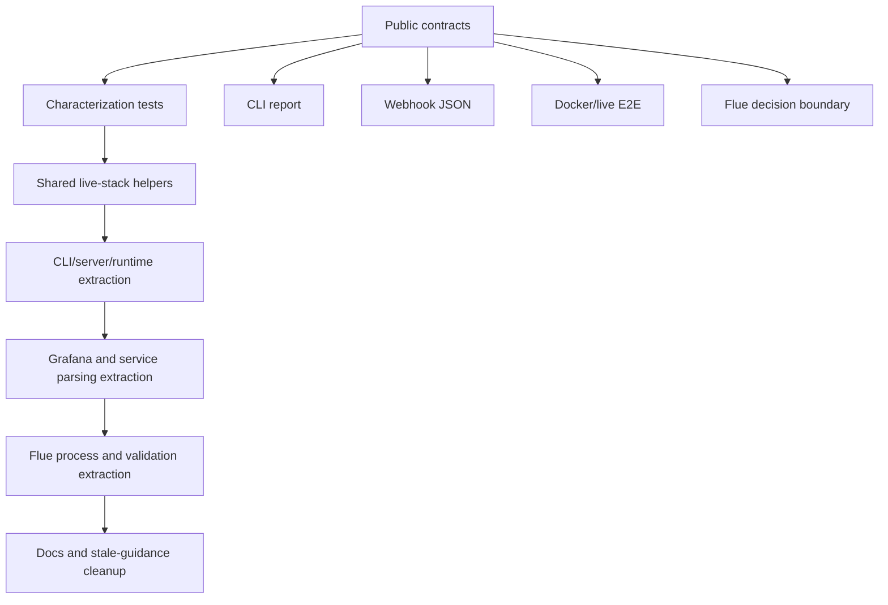

# refactor: Modernize TypeScript incident triage codebase

## Summary

Modernize the current TypeScript incident-triage codebase through small, behavior-preserving refactor passes. The work should first lock down characterization coverage for public contracts, then remove duplicated live-stack orchestration, then split oversized modules along existing responsibility boundaries, and finally refresh stale docs that still reflect older migration history.

---

## Problem Frame

The project has just completed a large Python-to-TypeScript runtime migration. The active runtime is now Node.js, TypeScript, Flue, Pino, Vitest, Docker Compose, Grafana, Loki, and a synthetic local incident service.

That migration left the project in a good functional state, but some files now carry too many responsibilities because they absorbed parity code quickly: CLI orchestration and terminal rendering live together, Grafana parsing is one long normalization path, server request handling and response serialization are coupled, and the live E2E tests plus demo probe duplicate stack orchestration. The next modernization pass should make future changes easier without changing incident-triage behavior.

---

## Requirements

**Behavior preservation**

- R1. Preserve CLI commands, flags, exit codes, stdout/stderr split, default log level, `--log-level debug` behavior, and terminal report semantics.
- R2. Preserve Grafana webhook request and response contracts, including auth, resolved-alert handling, invalid JSON handling, Loki failure handling, response keys, provenance shape, safety shape, and scorecard shape.
- R3. Preserve the Flue-backed MiniMax decision boundary, including local schema validation, taxonomy validation, confidence validation, evidence ID validation, recoverable failures, and secret redaction.
- R4. Preserve deterministic mock behavior for default tests, base Docker Compose, and non-live demos.
- R5. Preserve opt-in behavior for Docker E2E and live MiniMax E2E.
- R6. Preserve raw fixture rules, stable evidence IDs, source-tier semantics, safety gate semantics, and deterministic scorecard meaning.

**Refactor shape**

- R7. Break the work into reviewable passes that can land independently.
- R8. Add characterization tests before moving behavior that is currently broad or indirectly tested.
- R9. Prefer deleting duplication and extracting cohesive helpers over creating broad abstractions.
- R10. Keep public APIs stable unless a pass explicitly includes a compatibility adapter.
- R11. Keep framework migrations, dependency upgrades, API changes, and architecture moves out of this behavior-preserving refactor plan.
- R12. Update docs and learning artifacts only where they would otherwise mislead future implementation.

---

## Current Hotspots

| Area | Current behavior | Structural drag | Proposed direction |
| --- | --- | --- | --- |
| `tests/e2e-grafana-loki.test.ts`, `tests/e2e-live-service-llm.test.ts`, `scripts/run-live-e2e-probe.ts` | Each owns Compose startup, readiness polling, synthetic-service calls, Grafana fixture mutation, webhook posting, and cleanup. | Duplication makes scenario changes easy to apply to one path and forget in another. | Extract shared live-stack helpers and keep test/probe entrypoints thin. |
| `src/cli.ts` | Parses arguments, constructs clients, runs workflows, starts the server, renders terminal output, and prints usage. | Rendering changes require reading command orchestration, and client construction is duplicated between `run` and `serve`. | Extract rendering and runtime client construction while preserving `main` and exported `renderRun`. |
| `src/server.ts` | Handles HTTP routing, body parsing, webhook orchestration, Loki enrichment, workflow execution, and response serialization. | The public webhook contract is harder to inspect because network and serialization code are interleaved. | Extract response serialization and request-body helpers behind the same public server API. |
| `src/grafana.ts` | Recursively rejects answer-like fields, selects alerts, extracts service/scenario/severity/time windows, and builds incidents. | The public facade is useful, but its internal parsing stages are hard to review independently. | Extract internal parsing stages without changing `normalizeGrafanaPayload`. |
| `services/synthetic-checkout-service.ts` | Defines routes, scenario log templates, Loki payload construction, HTTP handling, env config, and process entrypoint. | Adding a new scenario requires touching route metadata, template behavior, and HTTP control flow in one file. | Extract scenario definitions and shared HTTP JSON helpers. |
| `src/llm.ts` | Defines decision types, static client, Flue client, Flue process execution, stdout/stderr debug streaming, JSON parsing, and decision validation. | Provider admission, process execution, and validation are audit-heavy but share one file. | Split Flue execution from decision validation after characterization coverage. |
| `docs/plans/` and `docs/learnings.md` | Historical plans still contain Python, uv, unittest, and Bun-era guidance as historical artifacts. | Search results can confuse future agents unless active vs historical guidance is obvious. | Add a documentation hygiene pass rather than rewriting history wholesale. |

---

## Key Technical Decisions

- KTD1. **Characterization comes before extraction:** The code already has strong tests, but module moves should start by tightening tests around public output and response contracts so later diffs are clearly structural.
- KTD2. **Live-stack orchestration is the first duplication target:** The Docker E2E, live E2E, and demo probe duplicate real operational glue, so extracting it first reduces future scenario friction without touching triage logic.
- KTD3. **Public facades stay stable:** `main`, `renderRun`, `normalizeGrafanaPayload`, `handleGrafanaWebhook`, `startWebhookServer`, `runToResponse`, `FlueDecisionClient`, and `validateDecisionPayload` should remain import-compatible during this refactor.
- KTD4. **Extract by responsibility, not by line count:** Large files are only split where the new boundary maps to a real concept: rendering, runtime construction, response serialization, Grafana parsing, live-stack orchestration, or Flue process execution.
- KTD5. **No framework churn in modernization passes:** Do not introduce Express/Fastify, a command parser, a test framework change, a Docker image upgrade, a Flue upgrade, or a logging library change as part of behavior-preserving refactors.
- KTD6. **Historical plans remain historical:** Older Python or Bun plans should not be rewritten as if they never happened, but active docs and new plans should make the current TypeScript runtime unmistakable.

---

## High-Level Technical Design

The sequence is intentionally conservative: protect observable behavior first, remove duplicated orchestration next, then split modules where tests can prove the public contract stayed stable.

---

## Implementation Units

### U1. Add characterization coverage for public contracts

- **Goal:** Make behavior-preserving refactors safer before moving code.
- **Requirements:** R1, R2, R3, R4, R6, R8
- **Dependencies:** None
- **Files:** `tests/cli.test.ts`, `tests/server.test.ts`, `tests/grafana.test.ts`, `tests/llm.test.ts`, `tests/webhook-outcomes.test.ts`, `tests/triage-outcomes.test.ts`
- **Current behavior:** Existing tests cover the main contracts, but some output and response semantics are asserted indirectly through workflow and outcome tests.
- **Structural improvement:** Add focused characterization tests for CLI report sections, invalid decision rendering, webhook response keys, Grafana answer-field rejection, Flue debug redaction, and response serialization.
- **Approach:** Keep tests behavior-oriented. Avoid object-construction-only tests and brittle full snapshots. Assert stable evidence IDs, section names, response keys, safety fields, and error boundaries.
- **Patterns to follow:** Follow the testing convention in `AGENTS.md` and outcome helpers in `tests/support/outcomes.ts`.
- **Test scenarios:**
  - `renderRun` emits incident identity, optional state trace, evidence list, LLM decision or invalid errors, provenance, safety, and scorecard sections for representative valid and invalid runs.
  - Webhook response serialization includes stable `incident`, `validation`, `decision`, `evidence`, `provenance`, `safety`, and `scorecard` keys for a valid run.
  - Grafana payloads with prohibited answer-like fields are rejected before workflow execution.
  - Flue failures and debug output redact `MINIMAX_API_KEY` before errors or logs become visible.
  - Outcome tests still prove bounded taxonomy, evidence citations, provenance support, and safety behavior.
- **Validation:** Default Vitest suite passes with no Docker or live MiniMax requirements.

### U2. Extract shared live-stack and webhook probe helpers

- **Goal:** Remove duplicated Docker/live E2E orchestration.
- **Requirements:** R4, R5, R7, R9
- **Dependencies:** U1
- **Files:** `tests/e2e-grafana-loki.test.ts`, `tests/e2e-live-service-llm.test.ts`, `tests/live-e2e-probe.test.ts`, `scripts/run-live-e2e-probe.ts`, new `tests/support/live-stack.ts` or `scripts/support/live-stack.ts`
- **Current behavior:** The mock Docker E2E, live MiniMax E2E, and demo probe each implement their own Compose command, readiness loop, synthetic log request, Grafana fixture timestamp mutation, webhook POST, and cleanup.
- **Structural improvement:** Introduce one small support module for live-stack orchestration and scenario metadata. Keep test files responsible for assertions and keep the demo probe responsible for CLI parsing and user-facing summary.
- **Approach:** Extract only repeated mechanics. Preserve the different timeouts and flags where they are meaningful, especially live-provider timeout windows and optional `LIVE_E2E_SHOW_AGENT_LOGS`.
- **Patterns to follow:** Reuse realistic Grafana fixtures from `fixtures/grafana/` and outcome assertions from `tests/support/outcomes.ts`.
- **Test scenarios:**
  - Mock Docker E2E still uses `docker-compose.yml` and deterministic mock LLM behavior.
  - Live E2E still uses `docker-compose.yml` plus `docker-compose.live.yml`, requires `RUN_LIVE_LLM_E2E=1`, and supports `LIVE_E2E_SCENARIOS`.
  - Demo probe still validates live config before starting Compose.
  - Shared fixture mutation updates alert timestamps in memory without modifying fixture files.
  - Cleanup runs when readiness, synthetic log generation, webhook posting, or live model execution fails.
- **Validation:** Default suite passes; opt-in Docker E2E and live E2E commands exercise the same helper path when explicitly enabled.

### U3. Split CLI rendering and runtime construction

- **Goal:** Reduce `src/cli.ts` responsibility while preserving CLI behavior.
- **Requirements:** R1, R3, R4, R7, R10
- **Dependencies:** U1
- **Files:** `src/cli.ts`, new `src/rendering.ts`, new `src/runtime.ts`, `tests/cli.test.ts`, `tests/runtime-summary.test.ts`
- **Current behavior:** `src/cli.ts` parses args, creates loggers, lists scenarios, loads fixtures, constructs mock/live LLM clients, starts the webhook server, and renders reports.
- **Structural improvement:** Move terminal rendering and format helpers into `src/rendering.ts`. Move live/static decision-client construction and webhook runtime construction into `src/runtime.ts` or similarly named focused helpers. Keep `main` as the command dispatcher.
- **Approach:** Preserve `renderRun` as a re-export or compatibility facade if tests or docs import it from `src/cli.ts`. Do not introduce a command parser dependency.
- **Patterns to follow:** Keep stdout for reports and stderr for logs, matching `AGENTS.md`.
- **Test scenarios:**
  - `list` still prints scenario names.
  - `run <scenario> --mock-llm --trace` still renders the same semantic sections.
  - Missing scenario still returns exit code `2`.
  - Missing live MiniMax config still returns a runtime error without leaking secrets.
  - `serve --mock-llm` still constructs webhook runtime without requiring MiniMax config.
- **Validation:** CLI tests and default outcome tests pass without changing documented commands.

### U4. Extract webhook response serialization and HTTP helpers

- **Goal:** Make `src/server.ts` easier to audit without changing the webhook contract.
- **Requirements:** R2, R4, R6, R10
- **Dependencies:** U1
- **Files:** `src/server.ts`, new `src/responses.ts`, optional new `src/http.ts`, `tests/server.test.ts`, `tests/webhook-outcomes.test.ts`
- **Current behavior:** `src/server.ts` owns request routing, body reading, auth header extraction, Grafana normalization, Loki enrichment, workflow execution, server lifecycle, JSON writing, and `TriageRun` response serialization.
- **Structural improvement:** Move `runToResponse` into `src/responses.ts` and move generic request-body/JSON helpers into a tiny HTTP helper if that reduces repetition. Keep `handleGrafanaWebhook` and `startWebhookServer` public behavior stable.
- **Approach:** Start by adding tests against `runToResponse` before moving it. Keep request size limits and status codes unchanged.
- **Patterns to follow:** Use existing `LokiClientLike` and `TriageRun` boundaries; do not introduce a web framework.
- **Test scenarios:**
  - Valid webhook response preserves all top-level and nested JSON fields.
  - Invalid JSON returns the existing `400` response.
  - Unauthorized webhook returns `401` without exposing the configured secret.
  - Resolved-only alert payload returns `202` ignored response.
  - Loki failures or missing logs produce missing context rather than crashing.
- **Validation:** Server tests, webhook outcome tests, and Docker E2E pass with unchanged response contracts.

### U5. Refactor Grafana normalization into named parsing stages

- **Goal:** Make Grafana ingestion easier to extend and review.
- **Requirements:** R2, R6, R7, R10
- **Dependencies:** U1
- **Files:** `src/grafana.ts`, optional new `src/grafana-alerts.ts`, `tests/grafana.test.ts`, `tests/server.test.ts`
- **Current behavior:** `normalizeGrafanaPayload` performs object validation, recursive answer-field rejection, active/resolved alert selection, service extraction, scenario naming, title/severity/symptom construction, runbook extraction, verification-signal extraction, time-window calculation, and raw incident construction in one module.
- **Structural improvement:** Keep `normalizeGrafanaPayload` as the public facade, but extract internal stages around alert selection, label extraction, incident construction, and Loki window derivation.
- **Approach:** Prefer private helpers or one adjacent module over a broad class hierarchy. Keep returned `GrafanaNormalizationResult` unchanged.
- **Patterns to follow:** Keep raw-ingestion boundaries from `AGENTS.md`: Grafana annotations are facts, not suspected causes or recommended actions.
- **Test scenarios:**
  - Active alert payloads produce the same incident fields and Loki query labels.
  - Resolved-only payloads produce ignored results with `resolved_alert`.
  - Missing service/app/job labels still fail with the same bounded error.
  - Invalid `startsAt` still fails with the same bounded error.
  - Answer-like fields remain rejected recursively.
- **Validation:** Grafana tests, server tests, and webhook outcome tests pass.

### U6. Extract synthetic service scenario definitions and JSON IO helpers

- **Goal:** Make the local synthetic service easier to extend for future incident classes.
- **Requirements:** R5, R6, R7, R9
- **Dependencies:** U1
- **Files:** `services/synthetic-checkout-service.ts`, optional new `services/synthetic-scenarios.ts`, optional new `services/http-json.ts`, `tests/synthetic-checkout-service.test.ts`, `tests/loki.test.ts`
- **Current behavior:** One file owns scenario log templates, route metadata, Loki payload construction, Loki push transport, request parsing, response writing, server lifecycle, env config, and process entrypoint.
- **Structural improvement:** Move scenario route/log definitions into a focused module and extract shared JSON request/response helpers only if tests show they clarify the service.
- **Approach:** Preserve endpoint paths, response shape, service labels, scenario names, and Loki payload shape. Keep the service synthetic and non-remediating.
- **Patterns to follow:** Preserve current scenario matrix: checkout payment timeout, capacity saturation, and bad deploy latency.
- **Test scenarios:**
  - `/health` still returns status without Loki.
  - `/checkout`, `/capacity`, and `/bad-deploy` still emit Loki-compatible records with expected service labels.
  - Empty request bodies still get generated IDs.
  - Invalid JSON and oversized payloads still return bounded client errors.
  - Loki push failures still return `loki_push_failed` without leaking request payloads.
- **Validation:** Synthetic service tests, Loki tests, and Docker E2E pass.

### U7. Split Flue process execution from decision validation

- **Goal:** Make the live LLM boundary easier to audit.
- **Requirements:** R3, R7, R10
- **Dependencies:** U1
- **Files:** `src/llm.ts`, optional new `src/flue-runner.ts`, optional new `src/decision-validation.ts`, `tests/llm.test.ts`, `tests/skill-contract.test.ts`
- **Current behavior:** `src/llm.ts` contains decision interfaces, static client, Flue client, Flue subprocess spawning, debug stdout/stderr streaming, Flue JSON extraction, schema validation, confidence validation, and evidence ID validation.
- **Structural improvement:** Move Flue subprocess execution and debug streaming into a dedicated runner module. Move decision payload validation into a focused validation module only if exports can remain stable.
- **Approach:** Keep `FlueDecisionClient`, `runIncidentTriageSkill`, `parseFlueRunOutput`, `parseDecisionText`, and `validateDecisionPayload` import-compatible through re-exports if needed.
- **Patterns to follow:** Preserve recent debug behavior: `info` stays readable, `debug` shows Flue process output, and secrets are redacted before logs/errors.
- **Test scenarios:**
  - Injected Flue runner path still works for deterministic tests.
  - Third-argument executor compatibility for `runIncidentTriageSkill` still works if kept as a public test helper.
  - Nonzero Flue exit, empty stdout, malformed JSON, low confidence, unknown taxonomy, and unknown evidence IDs still fail closed.
  - Debug streaming still logs Flue stdout/stderr only at debug level and redacts secrets.
- **Validation:** LLM tests, skill contract tests, CLI tests, and a manual live debug smoke when credentials are available.

### U8. Clean stale docs and historical-plan discoverability

- **Goal:** Prevent old migration guidance from slowing future agents while preserving useful history.
- **Requirements:** R11, R12
- **Dependencies:** U2, U3, U4, U5, U6, U7
- **Files:** `README.md`, `AGENTS.md`, `docs/learnings.md`, `docs/solutions/architecture-patterns/bounded-llm-incident-triage-workflow.md`, historical files under `docs/plans/`
- **Current behavior:** Active docs are TypeScript-oriented, but historical plan files still contain many Python, uv, unittest, and Bun references because they document earlier stages.
- **Structural improvement:** Add a lightweight note or index guidance that distinguishes active runtime docs from historical plans. Refresh active docs only when module boundaries or commands change.
- **Approach:** Do not rewrite old plans as if they were current truth. Instead, make active docs and learnings point future readers to current commands and current architecture.
- **Patterns to follow:** Keep `docs/learnings.md` as a teaching checklist and `docs/solutions/` as durable architecture rationale, not a changelog.
- **Test scenarios:**
  - Active docs describe npm, TypeScript, Flue, Pino, Docker, and opt-in live MiniMax paths.
  - Active docs do not recommend Python, uv, unittest, Bun, or removed entrypoints as current workflow.
  - Historical plans remain readable as historical context.
  - Topic docs still explain the bounded workflow without implying production remediation.
- **Validation:** Documentation review plus `rg` checks that active docs do not point at removed runtime paths.

---

## Scope Boundaries

- Do not change incident classes, next actions, fixture schemas, evidence ID formats, source-tier semantics, safety rules, or scorecard definitions.
- Do not change prompt semantics or skill instructions except to preserve import paths or docs after a module move.
- Do not change Flue version, MiniMax model, provider endpoint shape, Grafana image, Loki image, Docker base image, Node version, or Pino setup in these passes.
- Do not introduce Express, Fastify, Commander, Zod, a test framework change, a queue system, or a new runtime.
- Do not make Docker or live MiniMax tests part of the default suite.
- Do not remove historical plans; clarify active guidance instead.

### Deferred to Follow-Up Work

- A framework migration for the HTTP server, if the local Node HTTP wrapper becomes limiting.
- A dependency upgrade pass for Flue, Pino, Grafana, Loki, Node, or TypeScript.
- A prompt-quality optimization pass for the `incident-triage` skill.
- A BullMQ or background-worker conversion from CLI/server execution to queued jobs.
- A production observability integration with real Grafana, Loki, deploy metadata, or alert routing.
- A log colorization knob such as `LOG_COLOR=always|auto|never` for Docker-followed demo logs.

---

## Parity And Validation Strategy

Before implementation starts, preserve the current behavioral contract in tests and docs:

- **Default parity:** `npm test`, `npm run typecheck`, and `npm run build` should remain the primary no-network checks.
- **CLI parity:** semantic report assertions should cover mock valid, mock invalid, trace, and config-error paths.
- **Webhook parity:** response-shape assertions should cover valid, invalid JSON, unauthorized, resolved alert, missing logs, and invalid LLM output.
- **Docker parity:** `RUN_DOCKER_E2E=1` should remain opt-in and continue to exercise checkout, capacity, and bad-deploy scenarios.
- **Live parity:** `RUN_LIVE_LLM_E2E=1` should remain opt-in and contract-based, not exact-wording-based.
- **Demo parity:** `npm run demo-live` should keep producing a sanitized summary with decision, provenance, safety, and scorecard fields.

---

## Separate Migration Tasks

These are intentionally outside the behavior-preserving modernization plan:

- **HTTP framework migration:** Moving from `node:http` to Express, Fastify, Hono, or another framework changes request lifecycle, error handling, and dependency surface.
- **CLI framework migration:** Moving from manual parsing to Commander, Yargs, or Clipanion changes help text, parsing errors, and command contracts.
- **Validation library migration:** Replacing Valibot changes schema errors and should be planned as an API contract migration.
- **Queue architecture migration:** BullMQ or another worker model changes execution timing, retries, persistence, idempotency, and observability.
- **Provider or Flue upgrade:** Updating Flue 1.0 beta, MiniMax model names, or provider base URL behavior should have its own live-provider compatibility plan.
- **Test framework or runner migration:** Vitest is now the project convention; any change to another runner is a separate migration.

---

## Risks And Mitigations

| Risk | Impact | Mitigation |
| --- | --- | --- |
| Refactor changes public CLI or webhook output accidentally | Demos, docs, and tests drift from expected operator contract | Add characterization tests before extraction and keep output assertions semantic. |
| Shared live-stack helper hides scenario-specific differences | Live and mock E2E become less clear | Extract mechanics only; leave assertions and scenario expectations in the test files. |
| Splitting modules creates too many tiny files | Code becomes harder to scan | Extract only named responsibilities with multiple call sites or real audit value. |
| Historical docs confuse future agents | Agents follow stale Python/Bun guidance | Update active docs and add discoverability notes without rewriting historical plans. |
| Live debug logging becomes too noisy | Demo output is harder to read | Keep `info` default clean and require explicit debug/log-follow flags for full Flue visibility. |

---

## Sources And Research

- `AGENTS.md` defines the active TypeScript runtime, hard constraints, and testing convention.
- `CONCEPTS.md` defines the project vocabulary for Evidence Package, Source Tier, Safety Gate, Scorecard, Integration E2E, and Live Provider E2E.
- `docs/plans/2026-06-16-004-refactor-modernization-plan.md` is the older Python-era modernization plan; it is useful historically but no longer matches the active runtime.
- `docs/plans/2026-06-18-002-feat-typescript-live-runtime-plan.md` documents the completed TypeScript live-runtime promotion.
- `docs/solutions/architecture-patterns/bounded-llm-incident-triage-workflow.md` records the core architecture pattern to preserve: code owns orchestration, state, validation, and safety; the skill owns bounded domain reasoning.
