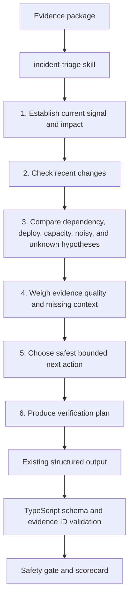

# feat: Add human investigation path to incident triage skill

## Summary

Update the `incident-triage` skill so the model reasons through an on-call SRE investigation path before returning the existing bounded structured decision. The implementation should preserve the current output schema, Flue workflow boundary, validation rules, safety gate, and scorecard behavior.

---

## Problem Frame

The current skill tells the model to classify one incident and choose one bounded next action from supplied evidence. That is safe, but it does not strongly guide the model through the way a human SRE investigates: establish the current signal, assess impact, check recent changes, compare local-service and dependency evidence, weigh evidence quality, choose the least risky next action, and define recovery verification.

The desired change is prompt-level behavior, not a new agent loop. The skill should simulate human investigation inside one Flue skill call while the TypeScript application continues to own evidence collection, schema validation, evidence citation validation, safety policy, provenance, and scorecards.

---

## Requirements

**Investigation behavior**

- R1. The skill must instruct the model to investigate in a human SRE order: current signal, impact, recent changes, dependency-vs-local evidence, evidence quality, missing context, next action, and verification.
- R2. The skill must keep runbooks as guidance, not proof, and keep prior incidents as supporting analogy, not primary evidence.
- R3. The skill must distinguish temporal correlation from causal evidence when recent deploys appear near incident start.
- R4. The skill must prefer non-mutating or human-confirming actions when evidence is mixed, missing, or contradictory.
- R5. The skill must include verification steps that prove or disprove the chosen hypothesis and confirm recovery.

**Contract preservation**

- R6. The skill must keep the same structured output fields: `incident_class`, `next_action`, `confidence`, `evidence_ids`, `caveats`, and `verification_plan`.
- R7. The skill must cite only evidence IDs supplied in the evidence package.
- R8. The TypeScript validation, evidence citation checks, safety gate, provenance output, and scorecard behavior must remain unchanged.
- R9. The change must not introduce agent-selected tool calls, production actions, Asana/task creation, RCA brief generation, or a new workflow state.

---

## Key Technical Decisions

- KTD1. **Improve the skill, not the workflow:** The model should reason in a more human investigative sequence, but the application should still call one Flue skill and validate one bounded result.
- KTD2. **Keep output schema stable:** The current schema already supports the desired improvement through better `evidence_ids`, `caveats`, and `verification_plan`; adding new fields would create avoidable downstream churn.
- KTD3. **Test prompt invariants directly:** Since this is prompt behavior, add skill-contract tests that check for the investigation stages, safety boundaries, evidence citation rules, and unchanged output fields.
- KTD4. **Use outcome tests as guardrails, not exact wording tests:** Deterministic mock outcomes should stay exact where they already are, but live MiniMax tests should continue checking broad contracts rather than the exact wording of caveats or verification plans.
- KTD5. **Defer multi-step tool use:** Agent-selected read-only evidence tools are a valid future direction, but this pass should keep the one-shot skill architecture to isolate prompt-quality impact.

---

## High-Level Technical Design

The implementation changes the reasoning instructions inside the skill. It does not add new runtime states or tool calls.

---

## Implementation Units

### U1. Strengthen skill-contract tests before editing the skill

- **Goal:** Capture the intended prompt contract before changing the skill body.
- **Requirements:** R1, R6, R7, R8, R9
- **Dependencies:** None
- **Files:** `tests/skill-contract.test.ts`, `.agents/skills/incident-triage/SKILL.md`
- **Approach:** Expand the existing skill-contract test from a few string checks into a small set of behavior-oriented prompt-invariant checks. Keep assertions focused on required concepts rather than full prompt snapshots.
- **Patterns to follow:** Current `tests/skill-contract.test.ts` reads the skill file directly and checks public mission/output boundaries.
- **Test scenarios:**
  - The skill declares the bounded mission and says it does not execute production changes.
  - The skill names the human-style investigation stages: current signal, impact, recent changes, dependency-vs-local evidence, evidence quality, missing context, next action, and verification.
  - The skill preserves the six required output fields.
  - The skill says evidence IDs must come from the supplied evidence package.
  - The skill does not ask the model to call tools or create external tickets/tasks.
- **Verification:** The skill-contract test fails before the prompt update and passes after the prompt update.

### U2. Rewrite the skill instructions around an SRE investigation loop

- **Goal:** Make the skill simulate how an experienced on-call SRE investigates an incident.
- **Requirements:** R1, R2, R3, R4, R5, R6, R7, R9
- **Dependencies:** U1
- **Files:** `.agents/skills/incident-triage/SKILL.md`, `tests/skill-contract.test.ts`
- **Approach:** Add an `Investigation Process` section that guides the model through the investigation order while retaining the existing `Inputs`, `Decision Rules`, and `Output` contract. Keep the language concise enough for Flue skill activation but specific enough to shape reasoning.
- **Patterns to follow:** Preserve the current mission boundary: classify one incident, choose one bounded next action, use only supplied evidence, and do not invent missing evidence.
- **Test scenarios:**
  - The prompt instructs the model to identify active alerts, symptoms, service, severity, and time window before classification.
  - The prompt instructs the model to compare recent deploy/config/traffic changes against logs and verification signals before treating the change as causal.
  - The prompt instructs the model to compare dependency outage, bad deploy, capacity saturation, noisy alert, insufficient context, and unknown hypotheses.
  - The prompt instructs the model to prefer current signal and operational evidence over runbooks and historical analogies.
  - The prompt instructs the model to choose safer non-mutating or human-confirming actions when evidence is mixed.
  - The prompt instructs the model to produce recovery-oriented verification steps.
- **Verification:** Skill-contract tests pass and the Flue workflow continues to activate the same skill name.

### U3. Add decision-quality fixtures or tests for human-style reasoning

- **Goal:** Prove the new instructions improve reasoning pressure without relying on live model wording.
- **Requirements:** R1, R2, R3, R4, R5, R8
- **Dependencies:** U2
- **Files:** `tests/triage-outcomes.test.ts`, `tests/llm.test.ts`, optional `docs/examples/live-e2e-response.json`
- **Approach:** Add or adjust deterministic tests that reflect human investigation expectations through the structured fields the workflow already validates. Keep static decisions realistic: caveats should mention mixed evidence when a deploy is present, and verification plans should include hypothesis-confirming recovery signals.
- **Patterns to follow:** Existing outcome tests assert incident class, next action, evidence prefixes, cited sources, cited tiers, safety behavior, and scorecard checks.
- **Test scenarios:**
  - Checkout dependency outage static response cites current payment/log evidence and caveats that the recent checkout deploy is weaker than dependency evidence.
  - Bad deploy static response cites deploy and log evidence and keeps rollback behind approval.
  - Capacity saturation static response cites saturation alerts/logs and uses an approval-required runbook action.
  - Noisy alert static response cites recovery/verification signals and chooses `continue_monitoring`.
  - Historical-only evidence remains visible as weak evidence and does not become high-quality grounding.
- **Verification:** Outcome tests continue to prove bounded decisions, evidence grounding, provenance, safety, and scorecard behavior.

### U4. Run a live prompt smoke and update the saved example if behavior improves

- **Goal:** Check that the live Flue/MiniMax path still returns valid structured output and tends to produce more investigation-shaped caveats and verification plans.
- **Requirements:** R5, R6, R7, R8
- **Dependencies:** U2, U3
- **Files:** `docs/examples/live-e2e-response.json`, `tests/e2e-live-service-llm.test.ts`, `README.md`
- **Approach:** Keep this as an opt-in validation step. If a live run produces a better sanitized example, update the saved example without including secrets or raw provider internals.
- **Patterns to follow:** Existing live E2E tests assert broad contracts, not exact model text.
- **Test scenarios:**
  - Live checkout run returns a valid structured decision.
  - Live response cites only supplied evidence IDs.
  - Live caveats distinguish weak deploy correlation from stronger current dependency evidence when applicable.
  - Live verification plan includes recovery confirmation signals such as timeout rate, latency, queue depth, error rate, or provider health.
  - Live debug logs remain opt-in with `AGENT_LOG_LEVEL=debug` and do not expose secrets.
- **Verification:** The opt-in live run passes when credentials are available; otherwise default tests remain sufficient.

### U5. Update docs and learnings for the investigation-style skill

- **Goal:** Teach the new mental model without implying the workflow has become a freeform agent loop.
- **Requirements:** R1, R8, R9
- **Dependencies:** U2, U3
- **Files:** `README.md`, `AGENTS.md`, `docs/learnings.md`, `docs/solutions/architecture-patterns/bounded-llm-incident-triage-workflow.md`
- **Approach:** Describe the skill as a human-style investigation prompt inside a bounded decision workflow. Keep docs clear that the code still owns orchestration, validation, safety, and scoring.
- **Patterns to follow:** Existing docs emphasize that the workflow is the system and the LLM contributes one bounded judgment.
- **Test scenarios:**
  - README describes the skill investigation path without claiming tool-calling autonomy.
  - AGENTS hard constraints still say the LLM does not drive workflow state until validation passes.
  - Learnings include why human-like reasoning instructions are safe only because output remains bounded.
  - Architecture docs distinguish this pass from future agent-selected evidence tools.
- **Verification:** Documentation review confirms current commands and architecture boundaries remain accurate.

---

## Scope Boundaries

- Do not add agent-selected tool calls in this pass.
- Do not add or change output schema fields.
- Do not change incident classes or next actions.
- Do not change TypeScript validation, safety policy, provenance semantics, or scorecard scoring.
- Do not add Asana, ticket creation, RCA brief creation, Slack, PagerDuty, or production remediation.
- Do not make live MiniMax tests part of the default suite.

### Deferred to Follow-Up Work

- A future tool-calling architecture where the agent selects read-only evidence tools before the bounded decision.
- A separate RCA brief renderer built from validated evidence and decision output.
- A handoff/task creation step after safety validation.
- Prompt optimization experiments that compare multiple investigation prompt variants with measurable outcome scores.

---

## Acceptance Examples

- AE1. **Human investigation prompt:** Given the updated skill file, when the skill-contract test reads it, then it finds the SRE investigation stages and the unchanged output contract.
- AE2. **Dependency outage reasoning:** Given checkout has payment-gateway alerts, payment timeout logs, and a recent but weaker checkout deploy, when the model returns a valid decision, then caveats should distinguish dependency evidence from deploy correlation.
- AE3. **Approval-sensitive reasoning:** Given bad deploy or capacity saturation evidence, when the decision recommends rollback or runbook action, then the bounded next action still routes through approval-required safety behavior.
- AE4. **Missing or weak evidence:** Given contradictory, historical-only, or incomplete evidence, when the decision is validated, then caveats, `gather_more_context`, or `ask_human` remain valid outcomes and unsupported confident action remains rejected by tests or scorecard.

---

## Risks And Mitigations

| Risk | Impact | Mitigation |
| --- | --- | --- |
| The prompt becomes verbose enough to distract the model from the output schema | More invalid live responses | Keep the investigation loop concise and repeat the exact output contract at the end. |
| Human-style reasoning language encourages hidden freeform conclusions | Harder-to-validate responses | Preserve schema validation and evidence ID validation unchanged. |
| The model overweights recent deploys because the prompt asks it to check changes | False bad-deploy classifications | State that temporal correlation is weak until supported by logs or verification signals. |
| Verification plans become generic | Less useful operator output | Require verification steps tied to cited hypothesis and recovery signals. |
| Tests become prompt snapshots | Brittle refactors | Test durable concepts and output fields, not exact paragraphs. |

---

## Sources And Research

- `.agents/skills/incident-triage/SKILL.md` contains the current bounded skill contract.
- `src/workflows/incident-triage.ts` shows that Flue calls one `incident-triage` skill and validates against `incidentTriageDecisionSchema`.
- `src/llm.ts` owns local validation, confidence checks, evidence ID validation, Flue process execution, and secret redaction.
- `tests/skill-contract.test.ts` is the narrow prompt-contract test surface.
- `tests/triage-outcomes.test.ts` and `tests/support/outcomes.ts` prove bounded decisions, evidence grounding, provenance, safety, and scorecard behavior.
- `docs/solutions/architecture-patterns/bounded-llm-incident-triage-workflow.md` records the architecture principle to preserve: code owns orchestration, state, validation, and safety; the skill owns bounded domain reasoning.
