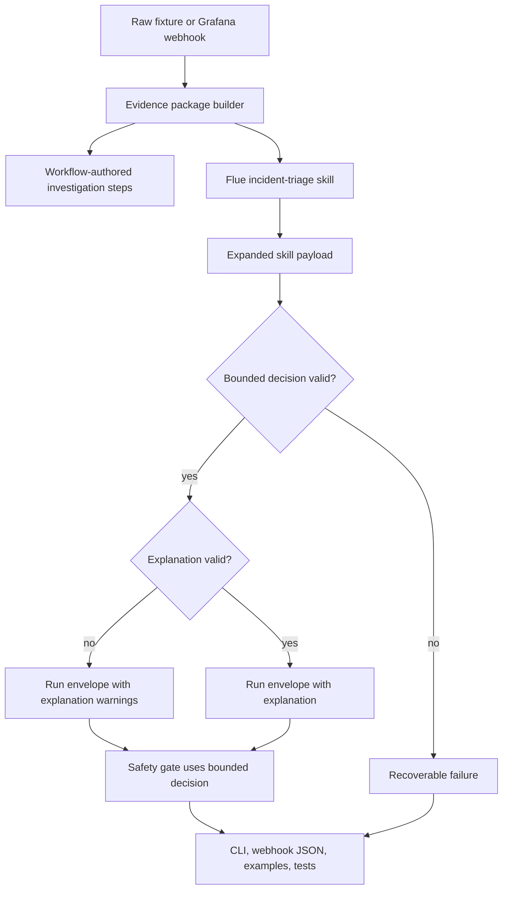

# feat: Add agentic triage run envelope

## Summary

Add an agentic run envelope around the current bounded incident triage decision. The workflow will record the investigation it actually performed, the `incident-triage` skill will return evidence-grounded explanation fields beside a nested bounded decision, and deterministic validation will decide which parts can be trusted.

---

## Problem Frame

The current architecture is safe but terse: code gathers evidence, MiniMax through Flue returns one bounded decision, and local validation, safety, provenance, and scoring control the operational result. The next gap is legibility. An operator can inspect evidence and the final decision, but the result does not yet read like an investigation with factual evidence-gathering steps, competing hypotheses, a finding summary, and a recommendation rationale.

This plan preserves the existing control boundary. The LLM may explain and recommend within the schema, but only the validated bounded decision can drive workflow state, safety behavior, approval handling, provenance, and scorecard results.

---

## Requirements

**Run Envelope**

- R1. The triage result exposes an additive run envelope with `run_id`, `run_status`, `investigation`, optional explanation fields, `explanation_validation`, the authoritative bounded decision, safety, provenance, and scorecard surfaces.
- R2. Existing decision fields remain stable: `incident_class`, `next_action`, `confidence`, `evidence_ids`, `caveats`, and `verification_plan`.
- R3. Existing webhook request status semantics stay stable while triage lifecycle state is represented separately as `run_status`.

**Investigation Trace**

- R4. The workflow records investigation steps for evidence-gathering work it actually performed, including found, missing, skipped, and failed lookups.
- R5. Investigation steps identify purpose, bounded status, and produced evidence IDs when evidence exists.
- R6. Investigation steps never claim that the LLM executed tools or took production actions.

**Explanation Layer**

- R7. The same `incident-triage` skill call returns `analysis.hypotheses`, `finding_summary`, `recommendation`, and a nested bounded `decision`.
- R8. Hypotheses and recommendation rationale cite only evidence IDs present in the supplied evidence package.
- R9. `recommendation` explains `decision.next_action` without introducing a second action field or action vocabulary.

**Validation And Safety**

- R10. Invalid bounded decisions continue to produce recoverable failure and do not reach safety policy.
- R11. Invalid explanation fields may be dropped when the bounded decision is valid, and `explanation_validation` records the degraded state.
- R12. Safety, provenance, and scorecard behavior continue to derive from the bounded decision, not from freeform explanatory text.

**Scope Safety**

- R13. This version does not add agent-selected tools, write tools, autonomous remediation, ticket creation, rollback execution, scaling execution, alert closure, persistence, or future tool-extension scaffolding.

---

## Key Technical Decisions

- **Additive envelope, stable decision core:** The new result wraps the existing bounded decision instead of replacing it. This lets current safety, provenance, scorecard, CLI, webhook, and outcome assertions migrate without semantic drift.
- **Workflow-authored investigation steps:** Evidence-gathering trace data belongs to deterministic code because it must describe what actually happened. The LLM can explain evidence, but it cannot be the source of truth for tool execution.
- **One skill call, expanded structured result:** The Flue workflow should keep one `session.skill("incident-triage", ...)` boundary and upgrade the result schema. Adding a second LLM call would raise latency, cost, and failure modes without improving authority separation.
- **Degradable explanation layer:** A valid decision with malformed explanatory fields should remain usable. The validator should preserve the decision, drop invalid explanation fields, and record warnings instead of sending the run to recoverable failure.
- **Legacy decision fallback for rollback:** The validation boundary should continue to understand the current decision-only shape as a rollback-compatible path. When that fallback is used, explanation fields are absent and `explanation_validation` reports that the explanation layer was not available.
- **Webhook `status` stays request-oriented:** Existing server responses use `status` for HTTP/request outcome. The triage envelope should add `run_status` rather than repurposing `status`.

---

## High-Level Technical Design

The workflow already has the right authority split. This change adds structured visibility around that split:

- Evidence construction produces both the evidence package and an investigation record.
- The Flue skill returns an expanded payload whose nested decision remains the operational contract.
- Local validation normalizes either expanded payloads or decision-only fallback payloads.
- Workflow state, safety, provenance, and scorecard logic continue to consume the validated decision.
- Renderers expose compact investigation output by default and detailed steps in trace or JSON surfaces.

---

## Implementation Units

### U1. Expand LLM result validation

- **Goal:** Validate the expanded skill payload while preserving the existing bounded decision contract.
- **Requirements:** R2, R7, R8, R9, R10, R11, R12
- **Dependencies:** None
- **Files:** `src/llm.ts`, `tests/llm.test.ts`, `tests/skill-contract.test.ts`
- **Approach:** Add schema and normalization support for hypotheses, `finding_summary`, recommendation rationale, nested `decision`, and `explanation_validation`. Keep `validateDecisionPayload` as a stable facade for existing policy and scoring callers, and add a higher-level validator for the expanded result. Accept the legacy decision-only shape as an explicit fallback that marks explanation data unavailable.
- **Patterns to follow:** Keep provider parsing and semantic validation inside `src/llm.ts`; follow the current Valibot schema style and evidence ID validation.
- **Test scenarios:**
  - Covers AE2. Given a valid expanded payload with hypotheses, finding summary, recommendation rationale, and nested decision, validation returns a valid decision and valid explanation metadata.
  - Covers AE2. Given a recommendation with an evidence ID not present in the evidence package, validation drops or rejects the explanation while preserving a valid bounded decision.
  - Covers AE2. Given a recommendation that introduces its own `next_action`, validation reports an explanation warning.
  - Covers AE3. Given an invalid nested incident class or next action, validation returns an invalid result with no trusted decision.
  - Covers AE4. Given a valid decision and malformed hypothesis, validation keeps the decision and records a degraded explanation state.
  - Given a legacy decision-only payload, validation returns the current decision and marks the explanation layer unavailable.
- **Verification:** Existing policy and scoring callers can still consume `ValidationResult.decision`, while expanded payload tests prove explanation fields are validated separately.

### U2. Record workflow investigation steps during evidence gathering

- **Goal:** Make the evidence-gathering work visible as workflow-authored investigation data.
- **Requirements:** R1, R4, R5, R6
- **Dependencies:** None
- **Files:** `src/evidence.ts`, `src/workflow.ts`, `tests/evidence.test.ts`, `tests/workflow.test.ts`
- **Approach:** Extend the evidence package or run metadata to include investigation steps generated by the evidence builder. Record a step for each evidence family the workflow inspects: alerts, symptoms, deploys, logs, service ownership, runbooks, prior incidents, and verification signals. Represent absent or failed lookups with bounded statuses instead of hiding them in `missingContext` alone.
- **Patterns to follow:** Preserve stable evidence IDs and current `missingContext` behavior. Keep fixture-derived facts raw and do not add suspected causes or recommendations to evidence.
- **Test scenarios:**
  - Covers AE1. Given checkout evidence with alerts, logs, runbook, prior incident, and verification signals, the run includes `found` investigation steps with the expected evidence ID prefixes.
  - Covers AE1. Given no logs or missing service ownership, the run includes `not_found` or `error` investigation steps and still reports missing context.
  - Covers AE5. Given any scenario, investigation steps describe evidence gathering only and never claim LLM tool execution or remediation.
  - Given a prebuilt evidence package from webhook handling, the workflow preserves the investigation steps instead of re-deriving incompatible trace data.
- **Verification:** A workflow run can show both compact investigation summary and detailed step data without changing the evidence IDs used by decision validation.

### U3. Update the Flue skill and mock decisions for the expanded payload

- **Goal:** Make live and mock LLM paths return the same expanded result shape.
- **Requirements:** R2, R7, R8, R9, R13
- **Dependencies:** U1
- **Files:** `.agents/skills/incident-triage/SKILL.md`, `src/workflows/incident-triage.ts`, `src/mock-decisions.ts`, `tests/skill-contract.test.ts`, `tests/triage-outcomes.test.ts`
- **Approach:** Update the skill output instructions to request evidence-grounded hypotheses, a concise finding summary, recommendation rationale, and nested bounded decision. Update the Flue result schema to the expanded validator schema. Update deterministic mock responses to exercise the expanded shape while retaining decision-only fallback tests in `src/llm.ts`.
- **Patterns to follow:** Keep the Flue workflow thin: register the provider, create a session, call the skill with arguments and result schema, and return `response.data`. Avoid extra wrappers around Flue.
- **Test scenarios:**
  - Covers AE2. The skill contract names the expanded output fields and says recommendation rationale explains the nested decision action.
  - Covers AE5. The skill contract continues to forbid tool calls, tickets, external handoffs, and production changes.
  - Given each mock outcome scenario, the workflow receives an expanded payload and still satisfies the expected incident class, next action, evidence prefixes, provenance support, and safety behavior.
  - Given a live-compatible payload shape from the Flue workflow boundary, the typed result schema accepts nested decision output.
- **Verification:** Mock and live paths share the expanded schema, while deterministic outcome tests remain focused on operator-facing behavior rather than exact rationale wording.

### U4. Thread the run envelope through workflow, safety, and scorecard

- **Goal:** Store the envelope on `TriageRun` without changing which fields drive safety and scoring.
- **Requirements:** R1, R3, R10, R11, R12
- **Dependencies:** U1, U2
- **Files:** `src/workflow.ts`, `src/scoring.ts`, `tests/workflow.test.ts`, `tests/scoring.test.ts`, `tests/support/outcomes.ts`
- **Approach:** Add run-level metadata for `run_id`, terminal `run_status`, investigation, explanation fields, and explanation validation. Keep current state transitions intact: invalid decisions still go to recoverable failure; valid decisions still pass through safety and scoring. Scorecard calculations should continue to inspect `ValidationResult.decision` and provenance from cited decision evidence IDs.
- **Patterns to follow:** Follow the current `TriageWorkflow.run` state-machine style and avoid introducing an agent loop.
- **Test scenarios:**
  - Covers AE3. Invalid bounded decisions produce recoverable failure, omit trusted decision output, and skip safety policy.
  - Covers AE4. Valid decisions with degraded explanations continue through safety and scoring with explanation warnings visible.
  - Given a safe dependency-outage recommendation, safety uses `decision.nextAction` and does not inspect recommendation rationale.
  - Given an approval-required bad-deploy or capacity scenario, staged/audit safety behavior remains unchanged.
- **Verification:** The state machine remains deterministic, and scorecard pass/fail behavior is unchanged for existing valid and invalid decision outcomes.

### U5. Render the envelope in CLI, webhook JSON, examples, and demo output

- **Goal:** Expose the run envelope to operators without making default output noisy.
- **Requirements:** R1, R2, R3, R11
- **Dependencies:** U1, U2, U4
- **Files:** `src/cli.ts`, `src/server.ts`, `scripts/run-live-e2e-probe.ts`, `docs/examples/live-e2e-response.json`, `docs/examples/typescript-webhook-response.json`, `tests/cli.test.ts`, `tests/server.test.ts`, `tests/webhook-outcomes.test.ts`, `tests/live-e2e-probe.test.ts`
- **Approach:** Render compact investigation summary, finding summary, recommendation rationale, decision, provenance, safety, and scorecard in normal operator output. Keep detailed investigation steps available in trace or JSON output. In webhook responses, preserve existing `status` and add run-envelope fields such as `run_status`, `investigation`, `analysis`, `finding_summary`, `recommendation`, and `explanation_validation`.
- **Patterns to follow:** Keep diagnostic logs on stderr and report output on stdout. Keep webhook JSON field names snake_case where the existing API already uses that convention.
- **Test scenarios:**
  - Covers AE1. CLI mock trace includes investigation steps and evidence details.
  - Given normal CLI output, the report includes a compact investigation summary and finding summary without dumping every step.
  - Given a webhook response, `status` remains request-oriented and `run_status` reflects triage lifecycle outcome.
  - Given a degraded explanation, JSON output includes explanation warnings while still including a valid decision and safety result.
  - Given the live demo probe summary, the printed output includes decision and explanation summary without leaking secrets.
- **Verification:** Operator-facing output is more legible, and existing consumers that check decision, provenance, safety, and scorecard fields can still find them.

### U6. Extend outcome, E2E, and documentation coverage

- **Goal:** Prove the new envelope across realistic paths and explain the architecture clearly.
- **Requirements:** R1, R4, R7, R10, R11, R13
- **Dependencies:** U1, U2, U3, U4, U5
- **Files:** `tests/support/outcomes.ts`, `tests/triage-outcomes.test.ts`, `tests/webhook-outcomes.test.ts`, `tests/e2e-live-service-llm.test.ts`, `README.md`, `AGENTS.md`, `docs/learnings.md`
- **Approach:** Extend shared outcome assertions to verify bounded decisions, citation validity, provenance support, safety behavior, and explanation-envelope presence without asserting exact model prose. Update docs to teach the distinction between workflow-authored investigation, LLM-authored explanation, and decision-authoritative safety behavior.
- **Patterns to follow:** Follow the testing convention in `AGENTS.md`: call actual functions or handlers, use realistic fixtures, mock only unstable external boundaries, and bias toward fewer focused integration tests.
- **Test scenarios:**
  - Covers AE1. Fixture and webhook outcome tests assert that investigation details exist for gathered and missing evidence families.
  - Covers AE2. Outcome helpers assert explanation evidence IDs are valid without checking exact rationale wording.
  - Covers AE3. Recoverable failure tests assert no trusted decision, no safety result, and visible validation errors.
  - Covers AE4. Degraded explanation tests assert valid decision plus explanation warnings.
  - Covers AE5. Tests assert no tool-selection or production-action fields appear in the result.
  - Live-provider E2E asserts broad envelope contract only when explicitly enabled.
- **Verification:** The default suite proves deterministic behavior without live credentials, and opt-in live coverage proves the expanded MiniMax/Flue contract without relying on exact provider wording.

---

## Acceptance Examples

- AE1. **Agentic run result:** Given a checkout payment timeout scenario, the rendered result includes workflow-authored investigation steps for found and missing evidence while preserving the nested bounded decision.
- AE2. **Explanation validation:** Given an expanded skill payload, hypotheses and recommendation rationale cite valid evidence IDs and recommendation does not introduce its own action field.
- AE3. **Invalid decision failure:** Given an invalid incident class or next action, the run enters recoverable failure and never applies safety policy.
- AE4. **Degraded explanation:** Given a valid decision with malformed explanation data, the decision continues through safety and `explanation_validation` reports warnings.
- AE5. **No autonomous authority:** Given the new envelope, the result contains investigation trace and explanation data but no agent-selected tools or production action execution.

---

## System-Wide Impact

- **LLM boundary:** `src/llm.ts` becomes responsible for a larger result contract, but the stable decision facade remains the integration point for policy and scoring.
- **Workflow state:** `TriageRun` carries more run metadata, but state transitions stay bounded and deterministic.
- **Public output:** Webhook JSON gains envelope fields. Existing `status`, `decision`, `provenance`, `safety`, and `scorecard` semantics should remain available.
- **Tests:** Outcome helpers become the main guardrail against contract drift across fixture, webhook, Docker, and live-provider paths.
- **Docs:** README and AGENTS should teach that the agent is more legible, not more autonomous.

---

## Scope Boundaries

### In Scope

- Expanded one-shot skill result.
- Workflow-authored investigation steps.
- Explanation validation and degraded explanation handling.
- CLI, webhook, examples, outcome tests, and learning docs.

### Deferred To Follow-Up Work

- Agent-selected read-only tools.
- Persisted run history.
- Queue-based triage execution.
- UI for exploring run traces.
- Risk ranking or queue prioritization across multiple incidents.

### Outside This Version

- Autonomous rollback, scaling, runbook execution, alert closure, ticket creation, or production mutation.
- Adding new incident classes or next actions.
- Replacing the current Flue/MiniMax boundary with another provider architecture.

---

## Risks & Dependencies

- **Provider schema reliability:** The larger structured response may be harder for MiniMax to satisfy consistently. Mitigation: validate explanation separately, retain decision-only fallback, and keep live tests broad rather than prose-exact.
- **Contract drift:** Adding envelope fields could accidentally break existing webhook expectations. Mitigation: preserve current decision and request-status fields, and extend response contract tests.
- **Over-agentification:** The envelope may look like an agent loop even though tools are not model-selected. Mitigation: make investigation steps workflow-authored and document the authority boundary.
- **Test brittleness:** Explanation prose can vary by provider. Mitigation: assert citation validity and required sections, not exact wording.
- **Output noise:** Detailed investigation steps can make CLI output hard to scan. Mitigation: compact default output, detailed trace mode, full JSON for APIs and examples.

---

## Documentation / Operational Notes

- Update `README.md` to explain the run envelope as an inspectability improvement around the existing bounded decision workflow.
- Update `AGENTS.md` to keep future agents aligned on workflow-authored investigation steps and non-authoritative explanation fields.
- Update `docs/learnings.md` with the teaching checklist for why the envelope improves legibility without increasing production authority.
- Refresh sanitized examples under `docs/examples/` so reviewers can see what "good" looks like for evidence citations, explanation validation, provenance, safety, and scorecard output.

---

## Sources / Research

- `docs/brainstorms/2026-06-19-agentic-triage-run-envelope-requirements.md`
- `AGENTS.md`
- `CONCEPTS.md`
- `docs/learnings.md`
- `docs/solutions/architecture-patterns/bounded-llm-incident-triage-workflow.md`
- `src/llm.ts`
- `src/evidence.ts`
- `src/workflow.ts`
- `src/workflows/incident-triage.ts`
- `src/server.ts`
- `src/cli.ts`
- `.agents/skills/incident-triage/SKILL.md`
