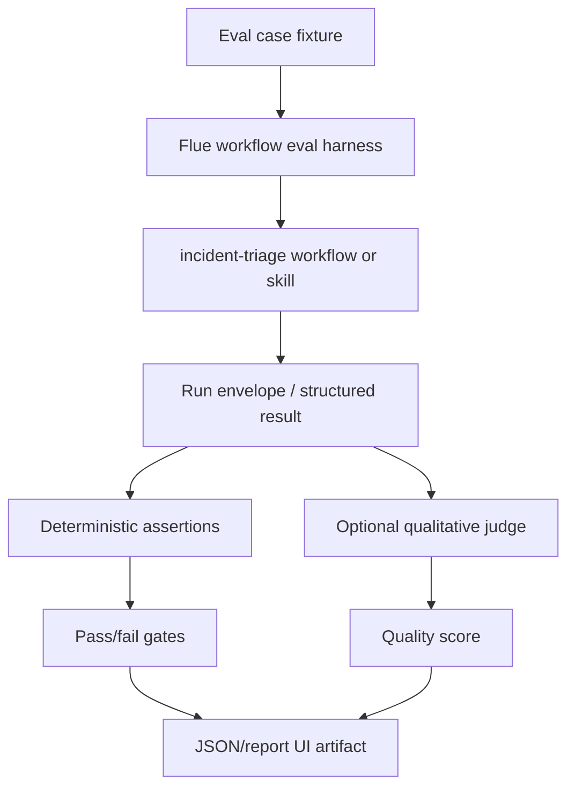

# test: Add Flue eval suite

## Summary

Add a Flue-oriented eval layer for incident triage behavior using `vitest-evals`. The suite should evaluate the workflow boundary and skill output over repeatable incident cases, while preserving the existing deterministic Vitest tests as the default correctness suite.

---

## Problem Frame

The project already has unit tests, outcome tests, webhook tests, Docker E2E coverage, and opt-in live MiniMax coverage. Those tests prove implementation correctness and operator-facing contracts, but they are not designed to compare model or prompt behavior over time.

Flue's eval guidance recommends `vitest-evals` rather than a framework-specific built-in eval runner. It also recommends direct assertions for concrete requirements and judge-based scoring for qualitative properties such as summary quality. This project should follow that split: deterministic assertions for schema, citations, provenance, safety, and bounded actions; optional judge scoring for explanation clarity and recommendation quality.

This plan does not change triage behavior, prompt content, taxonomy values, safety policy, scorecard semantics, or CLI/webhook behavior.

---

## Requirements

**Eval harness and execution**

- R1. The project must add a dedicated eval command that runs separately from `npm test`.
- R2. The eval harness must evaluate the Flue incident-triage workflow or skill boundary, not a separate hand-written prompt path.
- R3. Eval cases must start from existing scenario fixtures or Grafana-shaped fixtures without embedding expected answers into raw incident evidence.
- R4. Eval output must be inspectable through normalized run artifacts, JSON reports, or a local report UI supported by the eval tool.

**Deterministic contract evals**

- R5. Eval cases must assert bounded `incident_class`, bounded `next_action`, schema validity, evidence citation validity, provenance support, and safety behavior.
- R6. Eval cases must cover dependency outage, bad deploy, capacity saturation, noisy alert, invalid output, and missing-context behavior.
- R7. Eval assertions must reuse or mirror the existing outcome vocabulary rather than duplicating scorecard internals.
- R8. The default eval command must not run in ordinary `npm test`, and live-provider evals must remain explicit because they depend on MiniMax credentials and model variance.

**Qualitative evals**

- R9. Judge-based evals may score finding summary quality, recommendation usefulness, caveat specificity, and verification-plan actionability.
- R10. Judge-based evals must not be the authority for safety, schema validity, evidence IDs, or bounded action correctness.
- R11. If a judge is used, it must be independent from the model being evaluated where practical.

**Docs and operation**

- R12. Documentation must explain when to run unit tests, outcome tests, Docker E2E tests, live E2E tests, and Flue evals.
- R13. Agent instructions must keep eval expectations out of raw incident fixtures and preserve the workflow/LLM responsibility split.
- R14. Learning docs must teach why evals are for behavior drift comparison, while deterministic tests remain the safety contract.

---

## Key Technical Decisions

- KTD1. **Use `vitest-evals` as the eval runner:** Flue's docs recommend this path and describe support for normalized runs, deterministic assertions, judges, JSON reports, report UI, and GitHub reporting.
- KTD2. **Evaluate workflow outputs first:** This project cares about the run envelope more than a chat transcript, so the first harness should return the workflow result as eval output.
- KTD3. **Reuse outcome helpers for hard gates:** Existing helpers in `tests/support/outcomes.ts` already express the domain contract. Eval code should call those helpers or extract a shared assertion module only if needed.
- KTD4. **Keep model-backed evals opt-in:** Live MiniMax evals are valuable for prompt/model drift, but they should not be part of the default deterministic suite.
- KTD5. **Separate hard assertions from judges:** Deterministic checks gate safety and evidence grounding. Judges score qualities that cannot be usefully expressed as exact matches.
- KTD6. **Start with scenario fixtures before deployed HTTP evals:** Local fixture cases are cheaper and easier to debug. Evaluating a deployed Flue route through `FLUE_BASE_URL` can follow after the local harness is stable.

---

## High-Level Technical Design

The eval layer should sit beside the existing Vitest suite rather than replace it. Tests answer "did the code preserve the contract?" Evals answer "did this model, prompt, or skill revision preserve acceptable behavior across representative scenarios?"

---

## Implementation Units

### U1. Add Eval Tooling And Commands

- **Goal:** Add the minimal `vitest-evals` setup and package scripts without changing default test behavior.
- **Requirements:** R1, R4, R8.
- **Files:** `package.json`, `evals/vitest.evals.config.ts`, `evals/README.md`.
- **Approach:** Use the Flue tooling blueprint where possible, then adapt the generated setup to the project's npm conventions. Add scripts such as `evals`, `evals:json`, and optionally `evals:ui`.
- **Patterns to follow:** Keep `npm test` deterministic and fast. Follow existing opt-in command style used by live and Docker tests.
- **Test scenarios:**
  - Running the ordinary test command does not invoke evals.
  - Running the eval command discovers only files under `evals/`.
  - Running the JSON eval command writes a normalized eval result artifact.
- **Verification:** `npm test`, `npm run typecheck`, and the new eval discovery command pass with deterministic mock cases.

### U2. Create The Flue Workflow Eval Harness

- **Goal:** Provide a reusable harness that invokes the existing Flue incident-triage boundary and returns the structured output for assertions.
- **Requirements:** R2, R3, R5, R7.
- **Files:** `evals/harness.ts`, `src/workflows/incident-triage.ts`, `tests/support/outcomes.ts`.
- **Approach:** Prefer a workflow harness around Flue's workflow invocation shape, matching the Flue eval guide's recommendation for workflows. If local HTTP invocation requires `flue dev`, keep that path explicit and document it; otherwise provide a local harness that exercises the same workflow module.
- **Patterns to follow:** Preserve the current Flue entrypoint in `src/workflows/incident-triage.ts`. Do not introduce a second prompt, second schema, or second provider adapter.
- **Test scenarios:**
  - The harness can run `checkout-payment-timeout` and return a structured result.
  - The harness exposes usage and model metadata when the eval runner provides it.
  - The harness isolates cases so conversation history from one eval cannot affect another.
  - The harness redacts provider secrets from failures and artifacts.
- **Verification:** A single deterministic eval case can execute without changing the CLI or webhook path.

### U3. Add Deterministic Incident Outcome Evals

- **Goal:** Express the core scenario matrix as eval cases with hard assertions.
- **Requirements:** R3, R5, R6, R7, R8.
- **Files:** `evals/incident-outcomes.eval.ts`, `tests/support/outcomes.ts`, `fixtures/`.
- **Approach:** Build a table of scenario cases and expected contracts. Reuse existing fixture names and expected class/action pairs, but keep those expectations in eval code rather than raw incident data.
- **Patterns to follow:** Mirror the stable contracts in `tests/triage-outcomes.test.ts` without asserting exact explanatory prose.
- **Test scenarios:**
  - `checkout-payment-timeout` yields dependency outage escalation with current and operational support.
  - `bad-deploy-latency` yields rollback approval behavior without execution.
  - `capacity-saturation` yields approval-gated runbook behavior.
  - `noisy-alert` yields non-mutating monitoring behavior.
  - Historical-only support is flagged as weak evidence when used alone.
- **Verification:** Deterministic eval cases pass without live MiniMax when using static or replayed workflow output.

### U4. Add Live Flue/MiniMax Drift Evals

- **Goal:** Provide opt-in evals that measure the real skill and MiniMax behavior across representative incidents.
- **Requirements:** R2, R5, R6, R8.
- **Files:** `evals/live-incident-triage.eval.ts`, `.env.example`, `README.md`.
- **Approach:** Gate live evals behind an explicit environment variable such as `RUN_LIVE_FLUE_EVALS=1`. Assertions should be broad: valid schema, bounded taxonomy, valid citations, provenance support, safety status, and no executed production action.
- **Patterns to follow:** Follow the opt-in posture of `tests/e2e-live-service-llm.test.ts`.
- **Test scenarios:**
  - Live checkout eval accepts varied caveat wording while requiring valid citations and safe escalation.
  - Live capacity eval accepts varied verification plans while requiring approval-sensitive safety behavior.
  - Live bad-deploy eval requires rollback approval rather than direct rollback execution.
  - Live noisy-alert eval requires non-mutating behavior or a recoverable insufficient-context result.
- **Verification:** The live eval suite skips clearly when credentials or the opt-in flag are missing, and exits non-zero for gated contract failures when enabled.

### U5. Add Qualitative Judge Evals

- **Goal:** Score model-authored explanation quality without letting judge scores control safety-critical behavior.
- **Requirements:** R9, R10, R11.
- **Files:** `evals/recommendation-quality.eval.ts`, `evals/judges.ts`, `docs/examples/`.
- **Approach:** Add a small judge rubric for finding summaries, recommendations, caveats, and verification plans. Keep thresholds conservative and report scores separately from hard gates.
- **Patterns to follow:** Judge only model-authored explanation fields: `analysis`, `finding_summary`, `recommendation`, `caveats`, and `verification_plan`.
- **Test scenarios:**
  - A good dependency-outage explanation scores high for preserving alert, log, verification, and runbook facts.
  - A generic recommendation scores lower because it lacks incident-specific evidence.
  - A caveat that invents unsupported ownership context scores lower or fails the rubric.
  - A verification plan with concrete recovery signals scores higher than generic "monitor the system" wording.
- **Verification:** Judge evals produce readable scores and do not replace deterministic pass/fail checks.

### U6. Add Eval Reports And CI-Friendly Artifacts

- **Goal:** Make eval results easy to inspect locally and attach to CI or PR reviews later.
- **Requirements:** R4, R12.
- **Files:** `package.json`, `evals/README.md`, `.gitignore`, `.github/workflows/`.
- **Approach:** Add JSON report generation and document how to open the local report UI. Do not add required CI gating until the suite is stable; start with an optional workflow or documented local command.
- **Patterns to follow:** Keep generated eval artifacts ignored unless a sanitized example is intentionally checked in.
- **Test scenarios:**
  - `npm run evals:json` creates a JSON report at a documented path.
  - Generated reports do not include MiniMax API keys or webhook secrets.
  - Optional CI config can run deterministic evals without live credentials.
- **Verification:** `git status --ignored` confirms generated artifacts are ignored, and docs describe how to inspect a report.

### U7. Document Eval Philosophy And Handoff Rules

- **Goal:** Teach when and why to use evals in this project.
- **Requirements:** R12, R13, R14.
- **Files:** `README.md`, `AGENTS.md`, `docs/learnings.md`, `docs/solutions/architecture-patterns/bounded-llm-incident-triage-workflow.md`.
- **Approach:** Add concise docs that distinguish deterministic tests, scorecards, outcome tests, Docker/live E2E, and Flue evals. Emphasize that evals compare behavior drift across model/prompt changes, while validation and safety still live in deterministic code.
- **Patterns to follow:** Keep `README.md` command-oriented, `AGENTS.md` constraint-oriented, and `docs/learnings.md` teaching-oriented.
- **Test scenarios:**
  - Docs explain that eval expectations stay outside raw fixtures.
  - Docs explain that safety and citation validity are hard assertions, not judge-only scores.
  - Docs explain that live evals are opt-in and may vary with provider behavior.
- **Verification:** Documentation review and `git diff --check`.

---

## Acceptance Examples

- AE1. **Deterministic dependency eval:** Given the checkout payment-timeout fixture, when the deterministic eval runs, then the output satisfies dependency-outage escalation, valid citations, current/operational provenance, and safe recommendation checks.
- AE2. **Approval eval:** Given the bad-deploy fixture, when the eval runs, then rollback is represented as approval-required and no production action is executed.
- AE3. **Live drift eval:** Given live MiniMax evals are enabled, when the checkout eval runs, then varied explanation wording is accepted only if schema, citations, provenance, safety, and bounded action checks pass.
- AE4. **Judge eval:** Given two recommendation outputs with the same bounded decision, when the quality judge runs, then the recommendation grounded in concrete alert/log/runbook evidence scores higher than generic incident prose.
- AE5. **Report artifact:** Given `npm run evals:json`, when evals finish, then a normalized report can be opened locally and does not contain secrets.

---

## Scope Boundaries

- Do not change the incident class taxonomy or next action taxonomy.
- Do not change safety policy, provenance semantics, scorecard calculations, or workflow states.
- Do not make live MiniMax evals part of default `npm test`.
- Do not store expected outcomes inside raw incident fixtures or Grafana payloads.
- Do not let judge scores override deterministic validation, citation checks, or safety gates.
- Do not add a new prompt path outside the Flue skill/workflow boundary.

### Deferred To Follow-Up Work

- Add repeated-run trend dashboards once the eval suite has enough history.
- Add deployed `FLUE_BASE_URL` evals after the local workflow harness is stable.
- Add GitHub eval annotations after the JSON artifact proves useful.
- Add agent-tool-selection evals if the workflow later lets the agent choose tools dynamically.

---

## System-Wide Impact

The eval suite becomes the project's model and prompt drift surface. It should make skill edits safer because reviewers can compare behavior across representative incidents without treating exact prose as the contract.

The suite should not weaken deterministic controls. Validation, citation checks, safety policy, provenance, and scorecards remain implementation-owned guardrails. Evals observe and compare behavior; they do not become the production control system.

---

## Risks And Mitigations

| Risk | Impact | Mitigation |
| --- | --- | --- |
| Eval harness becomes a second workflow | Results stop matching production behavior | Invoke the existing Flue workflow or skill boundary |
| Judge scores are treated as safety gates | Unsafe behavior could pass on fluent prose | Keep schema, citations, provenance, and safety as deterministic assertions |
| Live evals become flaky | Developers lose trust in the suite | Keep live evals opt-in and assert broad contracts |
| Reports leak secrets | Provider credentials could appear in artifacts | Redact environment-derived secrets and ignore generated reports by default |
| Eval setup duplicates outcome tests | Maintenance cost rises without new signal | Reuse outcome helpers and reserve evals for model/prompt drift |

---

## Sources And Research

- [Flue Evals guide](https://flueframework.com/docs/guide/evals/) for the recommended `vitest-evals` approach, workflow harness guidance, JSON reports, and judge usage.
- `docs/plans/2026-06-17-001-test-outcome-based-triage-suite-plan.md` for the existing outcome-test contract.
- `tests/support/outcomes.ts` for reusable outcome assertions.
- `tests/triage-outcomes.test.ts` and `tests/webhook-outcomes.test.ts` for deterministic scenario coverage to preserve.
- `tests/e2e-live-service-llm.test.ts` for the current opt-in live-provider posture.
- `src/workflows/incident-triage.ts` for the current Flue workflow boundary.
