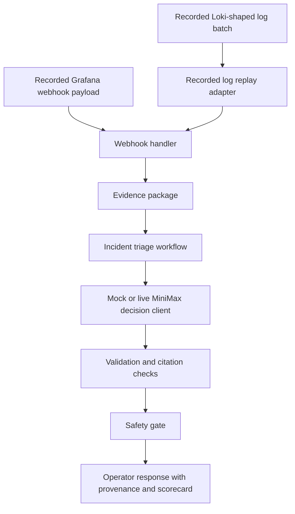

# refactor: Replace Grafana stack with recorded observability inputs

## Summary

Replace the primary Grafana/Loki/synthetic-service demo and integration surface with recorded observability inputs: Grafana webhook payload fixtures plus Loki-shaped log fixtures. The agent should keep exercising the real webhook normalization, evidence construction, workflow, Flue/MiniMax decision path, validation, safety gate, provenance, and scorecard, but default verification should no longer depend on starting Grafana, Loki, Docker Compose, or a synthetic HTTP service.

---

## Problem Frame

The current stack proves that Docker Compose can start Grafana, Loki, a synthetic service, and the webhook agent. That is useful infrastructure confidence, but it is not the strongest proof for this project. The project's main value is the incident-triage architecture: raw operational facts enter the system, deterministic code builds and validates evidence, the skill/LLM makes one bounded judgment, and deterministic policy gates the result.

Keeping the full Grafana/Loki stack as the primary demo also makes the project harder to explain. A reviewer has to understand container readiness, service log generation, Loki ingestion, webhook posting, and provider configuration before seeing the agent decision. Recorded observability inputs keep the data realistic while making the architecture easier to run, test, and inspect.

This plan does not remove Grafana-shaped webhook support, Loki-shaped log evidence, MiniMax live execution, or the bounded incident decision contract. It removes the requirement that a local observability product stack be running to demonstrate those behaviors.

---

## Requirements

**Recorded input surface**

- R1. Preserve Grafana webhook payload fixtures as raw alert facts with no expected answers, suspected causes, recommended actions, or approval hints.
- R2. Add recorded log fixtures that represent the shape and content the agent would have received from Loki for checkout, capacity, and bad-deploy scenarios.
- R3. Recorded log fixtures must stay raw: they may contain timestamps, labels, and log lines, but not expected incident classes, next actions, safety expectations, or scorecard expectations.
- R4. Recorded observability inputs must cover successful log enrichment, missing logs, resolved alerts, invalid payloads, and invalid model output.

**Integration behavior**

- R5. Integration tests must call real parser, webhook handler, evidence builder, workflow, validation, policy, provenance, scorecard, and response-rendering code paths.
- R6. Tests may mock unstable external boundaries such as the LLM provider and Loki transport, but they must not mock the incident-triage workflow or response contract.
- R7. The live MiniMax path must remain opt-in and should replay recorded observability inputs rather than requiring Docker Compose.
- R8. The default test suite must not require Docker, Grafana, Loki, a synthetic service, live MiniMax credentials, or networked Loki.

**Stack cleanup**

- R9. Remove or retire the Grafana/Loki Docker Compose stack from the primary README demo and integration-test instructions.
- R10. Remove stack-only scripts and tests when their only purpose is to orchestrate Grafana, Loki, and the synthetic service.
- R11. Keep Docker image packaging only if it remains useful as a separate CLI/server packaging smoke path; do not conflate image packaging with observability integration.
- R12. Keep `normalizeGrafanaPayload`, `handleGrafanaWebhook`, and Loki log evidence conversion as stable public boundaries unless implementation proves a narrower adapter is needed.

**Documentation and teaching**

- R13. Update project docs so "integration test" means fixture replay through real agent code, not a full observability product stack.
- R14. Update agent instructions so future tests use recorded observability fixtures for this surface and do not reintroduce answer-bearing payloads.
- R15. Update `docs/learnings.md` to teach the trade-off: recorded inputs reduce operational noise while preserving the agent architecture proof.

---

## Key Technical Decisions

- KTD1. **Recorded observability inputs become the primary integration surface:** The project should prove the incident agent's behavior with realistic inputs and real code paths, not with a local reproduction of an observability platform.
- KTD2. **Keep Grafana and Loki shapes at the boundary:** The fixtures should still look like Grafana webhook payloads and Loki log results. This preserves useful contract pressure without running those systems.
- KTD3. **Use fixture replay instead of service-generated logs:** The synthetic service currently creates logs so Loki can return them. Recorded log batches can represent the same facts with less moving infrastructure.
- KTD4. **Keep the webhook handler as the central integration boundary:** `handleGrafanaWebhook` already connects payload normalization, log enrichment, evidence construction, workflow execution, safety, provenance, and response rendering.
- KTD5. **Separate Docker packaging from observability integration:** If `Dockerfile` remains, it should prove the app can run in a container. It should not require Grafana/Loki Compose to be considered the integration demo.
- KTD6. **Do not make live MiniMax default:** Live provider calls are valuable for proof and eval drift, but deterministic mock decisions remain the default correctness path.

---

## High-Level Technical Design

The important boundary is not "Grafana is running locally." The important boundary is "the agent receives alert-shaped facts and log-shaped facts, then produces a validated, safe, evidence-grounded triage output."

---

## Implementation Units

### U1. Inventory And Retire Stack-Only Surfaces

- **Goal:** Identify which files exist only to run the full Grafana/Loki/synthetic-service stack and remove or retire them in a small first pass.
- **Requirements:** R8, R9, R10, R11.
- **Files:** `docker-compose.yml`, `docker-compose.live.yml`, `services/synthetic-checkout-service.ts`, `tests/e2e-grafana-loki.test.ts`, `tests/e2e-live-service-llm.test.ts`, `tests/synthetic-checkout-service.test.ts`, `tests/compose-config.test.ts`, `scripts/run-live-e2e-probe.ts`, `package.json`, `README.md`, `AGENTS.md`.
- **Approach:** Separate three categories before deleting: stack orchestration, app packaging, and reusable observability parsing. Remove stack orchestration from the primary path. Keep app packaging only if the Docker image remains useful without Compose.
- **Patterns to follow:** Preserve public agent behavior while reducing moving parts. Do not delete `src/grafana.ts`, `src/loki.ts`, or `src/server.ts` just because the containers are gone.
- **Test scenarios:**
  - The default test command no longer discovers tests that spawn `docker compose`.
  - Package scripts no longer expose a command that starts Grafana/Loki as the main demo.
  - Documentation no longer tells users to run Compose for the primary integration proof.
  - Any remaining Docker command is clearly labeled as packaging smoke, not the agent integration demo.
- **Verification:** `rg "docker compose|RUN_DOCKER_E2E|docker-compose.live|synthetic-service"` should return only intentional historical docs or newly documented optional packaging notes.

### U2. Add Recorded Loki-Shaped Log Fixtures

- **Goal:** Store realistic log inputs beside existing Grafana payloads so tests and demos can replay observability facts without a running Loki instance.
- **Requirements:** R1, R2, R3, R4.
- **Files:** `fixtures/logs/checkout-payment-timeout.json`, `fixtures/logs/capacity-saturation.json`, `fixtures/logs/bad-deploy-latency.json`, `fixtures/logs/empty.json`, `tests/loki.test.ts`, `tests/grafana.test.ts`.
- **Approach:** Model fixtures around the current `LokiLogEntry` fields: timestamp, labels, and line text. Keep scenario expectation data in tests, not in fixture files.
- **Patterns to follow:** Follow the existing raw fixture rule used by `fixtures/scenarios/` and `fixtures/grafana/`.
- **Test scenarios:**
  - Checkout logs include payment timeout and retry symptoms with `service=checkout-api`.
  - Capacity logs include worker saturation, CPU, or queue-depth facts with `service=search-api`.
  - Bad-deploy logs include latency or error facts correlated with deploy evidence, but no rollback recommendation.
  - Empty logs produce zero log evidence and preserve the missing-log path.
- **Verification:** Existing fixture answer-field checks or a new fixture hygiene test rejects answer-like fields in recorded log fixtures.

### U3. Add A Recorded Log Replay Adapter

- **Goal:** Replace fake one-line Loki clients in integration tests with a small adapter that replays recorded log fixtures through the existing Loki evidence conversion boundary.
- **Requirements:** R2, R5, R6, R8, R12.
- **Files:** `tests/support/observability-fixtures.ts`, `tests/loki.test.ts`, `tests/server.test.ts`, `tests/webhook-outcomes.test.ts`.
- **Approach:** Provide a test-support adapter that implements the existing `LokiClientLike` shape used by `handleGrafanaWebhook`. It should filter or select recorded log fixtures by scenario or service, then call `LokiClient.toEvidence`.
- **Patterns to follow:** Keep the adapter in `tests/support/` unless production code needs the same replay behavior for a demo script.
- **Test scenarios:**
  - The adapter records the labels, time window, limit, and direction requested by the handler.
  - The adapter returns only logs for the requested service.
  - The adapter uses `LokiClient.toEvidence` so evidence IDs and source tiers remain stable.
  - Missing fixture logs become empty log evidence without crashing the handler.
- **Verification:** `tests/server.test.ts` and `tests/webhook-outcomes.test.ts` prove real handler behavior without networked Loki.

### U4. Replace Docker E2E With Recorded Observability Integration Tests

- **Goal:** Preserve the scenario matrix currently covered by Docker E2E while removing container startup and service-log generation from the integration test.
- **Requirements:** R4, R5, R6, R8, R10.
- **Files:** `tests/observability-integration.test.ts`, `tests/webhook-outcomes.test.ts`, `tests/support/outcomes.ts`, `tests/e2e-grafana-loki.test.ts`, `tests/e2e-live-service-llm.test.ts`.
- **Approach:** Move checkout, capacity, and bad-deploy scenario assertions into a fixture-replay integration test. Delete or retire the Docker E2E files once equivalent contract coverage exists.
- **Patterns to follow:** Use `assertValidResponseOutcome` for operator-facing behavior instead of exact prose assertions.
- **Test scenarios:**
  - Checkout webhook plus recorded checkout logs yields dependency-outage escalation with alert, log, and runbook evidence.
  - Capacity webhook plus recorded capacity logs yields approval-required runbook behavior with alert, log, and runbook evidence.
  - Bad-deploy webhook plus recorded bad-deploy logs and deploy facts yields rollback approval behavior without executing a rollback.
  - Resolved webhook payload returns an ignored response without a decision.
  - Invalid LLM output returns a recoverable failure without safety action.
  - Missing logs preserve missing context and still produce a bounded response when the decision cites available evidence.
- **Verification:** The replacement integration test passes under plain `npm test` without Docker.

### U5. Replace The Live Demo Probe With Recorded Replay

- **Goal:** Keep a one-command demo that can call real MiniMax, but make it replay recorded webhook and log inputs instead of starting Compose.
- **Requirements:** R5, R7, R8, R9, R10.
- **Files:** `scripts/run-live-e2e-probe.ts`, `tests/live-e2e-probe.test.ts`, `package.json`, `README.md`, `docs/examples/live-e2e-response.json`.
- **Approach:** Rename or rewrite the probe around recorded inputs. It should load a Grafana payload fixture, load the matching log fixture, run the handler through the real workflow, use mock LLM by default or live MiniMax behind an explicit flag, print a sanitized summary, and exit without cleanup orchestration.
- **Patterns to follow:** Keep secrets out of output and preserve `--json` for machine-readable demos.
- **Test scenarios:**
  - The probe can run checkout with mock output and print decision, provenance, safety, and scorecard fields.
  - The probe can select capacity and bad-deploy scenarios.
  - The probe refuses live mode when MiniMax config is missing or placeholder.
  - The probe's JSON mode writes only sanitized operator output.
- **Verification:** The script test covers argument parsing, config validation, summary rendering, and fixture selection without calling MiniMax.

### U6. Update Live MiniMax Coverage And Evals

- **Goal:** Keep live-provider confidence while aligning it with the recorded-input architecture.
- **Requirements:** R7, R8, R13.
- **Files:** `evals/live-incident-triage.eval.ts`, `evals/harness.ts`, `tests/observability-integration.test.ts`, `README.md`, `evals/README.md`.
- **Approach:** Prefer live MiniMax coverage through the eval suite or a recorded-input live test that is explicitly skipped unless enabled. Remove the live Docker E2E dependency.
- **Patterns to follow:** Live checks should assert broad contracts: valid schema, bounded taxonomy, valid citations, provenance support, safe behavior, and no production action.
- **Test scenarios:**
  - Live checkout replay accepts varied wording but requires valid evidence citations and safe escalation or recoverable insufficient context.
  - Live capacity replay requires approval-sensitive behavior when choosing an approval-gated action.
  - Live bad-deploy replay requires rollback approval rather than rollback execution.
  - Live checks skip clearly when flags or credentials are missing.
- **Verification:** `npm run evals` remains deterministic by default, and live evals remain gated by `RUN_LIVE_FLUE_EVALS=1`.

### U7. Clean Documentation, Concepts, And Agent Instructions

- **Goal:** Make the simplified architecture discoverable and prevent future work from reintroducing the full stack accidentally.
- **Requirements:** R9, R13, R14, R15.
- **Files:** `README.md`, `AGENTS.md`, `CONCEPTS.md`, `docs/learnings.md`, `docs/examples/typescript-webhook-response.json`, `docs/examples/live-e2e-response.json`, `docs/solutions/architecture-patterns/bounded-llm-incident-triage-workflow.md`.
- **Approach:** Update command examples, testing guidance, and concept definitions to describe recorded observability integration. Keep historical plan docs unchanged except when active docs link to obsolete commands.
- **Patterns to follow:** Keep `README.md` command-oriented, `AGENTS.md` constraint-oriented, and `docs/learnings.md` teaching-oriented.
- **Test scenarios:**
  - README default demo commands do not require Docker Compose.
  - AGENTS testing convention points to recorded observability fixtures for integration tests.
  - Concepts explain that Grafana/Loki shapes are simulated through recorded inputs.
  - Example responses are sanitized and do not include secrets.
- **Verification:** `git diff --check` and targeted `rg` searches confirm active docs no longer position Compose as the primary demo path.

---

## Acceptance Examples

- AE1. **Recorded checkout integration:** Given `fixtures/grafana/checkout-payment-timeout-webhook.json` and recorded checkout logs, when the integration test runs the webhook handler, then the response contains dependency-outage escalation, valid alert/log/runbook citations, provenance support, safe recommendation, and scorecard output.
- AE2. **Recorded capacity integration:** Given the capacity webhook and capacity logs, when fixture replay runs, then the response can recommend an approval-gated runbook action and the safety gate marks approval required.
- AE3. **Recorded bad-deploy integration:** Given the bad-deploy webhook, bad-deploy logs, and deploy facts, when fixture replay runs, then rollback is only recommended through `request_rollback_approval` and no production mutation occurs.
- AE4. **Missing logs:** Given a valid Grafana payload and an empty recorded log batch, when the handler runs, then log context is marked missing instead of crashing the workflow.
- AE5. **Live replay:** Given live MiniMax mode is explicitly enabled with valid `.env` values, when the recorded checkout demo runs, then the result satisfies schema, citation, provenance, safety, and bounded-action checks without starting Docker Compose.
- AE6. **No primary Compose dependency:** Given a fresh checkout with Node dependencies installed, when a reviewer runs the documented integration demo and default tests, then Docker, Grafana, Loki, and the synthetic service are not required.

---

## Scope Boundaries

- Do not remove Grafana webhook normalization.
- Do not remove Loki-shaped log evidence conversion.
- Do not remove the webhook HTTP server contract unless a later plan explicitly replaces it.
- Do not add production Grafana, Loki, incident-management, ticketing, chat, rollback, or scaling integrations.
- Do not make live MiniMax the default test or demo path.
- Do not store expected answers in Grafana payloads, log fixtures, or raw incident fixtures.
- Do not turn recorded fixtures into a second decision source; they are facts only.

### Deferred To Follow-Up Work

- Add a production observability connector only after the recorded-input architecture is stable.
- Add a small Docker image smoke test if container packaging remains important.
- Add a deployed webhook smoke test if the project later hosts the server.
- Add a real alert-manager integration once the agent needs to receive non-local messages.

---

## System-Wide Impact

This refactor changes the project's proof strategy. The demo becomes less about running a local observability stack and more about showing the agent boundary clearly: raw alert facts plus log facts produce a validated, safe, evidence-grounded recommendation.

It also reduces test flakiness. Docker readiness, Loki ingestion timing, synthetic-service health, and Compose cleanup stop being normal development concerns. That makes the integration suite faster and easier to trust, while live MiniMax still gives an opt-in provider check.

The trade-off is that the project will no longer prove local Grafana and Loki connectivity by default. That confidence can be restored later with a narrower connector smoke test if production integration becomes a real goal.

---

## Risks And Mitigations

| Risk | Impact | Mitigation |
| --- | --- | --- |
| Recorded inputs drift away from real Grafana or Loki shapes | Tests stop representing real observability messages | Keep fixtures shaped like Grafana webhooks and Loki entries, and test parsing/conversion boundaries directly |
| Removing Compose loses useful packaging confidence | Container regressions may go unnoticed | Keep a separate Docker image smoke path if packaging remains a project goal |
| Fixture replay becomes over-mocked | Tests prove fixtures rather than real behavior | Call `handleGrafanaWebhook`, workflow, validation, policy, scoring, and rendering code directly |
| Fixtures accidentally include answers | The model may be led by test expectations | Add fixture hygiene checks for answer-like fields in log fixtures as well as Grafana payloads |
| Live replay still varies by model behavior | Opt-in checks may be noisy | Assert broad contracts instead of exact wording and keep deterministic mock tests authoritative |

---

## Sources And Research

- `README.md` for current Docker, Compose, live demo, and test instructions.
- `AGENTS.md` for current hard constraints and testing convention.
- `docker-compose.yml` and `docker-compose.live.yml` for the full stack surface to retire.
- `services/synthetic-checkout-service.ts` for service-generated log behavior that recorded fixtures should replace.
- `scripts/run-live-e2e-probe.ts` for the current Compose-backed one-command demo.
- `tests/e2e-grafana-loki.test.ts` and `tests/e2e-live-service-llm.test.ts` for scenario contracts that recorded integration tests should preserve.
- `tests/webhook-outcomes.test.ts`, `tests/server.test.ts`, and `tests/support/outcomes.ts` for existing handler-level contracts to reuse.
- `src/grafana.ts`, `src/loki.ts`, and `src/server.ts` for the parsing, log evidence, and webhook boundaries that should remain stable.
