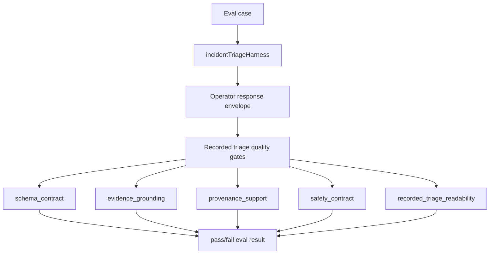

# test: Add recorded triage quality gates

## Summary

Add a deterministic pass/fail eval suite for recorded triage output quality. The suite should treat readable operator output as a contract: valid bounded decision, valid evidence citations, provenance support, safety status, finding summary, recommendation rationale, and a non-empty verification plan.

---

## Problem Frame

The current eval layer already checks broad deterministic outcomes and live-provider boundedness. It also has a recommendation-quality judge that produces a fractional score for softer explanation quality. That split is useful, but it misses a specific project failure mode: a run can be valid and safe while still producing weak operator-facing output, such as `recommendation_rationale: none`.

This plan adds a simple pass/fail readiness layer for the recorded triage surface. The goal is not to grade prose with abstract scores. The goal is to report named gates that a reviewer can understand immediately: schema contract, evidence grounding, provenance support, safety contract, and recorded-triage readability.

Because the project has moved away from presentation-oriented naming, the implementation should use `recorded triage` or `operator readability` in file names and public output. The user-facing intent is to catch responses that are structurally valid but not good enough to show as the project's representative run.

---

## Requirements

**Pass/fail quality gates**

- R1. Add a deterministic eval that reports pass/fail gates for recorded triage output quality.
- R2. The eval must fail when the response lacks a valid bounded decision.
- R3. The eval must fail when decision evidence IDs or explanation evidence IDs are invalid.
- R4. The eval must fail when provenance support is missing or lacks cited tiers and cited sources.
- R5. The eval must fail when safety status is missing.
- R6. The eval must fail when `finding_summary` is missing or blank.
- R7. The eval must fail when `recommendation.rationale` is missing or blank.
- R8. The eval must fail when `decision.verification_plan` is missing or empty.

**Reporting style**

- R9. The primary eval result must be named pass/fail gates, not an abstract score such as `recommendation quality: 0.73`.
- R10. Gate names should be stable and operator-readable, such as `schema_contract`, `evidence_grounding`, `provenance_support`, `safety_contract`, and `recorded_triage_readability`.
- R11. Any judge-style score must remain secondary and must not determine hard contract pass/fail.
- R12. The plan must distinguish regression gates that should stay near 100% from capability or quality evals that can be used as improvement targets.

**Scope and safety**

- R13. The eval must run with deterministic mock output by default and must not require MiniMax credentials.
- R14. The eval must reuse real workflow response envelopes from `incidentTriageHarness`; it must not create local objects and assert their own shape.
- R15. The eval must keep expected quality rules in eval code, not raw incident fixtures or Grafana payloads.
- R16. Documentation must explain the difference between hard pass/fail gates and optional explanation-quality judges.

**Eval health and maintenance**

- R17. The eval suite must include a known-good reference response or fixture that proves the gates are passable.
- R18. The eval suite must include balanced negative cases so gates fail for the right reasons, not only happy-path positives.
- R19. Failed eval artifacts must preserve enough response and gate context for a reviewer to decide whether the model failed or the grader is too rigid.

---

## Key Technical Decisions

- KTD1. **Use a deterministic gate helper instead of another judge:** The missing-rationale issue is a contract failure, not a fuzzy quality preference. A gate helper can return explicit booleans and failure reasons without model variance.
- KTD2. **Name the public gate `recorded_triage_readability`:** This preserves the representative-quality intent while aligning with the new project language. The gate covers finding summary, recommendation rationale, and verification plan presence.
- KTD3. **Run through `incidentTriageHarness`:** The eval should exercise the same workflow-to-response path used by existing evals. It should not test a hand-built response object.
- KTD4. **Keep judge scores secondary:** `recommendation-quality.eval.ts` can remain useful for softer rubric inspection, but the main readiness result should be pass/fail contract gates.
- KTD5. **Prefer explicit failure reasons:** A failed gate should tell the implementer what is missing, for example `recommendation.rationale is required for recorded triage readability`.
- KTD6. **Treat recorded triage quality as a regression suite:** These gates define the minimum acceptable representative run and should normally pass at 100%. Softer recommendation-quality judges can remain capability evals where scores show room to improve.
- KTD7. **Prove the grader with a reference passing output:** A known-good response makes it clear that the task is solvable and that the gate logic is not over-constrained.

---

## High-Level Technical Design

The helper should classify the same output a human sees. Hard gates verify the structure and trust boundaries. The readability gate verifies the minimum explanation fields needed for a representative recorded triage run.

---

## Implementation Units

### U1. Add A Deterministic Quality Gate Helper

- **Goal:** Create a reusable helper that evaluates operator response envelopes into named pass/fail gates.
- **Requirements:** R1, R2, R3, R4, R5, R6, R7, R8, R9, R10.
- **Dependencies:** None.
- **Files:** `evals/quality-gates.ts`, `evals/recorded-triage-quality.eval.ts`.
- **Approach:** Add a small helper that accepts the response returned by `incidentTriageHarness` and returns a gate map plus failure messages. Keep the checks deterministic and data-driven. Do not call a model or judge from this helper.
- **Patterns to follow:** Reuse the contract vocabulary in `tests/support/outcomes.ts`. Keep the helper focused on public response fields from `runToResponse`, not internal workflow objects.
- **Test scenarios:**
  - Given a valid checkout response, the helper returns passing gates for schema, evidence, provenance, safety, and readability.
  - Given a response with blank `finding_summary`, the helper fails only `recorded_triage_readability` with a specific reason.
  - Given a response with missing `recommendation.rationale`, the helper fails `recorded_triage_readability`.
  - Given a response with an unknown recommendation evidence ID, the helper fails `evidence_grounding`.
  - Given a response with missing `safety`, the helper fails `safety_contract`.
- **Verification:** The helper is exercised by eval cases rather than object-construction-only tests.

### U2. Add The Recorded Triage Quality Eval

- **Goal:** Add a deterministic eval suite that runs representative scenarios and fails on any quality gate failure.
- **Requirements:** R1, R9, R10, R12, R13, R14, R15, R17, R18.
- **Dependencies:** U1.
- **Files:** `evals/recorded-triage-quality.eval.ts`, `evals/harness.ts`, `docs/examples/recorded-triage-response.json`.
- **Approach:** Add eval cases for `checkout-payment-timeout`, `capacity-saturation`, and `bad-deploy-latency` using mock mode. Each case should run `incidentTriageHarness`, compute gate results, attach the gate map as eval metadata or artifact, and assert every gate passes. Include a known-good recorded response as a reference passing output so the grader can be checked independently of model behavior.
- **Patterns to follow:** Follow the case-table shape in `evals/incident-outcomes.eval.ts`. Keep scenario expectations in eval code.
- **Test scenarios:**
  - Checkout payment timeout passes all gates with dependency-outage mock output.
  - Capacity saturation passes all gates while preserving approval-required safety behavior.
  - Bad deploy passes all gates while preserving rollback approval gating.
  - A saved reference response passes every gate.
  - A targeted negative case with missing `recommendation.rationale` fails `recorded_triage_readability`.
  - A targeted negative case with missing safety fails `safety_contract`.
  - A targeted negative case with readable prose but invalid evidence IDs fails `evidence_grounding`.
  - A targeted negative case with readable recommendation but missing provenance fails `provenance_support`.
- **Verification:** `npm run evals` exits non-zero for the negative missing-rationale case only if it is intentionally included as a failure fixture; otherwise the negative case should assert the helper returns the expected failed gate without making the whole suite red.

### U3. Make Gate Output The Primary Readout

- **Goal:** Ensure eval output communicates pass/fail gates before any softer quality score.
- **Requirements:** R9, R10, R11, R12, R19.
- **Dependencies:** U1, U2.
- **Files:** `evals/recorded-triage-quality.eval.ts`, `evals/README.md`, `README.md`.
- **Approach:** Attach a compact gate artifact to each eval result. Use stable names such as `schema_contract`, `evidence_grounding`, `provenance_support`, `safety_contract`, and `recorded_triage_readability`. Keep `RecommendationQualityJudge` output available but documented as secondary. Failed artifacts should include the response envelope fields and gate failure reasons needed for transcript-style review.
- **Patterns to follow:** Match the CLI scorecard style in `src/cli.ts`, where check names read as pass/fail rather than opaque numeric metrics.
- **Test scenarios:**
  - Eval report metadata includes all gate names.
  - Passing cases show every gate as `pass`.
  - The missing-rationale negative case shows `recorded_triage_readability: fail` and does not hide the specific reason behind a fractional score.
  - A failed gate artifact includes enough context to inspect whether the response or the gate was wrong.
- **Verification:** JSON eval output is inspectable and contains named gates.

### U4. Align The Existing Recommendation Quality Eval

- **Goal:** Keep the current recommendation-quality judge useful without making it the main readiness signal.
- **Requirements:** R11, R12, R16.
- **Dependencies:** U2, U3.
- **Files:** `evals/recommendation-quality.eval.ts`, `evals/judges.ts`, `evals/README.md`.
- **Approach:** Leave the judge for softer qualities such as specificity and actionability. If needed, rename comments or docs so it is clear that a judge score does not replace `recorded_triage_readability`. Document this as a capability or quality eval rather than a regression gate.
- **Patterns to follow:** Continue judging only LLM-authored explanation fields: `finding_summary`, `recommendation`, `caveats`, and `verification_plan`.
- **Test scenarios:**
  - The judge can score explanation specificity without changing pass/fail gate outcomes.
  - A response can pass hard gates while receiving a lower soft quality score.
  - A response missing `recommendation.rationale` fails the deterministic gate even if a judge would otherwise produce a partial score.
- **Verification:** Eval documentation separates "contract gates" from "soft judge scores."

### U5. Update Documentation And Learning Notes

- **Goal:** Document the eval philosophy and preserve the naming decision.
- **Requirements:** R12, R16, R17, R18, R19.
- **Dependencies:** U1, U2, U3, U4.
- **Files:** `README.md`, `AGENTS.md`, `evals/README.md`, `docs/learnings.md`, `docs/solutions/architecture-patterns/bounded-llm-incident-triage-workflow.md`.
- **Approach:** Explain that deterministic evals are pass/fail gates for contract readiness, while judge evals are supporting diagnostics. Use `recorded triage quality` terminology rather than presentation-oriented language. Add maintenance guidance that failed eval artifacts should be inspected before assuming the model is wrong, and that reference passing outputs prove the gate is fair.
- **Patterns to follow:** Keep `README.md` command-oriented, `AGENTS.md` constraint-oriented, and `docs/learnings.md` teaching-oriented.
- **Test scenarios:**
  - Documentation names the new pass/fail gates.
  - Documentation states that missing `recommendation.rationale` fails recorded-triage readability.
  - Documentation states that live MiniMax evals remain opt-in.
  - Documentation distinguishes regression gates from capability/quality evals.
  - Documentation says failed eval artifacts should be reviewed for grader bugs or ambiguous criteria.
- **Verification:** Docs are consistent with the renamed `triage:recorded` and `triage:live` commands.

---

## Acceptance Examples

- AE1. **Readable recorded triage response:** Given the checkout payment-timeout case, when the recorded triage quality eval runs, then `schema_contract`, `evidence_grounding`, `provenance_support`, `safety_contract`, and `recorded_triage_readability` all pass.
- AE2. **Missing recommendation rationale:** Given a response that otherwise has a valid bounded decision but omits `recommendation.rationale`, when quality gates run, then `recorded_triage_readability` fails with a reason that names the missing field.
- AE3. **Invalid citation:** Given a response whose recommendation cites an unknown evidence ID, when quality gates run, then `evidence_grounding` fails even if the finding summary is readable.
- AE4. **No abstract primary score:** Given eval report output, when a reviewer inspects the result, then the primary status is named pass/fail gates rather than a fractional recommendation-quality score.
- AE5. **Soft score remains diagnostic:** Given the recommendation quality judge runs, when it produces a fractional score, then that score is documented as diagnostic and does not override deterministic gate failures.
- AE6. **Reference output sanity check:** Given the known-good recorded triage response, when quality gates run, then every gate passes, proving the grader is passable.
- AE7. **Balanced negative coverage:** Given responses that each violate one gate, when quality gates run, then the violated gate fails without turning unrelated gates red.
- AE8. **Failure artifact review:** Given a quality gate failure, when the eval report is inspected, then it includes the response fields and failure reasons needed to decide whether the model failed or the grader is too strict.

---

## Scope Boundaries

- Do not change the incident class taxonomy or next action taxonomy.
- Do not change workflow validation, safety policy, provenance semantics, or scorecard calculations.
- Do not make live MiniMax credentials required for the new quality eval.
- Do not move expected classes, actions, or readability expectations into raw fixtures.
- Do not remove the existing recommendation-quality judge unless implementation proves it is redundant.
- Do not reintroduce presentation-oriented labels as active command, script, or file naming conventions.
- Do not add repeated live trials, pass@k, or pass^k to the first deterministic recorded triage quality gate.

### Deferred To Follow-Up Work

- Add trend reporting for gate pass rates after eval artifacts have enough history.
- Add CI annotations for named gate failures after local JSON reporting proves useful.
- Add live-provider versions of the quality gates only after deterministic mock-mode gates are stable.

---

## Risks And Mitigations

| Risk | Impact | Mitigation |
| --- | --- | --- |
| Gate helper duplicates outcome assertions | More maintenance without new signal | Keep hard schema/citation logic aligned with `tests/support/outcomes.ts` and add only readability gates not covered there |
| Readability gate becomes too subjective | Eval becomes noisy | Keep the first version presence-based: non-empty summary, rationale, and verification plan |
| Negative case makes the eval suite intentionally fail | `npm run evals` becomes unusable | Make negative cases assert helper behavior inside a passing test rather than leaving a permanent failing eval |
| Judge score remains more visible than pass/fail gates | Reviewers focus on abstract numbers | Put gate artifacts and docs ahead of judge output |
| Naming drifts back to presentation-oriented labels | Project surface becomes inconsistent | Use `recorded triage` and `operator readability` in filenames, docs, and gate names |
| Grader rejects valid output | The suite creates false confidence or noisy failures | Keep reference passing outputs and require failed artifact review before treating every failure as model regression |

---

## Sources And Research

- `evals/incident-outcomes.eval.ts` for existing deterministic eval case structure.
- `evals/recommendation-quality.eval.ts` and `evals/judges.ts` for the current soft-quality judge.
- `evals/harness.ts` for the workflow-backed eval output boundary.
- `tests/support/outcomes.ts` for existing schema, citation, provenance, and safety assertions.
- `scripts/run-recorded-triage.ts` for the operator-facing recorded triage output that the new gate should protect.
- `README.md` and `AGENTS.md` for current eval and testing constraints.
- Sentry eval guidance, as discussed in the prior review, for the principle that evals should behave like understandable tests with simple pass/fail results when possible.
- Anthropic's "Demystifying evals for AI agents" for reference outputs, balanced problem sets, deterministic graders where possible, artifact review, and the distinction between regression and capability evals.
