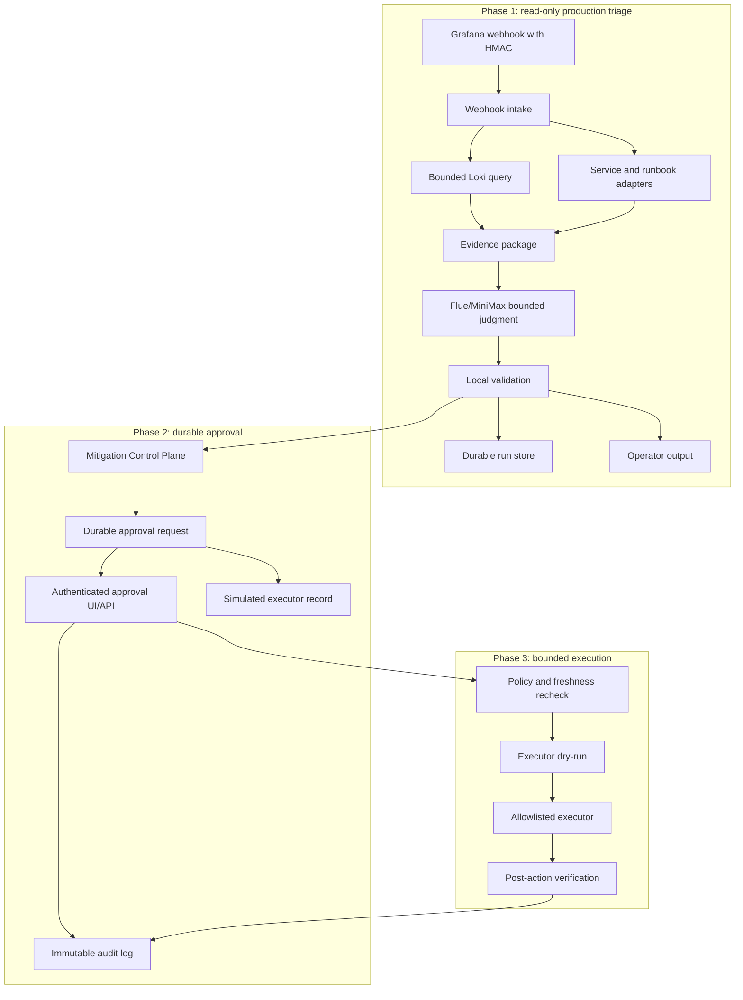
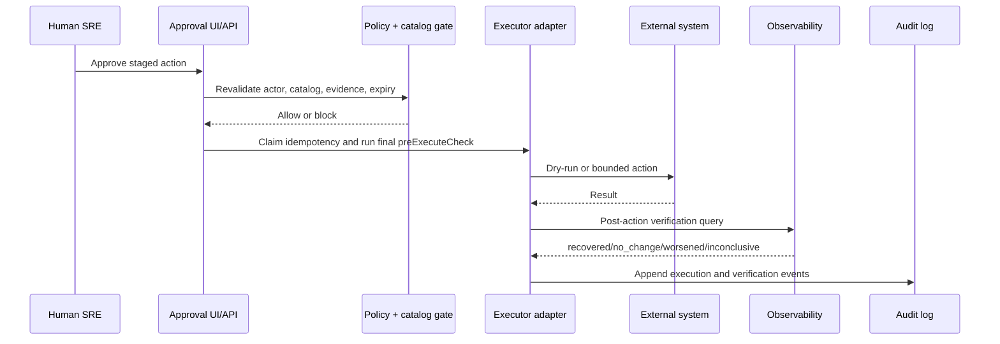

# feat: Productionize AI Operator phases 1-3

## Goal Capsule

| Field | Value |
| --- | --- |
| Objective | Move the incident triage agent from a local portfolio prototype toward a production-bound AI Operator in three gated phases: read-only triage, durable approval workflow, and bounded execution. |
| Authority hierarchy | Deterministic code owns ingestion, state, evidence, policy, approval, execution, audit, verification, and scoring. The LLM owns one bounded judgment only. |
| Execution profile | Deep, phased, security-sensitive, and integration-heavy. Each phase must be independently shippable and reversible. |
| Stop conditions | Stop before any production mutation path unless read-only ingestion, durable audit, approval identity, policy checks, and post-action verification are already proven. |
| Tail ownership | Phase 3 does not imply autonomous remediation. It introduces narrow executors behind catalog policy, human approval, idempotency, dry-run, audit, and verification. |

---

## Product Contract

### Summary

Productionization should preserve the current architecture rather than replace it. The system should first process real operational signals in read-only mode, then persist and approve staged mitigations, then execute only allowlisted actions through a bounded executor.

The current prototype already has useful seams: `src/server.ts` owns Grafana webhook handling, `src/loki.ts` owns Loki-shaped log evidence, `src/workflow.ts` owns lifecycle transitions, `src/llm.ts` owns model admission and validation, `src/mitigation-control.ts` owns catalog governance, `src/approval-store.ts` owns approval state, `src/mitigation-executor.ts` records simulated execution, and tests verify deterministic outcome contracts. Productionization should harden those seams instead of letting the model gain more authority.

### Problem Frame

The repo can run recorded observability scenarios, call MiniMax through Flue, stage approval-sensitive mitigation, and expose a local approval console. It is still not production software. The highest-risk gaps are production authentication, durable state, replay-safe webhooks, real observability access, identity-aware approval, immutable audit, action policy, executor idempotency, and agent self-observability.

The correct next step is not direct rollback automation. The correct next step is to prove production read-only triage against real signals while all action paths remain disabled. Approval workflow and bounded execution come after the system can explain, persist, audit, and verify its own behavior.

### Requirements

**Phase 1: Production read-only triage**

- R1. The server must support a production read-only mode that ingests real Grafana webhook notifications and real Loki query results without staging or executing mitigation actions.
- R2. Grafana ingestion must verify request authenticity with HMAC signature support, timestamp freshness, body-size limits, and replay protection.
- R3. Loki queries must remain bounded by service labels, alert time window, query limit, timeout, tenant/auth context, and redaction rules before prompt assembly.
- R4. Service ownership and runbook evidence must come from versioned adapter boundaries, not local fixtures only.
- R5. Every Phase 1 triage run must persist the run envelope, evidence snapshot, validation result, safety decision, scorecard, replay key, retention class, and trace correlation IDs in durable storage.
- R6. Phase 1 must keep approval staging and production mutation impossible by configuration and by code path, not just by operator convention.

**Phase 2: Durable approval workflow**

- R7. Approval requests, approval decisions, immutable audit events, executor attempts, and verification results must move from `.triage/approvals.json` to durable storage.
- R8. Approval APIs and UI must require authenticated users, role-based authorization, service ownership checks, risk-tier checks, and CSRF or equivalent origin-bound mutation protection.
- R9. Approval decisions must revalidate current policy, catalog entry, evidence freshness, and incident state before changing approval status.
- R10. Approval records must expire or require revalidation when evidence, incident state, or catalog policy is stale.
- R11. Approval events must produce immutable audit records and optional notifications to incident channels or paging systems.
- R12. Phase 2 must still keep all executor outputs simulated with `executed: false`.

**Phase 3: Bounded execution**

- R13. Execution must be available only through allowlisted executor adapters selected by mitigation catalog ID and gated by policy, approval state, final pre-execute check, dry-run result, idempotency key, and post-action verification plan.
- R14. The first production executor must be comment-only, non-state-changing, non-mentioning, and unable to trigger incident-system automation; ticket status updates are outside the first executor.
- R15. Higher-risk executors require a later plan, explicit human approval, successful sandbox/canary history, zero duplicate side effects, audited failure drills, and a documented disable procedure for the action family.
- R16. Executor outputs must use separate canonical fields: `execution_status` as `not_run`, `dry_run`, `executed`, `blocked`, or `failed`; and `verification_outcome` as `not_run`, `recovered`, `no_change`, `worsened`, or `inconclusive`.
- R17. Post-action verification must include external side-effect verification and observability-based incident-state verification.
- R18. Phase 3 must include a global execution kill switch and per-catalog action disablement.

**Cross-phase safety and evaluation**

- R19. The bounded incident class and next action taxonomy must remain locally validated.
- R20. The model must never author mitigation catalog entries, approval posture, executor payloads, audit results, verification results, or scorecard outcomes.
- R21. Default tests must not require live provider credentials, real Grafana, real Loki, production databases, or production action systems.
- R22. Production-like integration tests must use mocked external transports or sandbox systems and prove the real application boundaries.
- R23. Live/canary runs must be explicitly enabled and must never execute mutating actions unless Phase 3 execution mode is enabled and all policy checks pass.
- R24. Logs, traces, metrics, eval artifacts, and audit records must redact secrets and user-sensitive operational data.
- R25. Persisted run, evidence, approval, audit, executor, and verification records must have retention classes, expiry behavior, and redaction/minimization rules.

### Actors

- A1. On-call SRE: receives incident context, reviews proposed mitigations, approves or rejects staged actions.
- A2. Service owner: owns service metadata, runbooks, and approval eligibility for service-specific actions.
- A3. Incident commander: reviews audit trail and decides escalation when the agent blocks or asks for human input.
- A4. Platform operator: configures production integrations, policy, secrets, deployment, and kill switches.
- A5. AI Operator system: gathers evidence, asks for one bounded model judgment, validates it, routes it through policy, and records outcomes.

### Key Flows

- F1. Read-only production triage
  - **Trigger:** Grafana sends a firing alert notification to the webhook endpoint.
  - **Actors:** A1, A4, A5.
  - **Steps:** The server authenticates the webhook, normalizes the payload, queries bounded Loki logs, loads service and runbook context, calls the LLM boundary, validates the bounded decision, persists the run, emits operator output, and records scorecard/audit data.
  - **Outcome:** The on-call receives evidence-grounded triage with no production mutation path.

- F2. Approval staging
  - **Trigger:** A validated decision maps to an approval-required mitigation catalog entry.
  - **Actors:** A1, A2, A5.
  - **Steps:** The Mitigation Control Plane checks catalog requirements, creates a durable approval request, records an audit event, and surfaces the request in the authenticated approval UI/API.
  - **Outcome:** A human can approve or reject a staged mitigation, but execution remains simulated in Phase 2.

- F3. Bounded execution
  - **Trigger:** An approved, unexpired approval request maps to an enabled executor adapter.
  - **Actors:** A1, A3, A4, A5.
  - **Steps:** The executor revalidates policy, checks idempotency, performs dry-run, executes only if all gates pass, records immutable audit, and runs post-action verification.
  - **Outcome:** A bounded action executes or is blocked with a traceable reason.

### Acceptance Examples

- AE1. Given a valid Grafana webhook with a fresh HMAC signature, when production read-only mode handles it, then the run persists a validated triage envelope and records no approval or execution side effect.
- AE2. Given a Grafana webhook with an invalid signature or stale timestamp, when the server handles it, then the request is rejected and no incident run is created.
- AE3. Given Loki is unavailable or times out, when Phase 1 triage runs, then missing log context is recorded and the workflow either produces a bounded decision from remaining evidence or enters recoverable failure.
- AE4. Given a bad-deploy decision maps to `rollback-approval`, when Phase 2 is enabled, then a durable approval request is created with actor-neutral pending state and `executed: false`.
- AE5. Given an approval is stale, policy has changed, or evidence freshness fails, when an approver attempts approval, then the approval is blocked and the audit log records the reason.
- AE6. Given Phase 3 enables the comment-only executor, when an approved request passes policy, final pre-execute check, dry-run, and idempotency claim, then the system posts the comment once, verifies the comment exists, and records incident-state verification separately.
- AE7. Given Phase 3 execution is disabled globally, when an approved request reaches the executor boundary, then execution is blocked even if the catalog entry and approval are valid.
- AE8. Given the model returns a direct execution recommendation or unsupported action, when validation and mitigation governance run, then the result is blocked before approval or execution.

### Scope Boundaries

- Do not add autonomous rollback, scaling, throttling, feature-flag mutation, Kubernetes writes, deploy writes, or database writes in Phase 1 or Phase 2.
- Do not let the LLM call tools directly or bypass deterministic validation.
- Do not use the approval UI as an authentication system. It must integrate with a real identity boundary before production use.
- Do not store secrets, full raw logs, or unredacted customer-sensitive incident data in persisted run records.
- Do not make live provider calls part of default tests.
- Do not turn evals or judge scores into production safety gates.

### Deferred to Follow-Up Work

- Multi-service incident correlation across alerts.
- Autonomous evidence-gathering loops where the model can request one additional evidence type.
- Slack, PagerDuty, Jira, GitHub, Kubernetes, deployment, and feature-flag executors beyond the first comment-only executor.
- SLO-based product metrics for agent value such as triage time saved and approval rejection rate.
- Multi-tenant SaaS hosting.

---

## Planning Contract

### Key Technical Decisions

- KTD1. **Gate productionization by capability mode:** Add explicit modes such as `read_only`, `approval`, and `execution_enabled`. This prevents config drift from turning a read-only deployment into an actuation deployment.
- KTD2. **Use node-postgres with SQL migrations for durable storage:** Use `pg` connection pooling plus repo-owned SQL migration files under `src/persistence/migrations/`. This gives explicit transactions without adding a larger ORM or migration framework before the schema stabilizes.
- KTD3. **Keep action policy in deterministic code or policy engine:** The Mitigation Control Plane should remain the authority for catalog matching, evidence requirements, approval posture, and executor eligibility. OPA is a viable later policy backend, but the first productionization step can keep policy local while preserving a policy-provider interface.
- KTD4. **Use real Grafana and Loki only at adapter boundaries:** Production connectors should feed the existing evidence package boundary. They should not inject suspected causes, expected actions, or hidden eval labels.
- KTD5. **Make executor adapters narrow and typed:** Each executor should own exactly one action family and accept only a typed payload built by deterministic code from a catalog entry. The LLM never writes executor payloads.
- KTD6. **Start execution with comment-only output:** The first executor may create a comment in a sandboxable incident system. It must not change incident status, mention users, trigger workflow automation, or execute rollback/scaling/ticket-state changes.
- KTD7. **Persist evidence snapshots, not only final decisions:** Approval and audit review must be able to answer what the system knew when it asked for approval.
- KTD8. **Treat post-action verification as part of execution:** Execution is not complete until side-effect verification and incident-state verification are both recorded. Incident-state outcomes use `recovered`, `no_change`, `worsened`, or `inconclusive`.
- KTD9. **Keep deterministic tests as the safety authority:** Evals can measure prompt and model drift. They must not replace schema validation, citation validation, policy tests, approval tests, executor tests, or audit tests.
- KTD10. **Keep `node:http` and add an auth provider boundary first:** Do not migrate web frameworks as part of approval auth. Keep the current server shape, add a typed `AuthProvider`, derive roles from verified identity claims in production, and use deterministic test principals in local tests.

### High-Level Technical Design

### Assumptions

- The first production target is an internal deployment controlled by the project owner, not a multi-tenant SaaS.
- Postgres is the default durable store, implemented with `pg` and repo-owned SQL migrations.
- Grafana and Loki remain the first production observability systems because the repo already has those boundaries.
- Service ownership and runbooks can start as adapter-backed JSON/file sources for Phase 1 triage. Phase 2 approvals require ownership data that is versioned, reviewed, and mapped to authenticated identity groups.
- Identity can start behind a simple OIDC/session boundary, but authorization rules must be testable without a live identity provider.
- Phase 3 begins with a comment-only executor. Rollback-like actions stay simulated until a later plan.

### Sequencing

1. Build Phase 1 first and deploy it as read-only.
2. Add Phase 2 only after production read-only runs are persisted, reviewable, and covered by read-only replay/canary gates.
3. Add Phase 3 only after approvals carry actor identity, immutable audit, expiry, policy revalidation, and approval canary coverage.
4. Keep every phase deployable with stricter modes than the next phase.

---

## System-Wide Impact

- **Security:** Webhook HMAC validation, replay protection, UI/API auth, role checks, secret redaction, and least-privilege external credentials become production requirements.
- **Data lifecycle:** Incident runs, evidence snapshots, approval records, audit events, executor attempts, and verification results need retention and redaction policy.
- **Reliability:** The agent becomes part of incident response. It needs health checks, timeouts, fallback behavior, and operator-visible degraded states.
- **Observability:** The agent needs its own traces, metrics, logs, and audit correlation IDs so operators can debug agent behavior during an incident.
- **Change management:** Mitigation catalog and runbook changes need review, ownership, and versioning because they shape approval and execution behavior.
- **Agent boundary:** More production access must not make the LLM more authoritative. The model remains one constrained judgment inside a deterministic harness.

---

## Implementation Units

### U1. Add fail-closed production modes

- **Goal:** Make production authority explicit and impossible to infer from partial environment configuration.
- **Requirements:** R1, R6, R12, R18, R21, R23.
- **Dependencies:** None.
- **Files:** `src/config.ts`, `src/cli.ts`, `src/server.ts`, `src/workflow.ts`, `src/policy.ts`, `src/mitigation-control.ts`, `src/runtime-summary.ts`, `tests/config.test.ts`, `tests/cli.test.ts`, `tests/server.test.ts`, `tests/workflow.test.ts`, `tests/runtime-summary.test.ts`, `.env.example`, `README.md`.
- **Approach:** Add `AI_OPERATOR_MODE` with `local`, `read_only`, `approval`, and `execution_enabled`. `serve` must require an explicit mode when any real external integration is configured. In `read_only`, do not construct approval or executor dependencies, do not emit `approvalRequest`, do not emit `stagedAction`, do not transition to `simulated_action_recorded`, and do not persist approval records.
- **Patterns to follow:** Preserve existing secret-redaction behavior and keep `.env` ignored.
- **Test scenarios:**
  - Given no mode and only local fixtures, local/demo commands still work with simulated actions.
  - Given no mode and real Grafana, Loki, MiniMax, or database config, `serve` fails startup with a non-secret error.
  - Given `read_only`, a bad-deploy decision produces operator output but no approval request, staged action, simulated action state, approval-store write, or executor dependency.
  - Given `approval`, approval records can be staged but executor output remains simulated.
  - Given `execution_enabled` without durable approval storage, startup fails.
- **Verification:** Runtime summary output shows active mode and blocked capabilities without printing secrets.

### U2. Add Phase 1 run persistence and replay store

- **Goal:** Persist read-only incident runs, evidence snapshots, replay keys, and retention metadata without pulling in approval or executor schemas.
- **Requirements:** R2, R5, R6, R21, R24, R25.
- **Dependencies:** U1.
- **Files:** `package.json`, `package-lock.json`, `src/persistence/`, `src/persistence/migrations/`, `src/server.ts`, `src/workflow.ts`, `tests/persistence.test.ts`, `tests/server.test.ts`, `tests/workflow.test.ts`.
- **Approach:** Add `pg` as the Postgres client and create repo-owned SQL migration files under `src/persistence/migrations/`. The Phase 1 schema should cover `incident_runs`, `evidence_snapshots`, `replay_keys`, and retention metadata. Use a single checked-out client for transactions. Replay protection must use an atomic check-and-insert keyed by sender, signature, timestamp, and body digest with TTL aligned to timestamp freshness.
- **Patterns to follow:** Keep the existing file-backed local mode available for demos.
- **Test scenarios:**
  - A completed read-only run persists incident metadata, evidence IDs, validation status, safety status, scorecard, retention class, and correlation ID.
  - A recoverable validation failure persists enough context to debug the failure without creating approval or executor records.
  - Duplicate replay key insertion fails atomically before workflow execution.
  - Replay keys survive process restart until TTL expiry.
  - Expired replay keys and expired evidence snapshots are removed or minimized according to retention policy.
- **Verification:** Persistence tests prove transactions, replay rejection, retention metadata, and local fallback behavior.

### U3. Harden Grafana webhook ingestion for production

- **Goal:** Accept real Grafana webhook notifications safely while preserving raw-fact normalization.
- **Requirements:** R1, R2, R5, R6, R19, R24.
- **Dependencies:** U1, U2.
- **Files:** `src/grafana.ts`, `src/server.ts`, `src/config.ts`, `tests/grafana.test.ts`, `tests/server.test.ts`, `tests/webhook-outcomes.test.ts`, `fixtures/grafana/`, `README.md`.
- **Approach:** Add HMAC validation against the raw request body, timestamp freshness checks, durable replay-key use, body-size limits, and signature error logging that does not expose secrets. Keep `normalizeGrafanaPayload` as the boundary that turns alert payloads into raw incident facts only.
- **Patterns to follow:** Existing rejected-field tests for answer-like payloads remain the guardrail.
- **Test scenarios:**
  - A valid signature and fresh timestamp allow a firing webhook to produce a persisted read-only run.
  - An invalid signature returns unauthorized and does not persist a run.
  - A stale timestamp returns unauthorized or rejected request and records no incident run.
  - A repeated signature/timestamp/body combination is rejected through durable replay storage.
  - A payload with answer-like fields is rejected or ignored by normalization rather than used as evidence.
  - A resolved alert still returns the existing ignored response.
- **Verification:** Webhook tests exercise raw-body authentication and normalized incident construction through the real handler.

### U4. Add Phase 1 production evidence adapters

- **Goal:** Let read-only production runs gather bounded Loki logs, service ownership, and runbook evidence from adapter boundaries.
- **Requirements:** R3, R4, R5, R19, R24.
- **Dependencies:** U1, U2, U3.
- **Files:** `src/loki.ts`, `src/evidence.ts`, `src/recorded-observability.ts`, `src/context-sources/`, `tests/loki.test.ts`, `tests/evidence.test.ts`, `tests/observability-integration.test.ts`, `tests/webhook-outcomes.test.ts`.
- **Approach:** Keep fixture loaders for local mode. Add production adapter interfaces for Loki, service ownership, and runbooks only. Defer deploy and prior-incident production adapters until approval freshness or richer evidence requires them. Defer verification adapters until Phase 3. The Loki adapter should use bounded `query_range` semantics with labels, start/end, limit, direction, timeout, tenant/auth context, and redaction.
- **Patterns to follow:** Existing stable evidence IDs and source-tier assignment remain workflow-owned.
- **Test scenarios:**
  - Loki query requests include service label, alert time window, limit, and direction from config.
  - Loki auth or transport failure records missing log context instead of crashing the workflow.
  - Service ownership adapter failure records missing owner context without blocking unrelated evidence.
  - Runbook adapter returns versioned runbook evidence with source tier `guidance`.
  - Production adapters cannot inject expected incident class, next action, or approval hints into evidence.
- **Verification:** Recorded observability tests still pass, and new adapter tests prove production context failures degrade safely.

### U5. Add Phase 1 replay and canary gates

- **Goal:** Validate read-only production behavior before approval or executor work begins.
- **Requirements:** R21, R22, R23, R24.
- **Dependencies:** U3, U4.
- **Files:** `evals/`, `tests/observability-integration.test.ts`, `tests/webhook-outcomes.test.ts`, `scripts/run-recorded-triage.ts`, `README.md`, `AGENTS.md`.
- **Approach:** Extend deterministic tests and evals with sanitized production replay fixtures and read-only live canary runs. The canary must verify ingestion, evidence, validation, persistence, scorecard, redaction, and absence of approval/execution side effects.
- **Patterns to follow:** Deterministic assertions own schema, citation, provenance, safety, mitigation, persistence, and redaction gates.
- **Test scenarios:**
  - Sanitized production replay cases cover dependency outage, bad deploy, capacity saturation, noisy alert, and insufficient context.
  - Read-only live canary verifies real ingestion and evidence adapters without staging approval.
  - Eval artifacts redact provider keys, webhook secrets, auth headers, customer IDs, and raw sensitive log lines.
  - CI runs deterministic replay by default, while live canary skips unless explicitly enabled.
- **Verification:** Phase 1 can be deployed read-only with replay/canary coverage and no mutation code enabled.

### U6. Add Phase 1 documentation and runbook updates

- **Goal:** Make read-only production operation explicit before moving to approvals.
- **Requirements:** R6, R21, R23, R24, R25.
- **Dependencies:** U1, U2, U3, U4, U5.
- **Files:** `README.md`, `AGENTS.md`, `CONCEPTS.md`, `docs/ai-operator-architecture.md`, `docs/learnings.md`, `docs/runbooks/`.
- **Approach:** Document Phase 1 mode, environment variables, webhook HMAC setup, Loki query bounds, read-only stop lines, retention behavior, canary command, and incident-review artifacts.
- **Patterns to follow:** Keep `README.md` command-oriented, `AGENTS.md` constraint-oriented, and `CONCEPTS.md` glossary-only.
- **Test scenarios:**
  - Docs state that Phase 1 cannot stage approvals or execute actions.
  - Docs describe replay protection, retention classes, and redaction behavior.
  - Docs identify which persisted artifacts an incident reviewer should inspect.
- **Verification:** `rg` checks confirm active docs do not imply approval staging or production mutation in Phase 1.

### U7. Add durable approval, executor-attempt, and immutable audit storage

- **Goal:** Add the Phase 2/3 persistence primitives after Phase 1 read-only storage is proven.
- **Requirements:** R7, R10, R11, R12, R16, R24, R25.
- **Dependencies:** U2.
- **Files:** `src/approval-store.ts`, `src/mitigation-control.ts`, `src/mitigation-executor.ts`, `src/persistence/`, `src/persistence/migrations/`, `tests/approval-store.test.ts`, `tests/mitigation-control.test.ts`, `tests/mitigation-executor.test.ts`, `tests/persistence.test.ts`.
- **Approach:** Extend SQL migrations with `approval_requests`, `approval_decisions`, `audit_events`, `executor_attempts`, and `verification_results`. Audit tables must be append-only through repository APIs, use database constraints where practical, and avoid update/delete application paths. Executor attempts need unique idempotency indexes and canonical `execution_status` plus `verification_outcome` fields.
- **Patterns to follow:** Preserve the existing approval JSON shape at API boundaries until durable storage can serve equivalent data.
- **Test scenarios:**
  - Approval request creation writes approval and audit event atomically.
  - Normal persistence APIs cannot update or delete audit events.
  - Approval decisions are transactionally linked to immutable audit rows.
  - Executor attempt idempotency keys are unique per action target.
  - Retention cleanup minimizes evidence/log snapshots while preserving audit-safe tombstones.
- **Verification:** Persistence tests prove transactional approval writes, append-only audit behavior, idempotency constraints, and retention cleanup.

### U8. Add authenticated approval UI and API authorization

- **Goal:** Require identity, authorization, and mutation protection for approval viewing and decisions.
- **Requirements:** R8, R9, R10, R11, R12, R24.
- **Dependencies:** U1, U4, U7.
- **Files:** `src/server.ts`, `src/approval-store.ts`, `src/auth/`, `tests/server.test.ts`, `tests/approval-store.test.ts`, `tests/approval-demo.test.ts`, `README.md`.
- **Approach:** Keep `node:http` and add a typed `AuthProvider`. Production mode verifies identity at the route boundary and derives roles from claims. Local tests use deterministic principals. Add an approval authority matrix covering viewer, scoped approver, service owner, break-glass admin, service ownership version, catalog action risk, and allowed approval actions. Approval mutation routes need CSRF protection or equivalent origin-bound protection when cookie/session auth is used.
- **Patterns to follow:** Keep the local approval demo usable through explicit mock-auth or local mode.
- **Test scenarios:**
  - Anonymous requests cannot view approval records in production mode.
  - A viewer can list and inspect approvals but cannot approve or reject.
  - A generic approver cannot approve outside assigned service or risk scope.
  - A service owner can approve only catalog entries for services they own, using an ownership version mapped to authenticated identity groups.
  - Approval mutation with missing or invalid CSRF/origin protection is rejected when session auth is active.
  - Local demo mode can still seed and mutate approvals without configuring a real identity provider.
- **Verification:** Server tests cover auth, authorization, and mutation-protection outcomes through HTTP routes.

### U9. Rework approval lifecycle for freshness, expiry, audit, and notifications

- **Goal:** Make approval state safe enough to precede execution.
- **Requirements:** R7, R9, R10, R11, R12, R20.
- **Dependencies:** U4, U7, U8.
- **Files:** `src/approval-store.ts`, `src/mitigation-control.ts`, `src/server.ts`, `src/notifications/`, `tests/approval-store.test.ts`, `tests/mitigation-control.test.ts`, `tests/server.test.ts`.
- **Approach:** Add approval states for pending, approved, rejected, expired, superseded, blocked, and simulated-recorded. Approval mutation must recheck catalog version, evidence freshness, incident state, actor permission, service ownership version, action risk, and mode. Notification adapters are optional and must not be required for default tests.
- **Patterns to follow:** Keep approval-sensitive action state deterministic. The model does not decide approval status.
- **Test scenarios:**
  - A pending approval expires after its configured TTL and cannot be approved.
  - A catalog version change supersedes existing pending approvals.
  - Evidence freshness failure blocks approval and writes an immutable audit event.
  - Stale or unmapped service ownership blocks approval in production mode.
  - Approval notification failure does not lose the approval record.
  - Approved Phase 2 records still produce simulated executor output with `executed: false`.
- **Verification:** Approval API tests prove lifecycle transitions and audit records across pending, approved, rejected, expired, superseded, and blocked states.

### U10. Add Phase 2 approval canary and documentation

- **Goal:** Validate production approval behavior before executor work begins.
- **Requirements:** R7, R8, R9, R10, R11, R12, R21, R22, R24.
- **Dependencies:** U8, U9.
- **Files:** `evals/`, `scripts/run-approval-demo.ts`, `README.md`, `AGENTS.md`, `CONCEPTS.md`, `docs/ai-operator-architecture.md`, `docs/learnings.md`.
- **Approach:** Add approval lifecycle canaries that create, inspect, approve, reject, expire, and block sandbox approval records without execution. Document Phase 2 mode, approval roles, freshness rules, audit review, notification behavior, and the execution stop line.
- **Patterns to follow:** Approval canaries must be explicit and non-mutating outside the approval store.
- **Test scenarios:**
  - Approval canary creates and expires a sandbox approval without execution.
  - Approval canary rejects stale evidence and stale ownership.
  - Docs state that Phase 2 can stage and approve but still cannot execute production actions.
  - Docs describe how to review approval and audit records after an incident.
- **Verification:** Phase 2 can be deployed with authenticated approval workflow and no executor side effects.

### U11. Add execution eligibility, idempotency, and kill-switch gates

- **Goal:** Add the execution framework gates before any real executor adapter exists.
- **Requirements:** R13, R15, R16, R18, R20, R23.
- **Dependencies:** U1, U7, U9, U10.
- **Files:** `src/mitigation-executor.ts`, `src/mitigation-control.ts`, `fixtures/mitigations/catalog.json`, `src/executors/`, `tests/mitigation-executor.test.ts`, `tests/mitigation-control.test.ts`, `tests/policy.test.ts`.
- **Approach:** Define executor eligibility, global kill switch, per-catalog enablement, final `preExecuteCheck`, idempotency claim, and canonical status fields while keeping the simulated adapter as default. `preExecuteCheck` must reload approval, catalog, kill switch, actor/session, target incident state, service ownership, and evidence freshness in the same critical section used to claim idempotency.
- **Patterns to follow:** Preserve the existing simulated executor as the default adapter.
- **Test scenarios:**
  - Execution is blocked when global execution is disabled.
  - Execution is blocked when the catalog entry is not executor-enabled.
  - Execution is blocked when approval is missing, rejected, expired, superseded, or stale.
  - Execution is blocked when final pre-execute check sees changed incident state, changed catalog policy, changed ownership, or stale evidence.
  - Duplicate idempotency keys do not execute twice.
  - LLM-authored text cannot alter executor payload fields.
- **Verification:** Executor tests prove every gate fails closed before any adapter execute call.

### U12. Add dry-run/result-state and verification contracts

- **Goal:** Separate executor dry-run, side-effect execution, side-effect verification, and incident-state verification before adding a real adapter.
- **Requirements:** R13, R16, R17, R18, R22, R24.
- **Dependencies:** U11.
- **Files:** `src/mitigation-executor.ts`, `src/executors/`, `src/evidence.ts`, `tests/mitigation-executor.test.ts`, `tests/evidence.test.ts`.
- **Approach:** Define adapter contracts for dry-run, execute, verify external side effect, and verify incident state. Use `execution_status` and `verification_outcome` consistently in executor output, audit records, persistence, and tests. Incident-state verification can use a fake observability adapter until a real Phase 3 verification source is available.
- **Patterns to follow:** Verification outcomes are deterministic system records, never LLM-authored fields.
- **Test scenarios:**
  - Dry-run failure records `execution_status: blocked` or `failed` and does not call execute.
  - Execute success records `execution_status: executed` before verification.
  - External side-effect verification success and failure are recorded separately from incident-state verification.
  - Incident-state verification records `recovered`, `no_change`, `worsened`, or `inconclusive`.
  - Audit and persistence use the same canonical status fields.
- **Verification:** Executor contract tests prove the status model before a production adapter is introduced.

### U13. Add executor sandbox gates

- **Goal:** Prove execution safety in a sandbox before the first real adapter can be enabled.
- **Requirements:** R13, R15, R16, R17, R18, R22, R23, R24.
- **Dependencies:** U11, U12.
- **Files:** `evals/`, `tests/mitigation-executor.test.ts`, `tests/server.test.ts`, `README.md`, `AGENTS.md`.
- **Approach:** Add sandbox execution tests and canaries that exercise eligibility, dry-run, idempotency, final pre-execute check, fake execute, external side-effect verification, incident-state verification, audit, and redaction. U14 is blocked until these gates pass.
- **Patterns to follow:** Production-like executor checks must be explicit and must not run in default CI unless all external targets are fake or sandboxed.
- **Test scenarios:**
  - Sandbox canary executes only against a fake or sandbox target.
  - Sandbox canary proves duplicate submission does not create duplicate side effects.
  - Sandbox canary proves final pre-execute check blocks after approval state changes.
  - Sandbox canary proves execution audit contains no secrets or raw sensitive log lines.
- **Verification:** Phase 3 executor adapter work cannot start until sandbox gates pass locally.

### U14. Add the first comment-only production executor

- **Goal:** Prove bounded execution with a comment-only, non-state-changing external side effect.
- **Requirements:** R13, R14, R15, R16, R17, R18, R22, R24.
- **Dependencies:** U13.
- **Files:** `src/executors/incident-comment.ts`, `src/executors/`, `fixtures/mitigations/catalog.json`, `tests/mitigation-executor.test.ts`, `tests/server.test.ts`, `README.md`.
- **Approach:** Implement one incident-comment adapter against a chosen incident system or a production-shaped adapter interface if the final external system is not yet selected. The first enabled action must create a comment only: no status changes, no mentions, no automation-triggering fields, no ticket assignment changes. Credentials must come from environment or secret manager, be least-privilege read-plus-create-comment only, support environment separation and rotation, and be redacted in logs/tests. Outbound payloads must be built from an allowlisted template, not raw evidence text.
- **Patterns to follow:** Do not implement rollback, scaling, throttling, ticket status changes, feature flag mutation, or paging in this unit.
- **Test scenarios:**
  - Startup fails when executor credentials are missing, placeholder, overbroad, or not scoped to the configured environment.
  - Dry-run returns target, action type, redacted payload preview, and idempotency key without posting.
  - Execute posts one comment when policy, approval, final pre-execute check, dry-run, and idempotency gates pass.
  - Posted payload has no mentions, status fields, automation-triggering fields, secrets, auth headers, customer IDs, or raw sensitive log lines.
  - External side-effect verification records that the expected comment exists.
  - Incident-state verification records recovered, no_change, worsened, or inconclusive from observability.
- **Verification:** Integration tests use a fake external incident-system transport and prove dry-run, execute, retry, redaction, side-effect verification, and incident-state verification behavior.

### U15. Add Phase 3 documentation and promotion policy

- **Goal:** Make bounded execution operable and prevent accidental promotion to higher-risk actions.
- **Requirements:** R14, R15, R18, R21, R23, R24.
- **Dependencies:** U14.
- **Files:** `README.md`, `AGENTS.md`, `CONCEPTS.md`, `docs/ai-operator-architecture.md`, `docs/ai-operator-architecture.html`, `docs/learnings.md`, `docs/runbooks/`.
- **Approach:** Document Phase 3 mode, executor credentials, sandbox gates, kill switch, idempotency behavior, final pre-execute checks, audit review, verification outcomes, and higher-risk executor promotion policy. Higher-risk executors require a new plan, explicit human approval, successful sandbox/canary history, zero duplicate side effects, audited failure drills, and a documented disable procedure.
- **Patterns to follow:** Keep architecture docs focused on authority boundaries and keep operational docs concrete.
- **Test scenarios:**
  - Docs identify the first executor as comment-only and non-state-changing.
  - Docs exclude rollback, scaling, throttling, ticket status changes, feature flags, paging, and user mentions from the first executor.
  - Docs describe how to disable all execution immediately.
  - Docs define the measurable gate for any future higher-risk executor.
- **Verification:** `rg` checks confirm active docs do not imply autonomous remediation or higher-risk execution readiness.

---

## Verification Contract

| Gate | Applies to | Done signal |
| --- | --- | --- |
| `npm test` | All units | Deterministic tests pass without live provider credentials, real Grafana, real Loki, production database, or production action systems. |
| `npm run typecheck` | All units | TypeScript contracts for config, persistence, auth, adapters, approval, audit, and executors compile. |
| `npm run build` | All units | Production build succeeds with no unresolved runtime imports. |
| `npm run evals` | U5, U10, U13 | Deterministic evals pass for schema, citation, provenance, safety, mitigation, approval, execution gating, and redaction gates. |
| Recorded production replay suite | U3, U4, U5 | Sanitized production-like incidents replay through real handler/workflow boundaries. |
| Persistence and migration tests | U2, U7 | Durable storage proves transactions, replay keys, idempotency constraints, append-only audit behavior, and retention cleanup. |
| Auth and approval HTTP tests | U8, U9, U10 | UI/API routes enforce identity, roles, freshness, expiry, mutation protection, and audit writes. |
| Executor sandbox tests | U11, U12, U13, U14 | Execution gates fail closed and the first comment-only executor proves dry-run, idempotency, execute, and verify behavior against a fake transport. |
| Redaction checks | U2, U5, U7, U10, U13, U14, U15 | Logs, persisted records, eval artifacts, executor payloads, audit records, and docs do not expose secrets or sensitive raw operational data. |
| `git diff --check` | All units | Markdown, source, and fixture changes have no whitespace errors. |

---

## Definition of Done

- Phase 1 is done when the app can process real Grafana and Loki signals in read-only mode, persist the run envelope and evidence snapshot, expose operator output, and prove no approval or execution side effect can occur.
- Phase 2 is done when approval requests are durable, authenticated, role-gated, expiring, revalidated, audited, and still simulated at the executor boundary.
- Phase 3 is done when one comment-only executor can dry-run, execute, verify, audit, and retry safely through an allowlisted catalog entry while higher-risk actions remain disabled.
- Every production mode has startup validation, documented environment variables, health checks, structured logs, audit correlation IDs, and a global kill switch for execution.
- Default tests and evals remain deterministic and safe for CI.
- Live provider, live observability, and executor sandbox checks are explicit opt-in paths.
- No code path lets the LLM author workflow state, approval state, catalog policy, executor payloads, audit records, verification results, or scorecards.
- Dead-end prototype code introduced during implementation is removed before landing.

---

## Sources & Research

- Existing project architecture: `README.md`, `AGENTS.md`, `CONCEPTS.md`, `docs/ai-operator-architecture.md`, and `docs/solutions/architecture-patterns/bounded-llm-incident-triage-workflow.md`.
- Existing implementation seams: `src/server.ts`, `src/workflow.ts`, `src/llm.ts`, `src/loki.ts`, `src/evidence.ts`, `src/mitigation-control.ts`, `src/approval-store.ts`, `src/mitigation-executor.ts`.
- Grafana webhook documentation: https://grafana.com/docs/grafana/latest/alerting/configure-notifications/manage-contact-points/integrations/webhook-notifier/. Load-bearing finding: Grafana webhook contact points can send JSON alert details and can use HMAC-SHA256 signatures with optional timestamp headers for replay protection.
- Grafana Loki HTTP API documentation: https://grafana.com/docs/loki/latest/reference/loki-http-api/. Load-bearing finding: log range queries use `/loki/api/v1/query_range` with query, limit, start, end, since, interval, and direction parameters.
- PagerDuty Events API documentation: https://developer.pagerduty.com/api-reference/b3A6Mjc0ODI2Nw-send-an-event-to-pager-duty. Load-bearing finding: event correlation uses a `dedup_key`, which is relevant if a later incident-system executor targets PagerDuty.
- Open Policy Agent API authorization documentation: https://www.openpolicyagent.org/docs/http-api-authorization. Load-bearing finding: OPA can externalize allow/deny policy decisions and use imported external data.
- Open Policy Agent security documentation: https://www.openpolicyagent.org/docs/security. Load-bearing finding: a policy service deployed in production needs TLS, authentication, authorization, and restricted API exposure.
- OpenTelemetry JavaScript documentation: https://opentelemetry.io/docs/languages/js/. Load-bearing finding: the Node.js ecosystem supports traces, metrics, and logs through OpenTelemetry APIs and SDKs, which fits the agent self-observability requirement.
