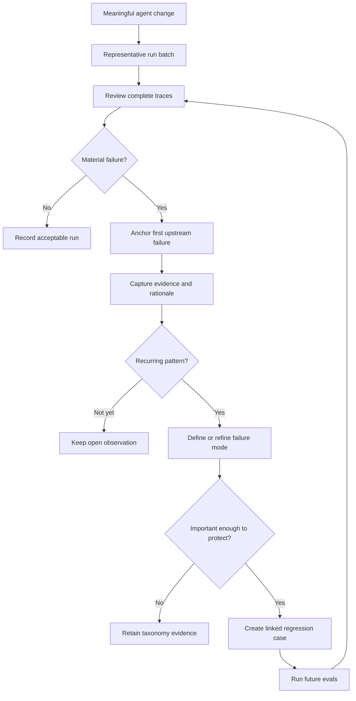
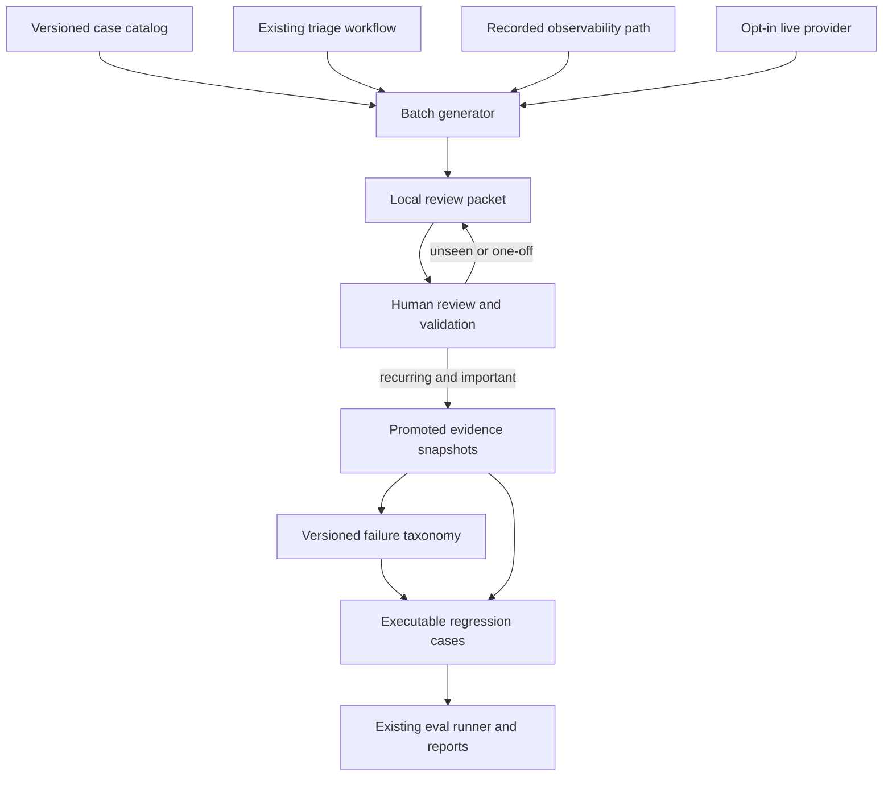
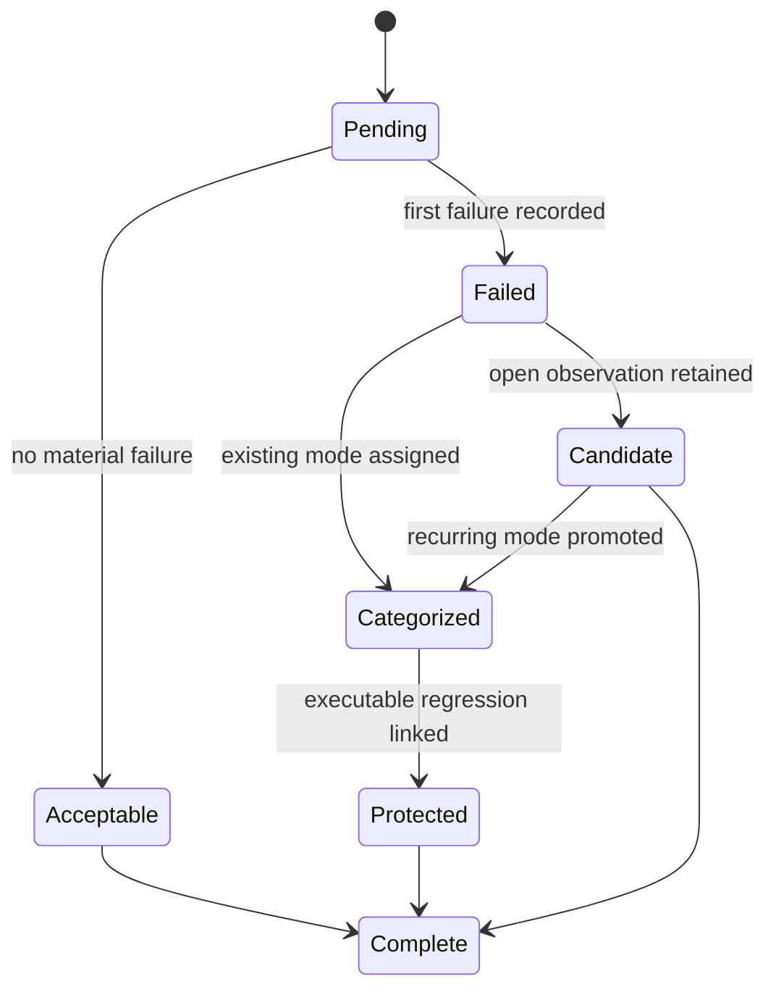

# Failure Discovery Loop - Plan

## Goal Capsule

- **Objective:** An SRE reviewer can find the first meaningful failure in representative incident runs and turn recurring failures into traceable regression protection.
- **Means:** Use a local review workspace for complete batches, then promote selected evidence into a versioned taxonomy and executable regression corpus (KTD1, KTD5, KTD6).
- **Product authority:** This contract defines the review behavior, taxonomy lifecycle, and regression provenance. Existing deterministic eval gates remain authoritative for schema, safety, provenance, and mitigation invariants.
- **Open blockers:** None.
- **Stop conditions:** Do not require live-provider access, grant production mutation authority, replace deterministic gates, or commit uncurated review batches.
- **Execution profile:** Code implementation in this repository.
- **Delivery owner:** The implementing agent or maintainer completes the implementation units, verification contract, cleanup, and final review.

---

## Product Contract

### Summary

Add a manual failure-discovery loop that produces review packets from representative incident runs, records the first upstream failure in each run, grows a living failure taxonomy from repeated observations, and links important failure modes to regression cases.

### Problem Frame

The current eval suite can show whether known contracts pass and can expose saved run output for inspection. It does not preserve an SRE reviewer's open-ended diagnosis of where a run first went wrong or connect that diagnosis to a reusable failure category and its eventual regression case.

Without that link, review findings remain local observations. The project can accumulate tests without retaining why each test exists, which trace exposed the weakness, or whether the same failure returns under a different symptom.

### Key Decisions

- **Start with generated review packets and a command-line workflow.** (session-settled: user-directed — chosen over an annotation UI or AI-assisted labeling: the review contract should stabilize before the project commits to an interface or automated reviewer.) Governs R1, R4, R14.
- **Review the whole run and anchor the finding to its first failing step.** (session-settled: user-directed — chosen over scoring every step or reviewing only the final outcome: the workflow must preserve causality without creating unnecessary annotation volume.) Governs R3-R5.
- **Let categories emerge from reviewed traces.** (session-settled: user-approved — chosen over beginning with a fixed taxonomy: early review should discover the project's actual failure patterns.) Governs R6-R8.

### Actors

- A1. **SRE reviewer:** Examines complete runs, records the first upstream failure, and decides which recurring findings deserve taxonomy and regression treatment.
- A2. **Project maintainer:** Selects meaningful changes and representative run batches, then uses review findings to improve the agent and eval suite.
- A3. **Eval workflow:** Produces reproducible run evidence and reports whether linked regressions continue to hold.

### Requirements

**Review batches**

- R1. The workflow must let a maintainer generate a review packet containing 20–30 representative runs after a meaningful agent change.
- R2. A batch must distinguish mock, recorded, and opt-in live runs and retain enough provenance for a reviewer to identify, reproduce, and compare each run.
- R3. Each review item must present the complete ordered run trace and the evidence needed to judge where behavior first diverged from an acceptable result.

**Human review**

- R4. The reviewer must give every run a disposition: no material failure, or a first upstream failure with its responsible step, supporting evidence, rationale, and follow-up disposition.
- R5. The reviewer may record downstream effects, but the review must distinguish them from the primary failure unless they are independent failures.
- R6. The reviewer must be able to record open-ended observations before assigning a taxonomy category.

**Living taxonomy**

- R7. A recurring observation may become a named failure mode only when its definition and source examples make it distinguishable from neighboring modes.
- R8. The taxonomy must allow candidate, revised, and previously unseen failure modes without forcing older reviews into a category that did not fit at review time.

**Regression provenance**

- R9. The reviewer must be able to designate an important recurring failure mode for regression coverage and link it to the source runs that established the pattern.
- R10. A resulting regression case must retain a durable link to its failure-mode definition, originating trace, failing step, and supporting evidence.
- R11. Later eval runs must show whether each linked regression remains protected and provide enough context to recognize a recurrence with different downstream symptoms.

**Boundaries**

- R12. Human review findings must supplement rather than replace deterministic schema, evidence, provenance, safety, and mitigation checks.
- R13. Live-provider runs must remain opt-in and must preserve the project's non-mutating safety boundary.
- R14. The first version must use generated review packets and a command-line review workflow without requiring a new annotation UI or automated failure labeling.

### Key Flows

- F1. Review a representative batch
  - **Trigger:** A2 decides that an agent change warrants qualitative review.
  - **Actors:** A1, A2, A3
  - **Steps:** A2 selects a representative batch; A3 produces review packets; A1 examines each complete trace; A1 records either no material failure or the first upstream failure and its evidence.
  - **Outcome:** Every run has a review disposition that can be compared across the batch.
  - **Covered by:** R1-R6, R12-R14.
- F2. Promote a recurring failure mode
  - **Trigger:** A1 recognizes the same underlying failure in multiple reviewed runs.
  - **Actors:** A1
  - **Steps:** A1 compares the source examples, defines the shared failure mode, distinguishes it from related modes, and links the supporting reviews.
  - **Outcome:** The taxonomy gains a reusable category without erasing the original observations.
  - **Covered by:** R6-R8.
- F3. Convert a finding into protection
  - **Trigger:** A1 designates a recurring failure mode as important enough to prevent from returning.
  - **Actors:** A1, A2, A3
  - **Steps:** A2 creates a regression case linked to the failure mode and source evidence; A3 runs it after relevant changes; A1 can trace a failure back to the originating finding.
  - **Outcome:** The project can tell whether the fix holds and why the regression exists.
  - **Covered by:** R9-R13.



### Acceptance Examples

- AE1. **Covers R4-R6.** Given a run with no meaningful defect, when the reviewer completes the packet, then the run is recorded as having no material failure without requiring an artificial taxonomy label.
- AE2. **Covers R3-R5.** Given a weak evidence selection that later produces a poor mitigation, when the reviewer evaluates the run, then the evidence-selection step is recorded as the first upstream failure and the mitigation is recorded as a downstream effect.
- AE3. **Covers R6-R8.** Given two reviews with similar free-form observations, when the reviewer determines that they share a distinguishable cause, then the observations can become a named failure mode while retaining links to both original reviews.
- AE4. **Covers R7-R8.** Given an observation that does not fit the current taxonomy, when the reviewer records it, then it remains a candidate or unseen mode rather than being forced into the nearest existing category.
- AE5. **Covers R9-R11.** Given an important recurring failure mode with a linked regression, when a later change reintroduces the same upstream defect with different downstream wording, then the eval result exposes the failed protection and its original evidence trail.
- AE6. **Covers R1-R2, R13.** Given that live-provider evaluation is not enabled, when the maintainer creates a batch, then the workflow still produces a representative packet from mock and recorded runs without attempting a live call.

### Success Criteria

- The first review cycle covers 20–30 representative runs and gives every run a complete disposition.
- The first cycle produces roughly 3–6 failure modes with definitions and source examples that the reviewer can apply consistently.
- Every important recurring failure mode selected for protection has at least one linked regression case with trace and evidence provenance.
- After a fix, a later eval run can show whether the linked failure remains prevented or has recurred.

### Scope Boundaries

- A new annotation interface is deferred until the review fields and taxonomy behavior have survived one or two manual batches.
- AI-proposed failure anchors or taxonomy labels are deferred because they could bias the discovery process and would require their own evaluation.
- Multi-reviewer assignment, disagreement resolution, and inter-rater scoring are outside the first version.
- Automated triggering after every code change is outside the first version; A2 decides when a change warrants a batch.
- Production actuation and mandatory live-provider evaluation remain outside scope.

### Dependencies and Assumptions

- Existing eval and retained-run outputs contain most of the trace, evidence, decision, safety, mitigation, and provenance context required for review.
- The first version serves one SRE reviewer or a small team using a shared review convention rather than a formal labeling operation.
- The reviewer decides which recurring modes are important enough for regression coverage; frequency alone does not determine priority.

### Sources and Research

- `evals/README.md` documents the deterministic, recorded, and opt-in live eval layers and the boundary between hard gates and qualitative judgment.
- `evals/harness.ts` shows the current run inputs, execution modes, artifact identity, and limited eval metadata.
- `src/persistence/index.ts` defines the retained run and review envelopes that can supply evidence to the discovery loop.
- `src/run-review-console.ts` confirms that the existing UI reviews operator decisions and approval state rather than collecting failure annotations.

---

## Planning Contract

### Product Contract Preservation

The Product Contract is restructured without a scope change: its three planning-owned questions are resolved by KTD1-KTD7, while every R/A/F/AE ID and session-settled product decision keeps its original meaning.

### Key Technical Decisions

- KTD1. **Separate local review work from curated repository evidence.** Generated batches live under the ignored `.triage/` workspace; promotion copies only selected, allowlisted source evidence into the versioned eval corpus. This keeps 20-30-run batches disposable while preserving the traces that justify taxonomy and regression decisions. Governs R1-R3, R9-R10.
- KTD2. **Use schema-versioned JSON as the source of truth and derive Markdown summaries.** JSON supports strict validation and machine-readable provenance, while generated summaries keep batch review scannable without making Markdown parsing part of the contract. Governs R2-R6.
- KTD3. **Reuse the existing workflow and recorded-observability paths through side-effect-free runners.** The review generator calls the same triage workflow used by `incidentTriageHarness` and the same webhook path used by recorded triage; it does not introduce a second prompt, model adapter, or safety path. Governs R2-R3, R12-R13.
- KTD4. **Give every batch, run, review, failure mode, and promoted case a stable identifier.** Batch provenance records the repository revision, dirty-state flag, source kind, scenario or case identity, execution mode, generation time, and content fingerprint without recording credentials. Governs R2, R9-R11.
- KTD5. **Version taxonomy definitions without rewriting historical reviews.** An active failure mode requires a definition, distinguishing notes, and at least two promoted source examples; reviews and regression cases retain the failure-mode revision they used. Candidate observations may remain uncategorized. Governs R6-R10.
- KTD6. **Keep regression protections as executable TypeScript eval cases with provenance metadata.** Each case links to a failure mode and promoted evidence snapshot while retaining case-specific assertions; the project will not add a generic assertion DSL. Governs R9-R12.
- KTD7. **Treat live-provider capture as an explicit source adapter.** The generator preflights live configuration before starting a live batch, records provider failures as reviewable outcomes after execution begins, and never enables production actuation. Governs R2, R13-R14.

### High-Level Technical Design

The review workflow adds a local curation layer around existing execution paths. It does not change which component owns workflow state, evidence gathering, validation, mitigation governance, or safety.



Each review item follows one lifecycle. Validation prevents an incomplete or internally inconsistent item from being promoted.



### Output Structure

```text
evals/
  failure-discovery.ts
  failure-case-catalog.ts
  failure-regressions.ts
  failure-regressions.eval.ts
  failure-taxonomy.json
  failure-cases/
    {promoted-case}.json
scripts/
  failure-review.ts
tests/
  failure-discovery.test.ts
.triage/
  failure-reviews/
    {batch-id}/
      manifest.json
      runs/
      reviews/
      summary.md
```

The `.triage/` subtree is generated and remains ignored. The files under `evals/` are reviewed source artifacts and enter version control.

### Data and Validation Contracts

- A batch manifest owns batch provenance, source selection, requested size, completion state, and references to run records.
- A run record owns the normalized operator response, ordered states and investigation steps, evidence, deterministic gate context, and a content fingerprint.
- A review record owns one disposition, an optional first-failure anchor, evidence references, rationale, downstream effects, optional independent findings, an optional failure-mode reference, and follow-up disposition.
- A promoted case is an immutable allowlisted snapshot of the source run and review fields needed to understand and reproduce the failure.
- A failure-mode entry owns its stable ID, revision, lifecycle state, definition, distinguishing notes, and promoted source-case references.
- A regression entry owns executable setup and assertions plus links to the failure-mode revision and promoted source cases that justify it.

Validation must reject dangling run, step, evidence, failure-mode, or promoted-case references. It must also reject a failed disposition without a first-failure anchor and an acceptable disposition that carries a primary failure.

### System-Wide Impact

- **SRE reviewer:** Gains a repeatable local workflow for reading complete traces and recording causal findings without using the operator UI.
- **Maintainer:** Gains a curated evidence trail from agent change to review finding to regression case.
- **Eval workflow:** Gains a data-backed regression suite while preserving existing deterministic gates and opt-in live behavior.
- **Repository:** Stores only promoted evidence snapshots, taxonomy definitions, and executable cases; raw review batches remain local.
- **Security and operations:** Captures only allowlisted operator output from synthetic or recorded inputs and never expands production permissions.

### Risks and Dependencies

| Risk or dependency | Consequence | Plan response |
| --- | --- | --- |
| The default case pool becomes repetitive | Review volume rises without discovering new failures | Require stable case identities and a balanced catalog of canonical, targeted negative, and recorded-observability cases |
| Generated packets contain secrets or excessive raw data | Local or promoted artifacts could expose sensitive values | Serialize an allowlist, test secret redaction, and require promotion to create a reduced snapshot |
| Taxonomy definitions drift | Reviews and regressions become ambiguous | Use stable IDs, explicit revisions, distinguishing notes, and referential validation |
| A reviewer forces novel findings into existing categories | The taxonomy hides new failure modes | Permit uncategorized and candidate observations per R8 |
| Regression metadata and executable assertions diverge | Provenance appears valid while protection is missing | Validate the regression catalog during the eval run and fail on dangling provenance |
| Live generation fails midway | A batch could appear complete when live evidence is missing | Preflight configuration and persist explicit per-run failure outcomes without marking the batch complete prematurely |
| Curated snapshots grow without bound | The repository becomes a run archive | Promote only evidence that supports an active failure mode or regression case |

### Documentation and Operational Notes

- Document the reviewer journey as generate, inspect, annotate, validate, summarize, promote, and add or run a regression.
- State that generated batches are local working material and that promotion is the durability boundary.
- Keep live review generation opt-in and document its credential, cost, latency, and variance implications.
- Explain that human findings supplement deterministic gates and that a failed gate still requires response-versus-grader inspection.

### Sources and Research

- `evals/harness.ts` is the workflow-backed execution boundary to extract into a reusable runner before adding batch generation.
- `scripts/run-recorded-triage.ts` already exercises recorded Grafana and Loki-shaped inputs through the real webhook handler.
- `src/server.ts` exposes the ordered run states, investigation steps, evidence, decision, provenance, mitigation, safety, and scorecard fields needed for packet capture.
- `src/approval-store.ts` provides the repository's small validated JSON-store pattern, although review writes should add atomic replacement because a batch has more cross-references.
- `evals/incident-outcomes.eval.ts` and `evals/recorded-triage-quality.eval.ts` provide canonical and targeted negative case patterns.
- `docs/solutions/architecture-patterns/bounded-llm-incident-triage-workflow.md` requires the workflow to remain authoritative for state, validation, safety, and deterministic scoring.

---

## Implementation Units

### U1. Add the review domain and local workspace

- **Goal:** Define and validate the durable contracts for batches, run records, human reviews, taxonomy entries, promoted cases, and regression provenance.
- **Requirements:** R2-R10, R12, R14; F1-F3; AE1-AE4.
- **Dependencies:** None.
- **Files:** `evals/failure-discovery.ts`, `tests/failure-discovery.test.ts`.
- **Approach:** Implement KTD1, KTD2, KTD4, and KTD5 in one domain module with explicit parsers, schema versions, referential checks, deterministic fingerprints, and atomic local writes. Keep packet storage rooted under `.triage/failure-reviews/` and make paths injectable for tests.
- **Patterns to follow:** Mirror the explicit parsing and JSON rendering style in `src/approval-store.ts`, the strict TypeScript settings in `tsconfig.json`, and stable evidence-ID validation in the existing eval helpers.
- **Test scenarios:**
  - A new empty batch workspace creates a valid manifest and empty run/review collections.
  - A valid failed review accepts one first-failure anchor plus evidence, rationale, downstream effects, independent findings, and follow-up disposition.
  - Covers AE1. An acceptable run validates without a failure anchor or taxonomy assignment.
  - A failed review without a phase or rationale is rejected.
  - An acceptable review carrying a primary failure is rejected.
  - A review that names a missing run, investigation step, or evidence ID is rejected.
  - A malformed or unsupported schema version fails with a field-specific diagnostic.
  - An interrupted write leaves the prior valid file intact.
- **Verification:** The domain tests prove parsing, lifecycle invariants, reference validation, fingerprint stability, and atomic replacement without invoking the model or network.

### U2. Build the representative run catalog and source adapters

- **Goal:** Generate 20-30 distinct reviewable runs through the repository's existing mock, recorded-observability, and optional live paths.
- **Requirements:** R1-R3, R12-R14; A2-A3; F1; AE6.
- **Dependencies:** U1.
- **Files:** `evals/harness.ts`, `evals/failure-case-catalog.ts`, `evals/failure-discovery.ts`, `scripts/run-recorded-triage.ts`, `tests/failure-discovery.test.ts`, `tests/recorded-triage.test.ts`.
- **Approach:** Extract a side-effect-free runner from the current eval harness and expose a reusable recorded-observability runner from the existing script path. Build a stable catalog of canonical scenarios, targeted mock defects, and recorded webhook cases; use live trials only when explicitly requested under KTD7. Normalize every source into the U1 run contract without duplicating workflow logic.
- **Execution note:** Preserve the current eval and recorded-triage outputs with characterization tests before extracting shared runners.
- **Patterns to follow:** Reuse the case-table style in `evals/incident-outcomes.eval.ts`, the negative variants in `evals/recorded-triage-quality.eval.ts`, and the real handler path in `scripts/run-recorded-triage.ts`.
- **Test scenarios:**
  - The default catalog contains between 20 and 30 stable case IDs without requiring live credentials.
  - Canonical mock cases produce complete run envelopes through the same runner used by existing evals.
  - Targeted malformed output, invalid evidence, missing context, and weak-explanation variants remain reviewable rather than crashing generation.
  - Recorded cases traverse Grafana normalization, recorded Loki lookup, workflow validation, and safety before capture.
  - Covers AE6. A default batch completes with mock and recorded cases when live mode is disabled.
  - Requesting live capture without required configuration fails before any live request begins and does not create a complete batch.
  - A provider error after a live batch begins becomes an explicit reviewable run outcome with no secret values.
  - No generated run records an executed production action.
- **Verification:** Existing eval and recorded-triage tests remain green, and the new catalog tests prove source parity, size bounds, unique identities, and opt-in live behavior.

### U3. Add the command-line review workflow

- **Goal:** Let a reviewer generate, inspect, annotate, validate, and summarize a batch without a new UI.
- **Requirements:** R1-R6, R13-R14; A1-A3; F1; AE1-AE2, AE6.
- **Dependencies:** U1, U2.
- **Files:** `scripts/failure-review.ts`, `package.json`, `tests/failure-discovery.test.ts`.
- **Approach:** Add one npm entry point with focused subcommands for batch generation, listing, single-run display, annotation, validation, and summary regeneration. Generation writes per-run review templates; an annotation subcommand accepts a structured review record from a file or stdin and replaces that run's review atomically after validation. Keep diagnostic logs on stderr and structured output on stdout.
- **Patterns to follow:** Follow argument parsing and exit-code behavior in `src/approval-cli.ts`, output hygiene in `src/cli.ts`, and temp-directory CLI tests in `tests/cli.test.ts`.
- **Test scenarios:**
  - Generating a default batch records a change label, source mix, repository revision, dirty-state flag, and requested size.
  - Listing a batch distinguishes pending, acceptable, failed, candidate, categorized, and protected reviews.
  - Showing one run renders ordered workflow states, investigation steps, evidence, output, gate context, and any saved annotation.
  - Annotating a run from a file or stdin writes a valid review atomically and rejects invalid input without replacing the prior record.
  - Covers AE2. A review anchored to an early evidence-selection step can record a later mitigation defect as a downstream effect.
  - Validation reports every incomplete or dangling review and exits non-zero until the batch is internally consistent.
  - Summary regeneration is deterministic and never becomes the editable source of truth.
  - Unknown commands, missing values, invalid paths, and malformed review files return actionable errors without stack traces or secret values.
- **Verification:** CLI integration tests exercise real filesystem writes in temporary directories and prove both human-readable and JSON output modes.

### U4. Add taxonomy promotion and curated evidence snapshots

- **Goal:** Convert repeated open observations into versioned failure modes while retaining the evidence and taxonomy revision behind each decision.
- **Requirements:** R6-R10, R12; A1-A2; F2; AE3-AE4.
- **Dependencies:** U1, U3.
- **Files:** `evals/failure-discovery.ts`, `evals/failure-taxonomy.json`, `evals/failure-cases/`, `scripts/failure-review.ts`, `tests/failure-discovery.test.ts`.
- **Approach:** Add promotion and revision operations that validate selected reviews, copy reduced allowlisted snapshots into the versioned corpus, and update taxonomy entries under KTD5. One source may be retained as a candidate observation without assigning a named failure mode; creating or activating a named mode requires a definition, distinguishing notes, and at least two distinguishable source examples. Retire or revise entries without deleting identifiers used by older reviews.
- **Patterns to follow:** Keep expected judgments outside raw fixtures, preserve stable evidence IDs, and follow the mitigation catalog's data-owned policy pattern without allowing runtime model output to author taxonomy entries.
- **Test scenarios:**
  - Covers AE3. Two compatible reviewed failures can be promoted into one active failure mode with both source snapshots.
  - Covers AE4. A novel observation can remain uncategorized or become a candidate without being forced into an active mode.
  - Activation fails when the definition, distinguishing notes, or second source example is missing.
  - A taxonomy revision increments the revision while old promoted cases retain their original revision reference.
  - A retired mode remains resolvable for historical reviews and regressions.
  - Promotion copies only allowlisted fields and rejects known credential-bearing keys before writing a versioned snapshot.
  - Promotion fails if selected reviews disagree on the requested mode identity or contain dangling evidence references.
- **Verification:** Tests prove taxonomy lifecycle rules, immutable promoted snapshots, historical revision lookup, and redaction at the repository boundary.

### U5. Add provenance-linked regression evals

- **Goal:** Make important failure modes executable as regressions and visible in ordinary eval reports with their source provenance.
- **Requirements:** R9-R13; A2-A3; F3; AE5.
- **Dependencies:** U1, U2, U4.
- **Files:** `evals/failure-regressions.ts`, `evals/failure-regressions.eval.ts`, `evals/failure-discovery.ts`, `tests/failure-discovery.test.ts`.
- **Approach:** Define regression cases as typed executable entries under KTD6. Each entry supplies its run input and case-specific assertion while carrying stable links to an active failure mode revision and promoted source cases. The eval suite validates the registry before execution and emits provenance as report metadata or artifacts.
- **Execution note:** Add one end-to-end regression from a promoted fixture before generalizing registry validation.
- **Patterns to follow:** Follow `describeEval` table cases in `evals/incident-outcomes.eval.ts`, deterministic gate reporting in `evals/quality-gates.ts`, and artifact metadata in `evals/harness.ts`.
- **Test scenarios:**
  - A valid regression entry resolves its failure mode revision and every promoted source case before running.
  - A dangling mode, revision, or source-case reference fails registry validation before the eval body runs.
  - Covers AE5. A regression detects the same upstream defect when downstream explanation wording changes.
  - A passing regression emits its failure-mode and source-case provenance in the saved eval result.
  - A deterministic regression remains part of `npm run evals` without enabling live-provider cases.
  - Existing quality gates still run independently and cannot be overridden by human annotation metadata.
- **Verification:** The eval suite proves at least one complete source-review-to-regression chain and preserves the existing deterministic/live separation.

### U6. Document operation and maintenance boundaries

- **Goal:** Make the workflow understandable enough for a maintainer to run a first review cycle and preserve its contracts during later changes.
- **Requirements:** R1-R14; F1-F3.
- **Dependencies:** U3-U5.
- **Files:** `README.md`, `evals/README.md`, `AGENTS.md`, `CONCEPTS.md`.
- **Approach:** Document the command sequence, local-versus-versioned artifact boundary, annotation fields, taxonomy lifecycle, regression linkage, live opt-in behavior, and deterministic gate authority. Add agent constraints that keep raw fixtures free of review answers and prohibit committing uncurated batches.
- **Patterns to follow:** Keep `README.md` command-oriented, `evals/README.md` evaluation-oriented, `AGENTS.md` constraint-oriented, and `CONCEPTS.md` limited to stable domain vocabulary.
- **Test scenarios:** Test expectation: none -- this unit documents behavior already proven by U1-U5 and should not add brittle prose assertions.
- **Verification:** A maintainer can follow the documented path from batch generation through promotion and regression execution without needing undocumented commands or production credentials.

---

## Verification Contract

| Verification | Applies to | Required outcome |
| --- | --- | --- |
| `npm test -- tests/failure-discovery.test.ts tests/recorded-triage.test.ts` | U1-U5 | Domain, filesystem, CLI, source-adapter, taxonomy, and provenance scenarios pass with temporary local state |
| `npm test` | U1-U6 | Existing workflow, safety, persistence, CLI, and recorded-observability behavior remains unchanged |
| `npm run typecheck` | U1-U6 | Strict TypeScript checks pass with no widened `any` boundary in the new contracts |
| `npm run build` | U1-U6 | Production source still builds; eval and script-only modules do not leak into the runtime bundle |
| `npm run evals` | U2, U5 | Existing deterministic evals and provenance-linked regressions pass; live cases remain skipped |
| `npm run review:failures -- generate --change local-validation --size 24` | U2-U3 | A local batch with 20-30 run records is created without live credentials or production mutation |
| `npm run review:failures -- validate {batch-id}` | U1, U3-U5 | Incomplete reviews fail clearly; a completed sample batch validates all references |
| `RUN_LIVE_FLUE_EVALS=1 npm run review:failures -- generate --change live-check --live` | U2-U3 | Optional manual check only: configured live runs are captured without enabling production actions |
| `git diff --check` | U1-U6 | No whitespace or patch-format errors remain |

Behavioral verification must inspect one generated packet and one promoted case. The reviewer should confirm that the packet contains the complete ordered trace, the promoted snapshot is reduced and secret-free, and the linked regression report names its originating failure mode and source case.

---

## Definition of Done

### Global Completion

- The default generator produces a 20-30-run representative batch from mock and recorded sources without requiring live credentials.
- Every review validates as either acceptable or failed with one first upstream failure, evidence, rationale, and follow-up disposition.
- Candidate and active taxonomy states preserve uncategorized observations and historical revisions.
- At least one recurring failure mode has two promoted source examples and one executable regression with end-to-end provenance.
- Existing deterministic gates remain authoritative and the default eval suite remains non-live.
- No review workflow grants production authority, records secret values, or commits an uncurated batch.
- User-facing documentation matches the implemented commands and artifact boundaries.
- Abandoned experiments, duplicate runners, dead fixtures, and temporary implementation files are removed from the final diff.

### Unit Completion

| Unit | Done when |
| --- | --- |
| U1 | Versioned schemas, parsing, reference validation, fingerprints, and atomic local storage pass focused tests |
| U2 | One shared execution path produces the bounded default catalog and optional live outcomes without changing current eval behavior |
| U3 | The CLI can generate, inspect, validate, and summarize a real temporary batch with useful failures and exit codes |
| U4 | Promotion creates reduced snapshots and enforces candidate, active, revised, and retired taxonomy behavior |
| U5 | Regression evals validate provenance and demonstrate one failure-mode-to-protection chain |
| U6 | README, eval guidance, agent constraints, and concepts describe the final workflow consistently |
